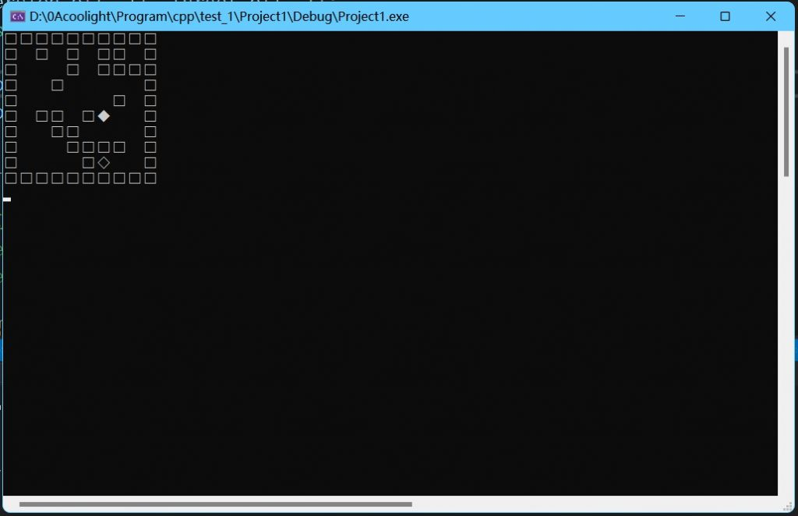

* * *

## **效果图**

* * *

## 源代码

若以下显示需要登录，请刷新页面或[点击此处](https://cloud.coolight.cool/#fileView&path=http%3A%2F%2Fcloud.coolight.cool%2F%3Fexplorer%2Fshare%2Ffile%26hash%3Defa0f2J_ltYpOqmD11BafBo6ciF4EMnrLmM43vpfW-zI7bV2Z9gcaLSP%26name%3D%2F%25E8%25BF%25B7%25E5%25AE%25AB%25E8%2587%25AA%25E5%258A%25A8%25E5%25AF%25BB%25E8%25B7%25AF.zip%26_etag%3Db727f)下载。

<iframe width="100%" height="800px" class="embed-show" src="https://cloud.coolight.cool/#fileView&amp;path=http%3A%2F%2Fcloud.coolight.cool%2F%3Fexplorer%2Fshare%2Ffile%26hash%3D344cDokDEypUpwEQQtfR24S0l51tVQge9lqssiJAhDFynuCY6VAI7jNn%26name%3D%2F%25E8%25BF%25B7%25E5%25AE%25AB%25E8%2587%25AA%25E5%258A%25A8%25E5%25AF%25BB%25E8%25B7%25AF.zip%26_etag%3Db727f" allowtransparency="true" allowfullscreen="true" webkitallowfullscreen="true" mozallowfullscreen="true" frameborder="0" scrolling="no"></iframe>

* * *

## **思路**

- 总体和数据结构的教科书上的大差不差：
    - 以起点为中心，每向外一步作为一轮循环，循环中把可走的位置入队，下一轮循环把上一轮入队的位置出队并再以这些位置为中心往外走一步，把可走位置入队，一直这样循环，直到遇到终点位置或者队列中为空（因为每一个方向都走不了则队列循环后为空）。
    - （想象一下在没有障碍物的地图中，以起点为中心向外扩散）
    - 在上述过程中，把可走位置入队的同时留下方向标记（上一个位置走到此位置的方向），在循环结束后从终点位置倒推即可找到一条回到起点的路径。
    - 此路径为最优解（最优解可能不止一条），因为算法中是从起点往外每一步进行一轮判断，因此如果找到了终点，那么就是在最少的步数内找到了终点，此时即可结束循环，此为最优解。如果不结束，继续找下去可能可以找到用更多步数的路径。
    - 本例与书中的不同：
        - 在找到路径后利用system("cls")清屏重新输出，来实现逐步走向终点的效果。
        - 在一些细节的实现上使用不同的尝试(例如 mapClass::auto\_find\_way()中使用sin()，直接使用地图做方向标记等)。
        - 3.支持循环多次寻路，支持重置障碍物位置。
