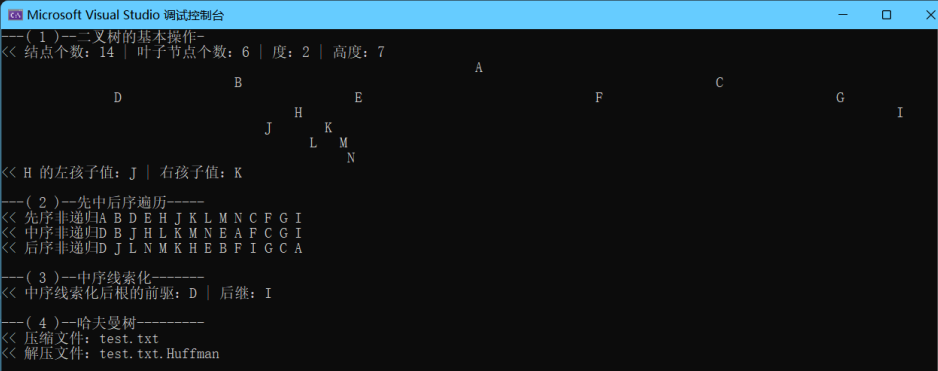

## 要求

- **二叉树的基本操作算法实现**
    
    - 利用二叉树字符串“A(B(D,E(H(J,K(L,M(,N))))),C(F,G(,I)))”创建二叉树的二叉链式存储结构；
    - 输出该二叉树；
    - 输出‘H’节点的左、右孩子结点值；
    - 输出该二叉树的结点个数、叶子结点个数、二叉树的度和高度；
    
    - **思路**
        - 与书中不同，我采用的方法是后序创建二叉树，即先创建叶子节点，再创建其父节点，一直到根节点。具体思路为使用堆栈，把最里层的括号先创建，然后再压回堆栈中循环。
            - 例如：A(B(C(H,I),D), E)，经过第一次创建后变成A(B(C,D),E),此时C，D已经连接到B中，第二次后变成A(B,E)故一直重复构建最里层即可。但实际构建实现时并不会重复去访问后面还没用到的E，访问一轮字符串即可构造出整棵树。详细请看代码实现。
        - 采用层序遍历输出二叉树。
        - 采用递归查找。
        - 采用递归，一次性把节点数，叶子节点数和高度计算出来。
            - 其中高度的计算中，假定一个共享的最大高度值（实现时采用引用传值）和一个形参高度，每往下调用一次则形参高度+1，当到达叶子节点时判断形参高度（即这个叶子的高度）是否比最大高度大，是则修改最大高度，即可找出整棵树的最大高度。

- **二叉树的各种遍历算法实现**
    - 实现上述二叉树的先序、中序和后序遍历的递归和非递归算法；
    - **思路**
        - 递归实现比较简单，调整输出语句的位置即可
        - 非递归中，先序是比较好写的，即实现 根左右 ，与之类似的根右左也很好写，因此在写后序时，可以按根右左入栈，最后出栈输出，即为后序左右根。

- **线索二叉树的遍历**
    - 中序线索化上述二叉树并找出根结点的前驱和后继。
    - **思路：**
        - 按中序的访问，保留上一节点的指针，在访问节点时修改上一节点的后继和本次访问的节点的前驱。

- **构造哈夫曼树和哈夫曼编码的算法实现**
    
    - 统计下面一段英文的不同字符个数和每个字符的出现频率，利用统计数据构造构造哈夫曼树和哈夫曼编码。要求：利用构造的哈夫曼编码对下文进行压缩和解压后，与原文一样。
        - The Chinese official said he viewed the Trump Presidency not as an aberration but as the product of a failing political system. This jibes with other accounts. The Chinese leadership believes that the United States, and Western democracies in general, haven’t risen to the challenge of a globalized economy, which necessitates big changes in production patterns, as well as major upgrades in education and public infrastructure. In Trump and Trumpism, the Chinese see an inevitable backlash to this failure.
    
    - **思路**
        - 统计字符个数和出现频率后，每次找出其中占比最小的两个结成一个节点，然后把这个节点压回，循环直到剩下一个根节点，即为哈夫曼树。用递归往左则编码字符串增加一位‘0’，往右则增加‘1’。即可构造哈夫曼编码，生成映射表，然后把文本逐一用编码代替，然后把编码写入新文件作为压缩文件，并生成对应的映射表文件，在解压时按哈夫曼树从根出发，编码0则往左，1则往右，遇见叶子节点时即为所表示的字符，把指针重新从根开始，继续按编码走即可。

* * *

## 效果图

* * *

## 源代码

若以下显示需要登录，请刷新页面或[点击此处](https://cloud.coolight.cool/#fileView&path=http%3A%2F%2Fcloud.coolight.cool%2F%3Fexplorer%2Fshare%2Ffile%26hash%3D1da2Zmv9ZVhKXFmz05oa8_53W5RqRD4lmAvkO0ZjzwWB54_Sa40Ks9y-%26name%3D%2F%25E4%25BA%258C%25E5%258F%2589%25E6%25A0%2591%2528%25E5%2593%2588%25E5%25A4%25AB%25E6%259B%25BC%25E6%25A0%2591%2529%25E7%259A%2584%25E6%2593%258D%25E4%25BD%259C%25E4%25B8%258E%25E5%25AE%259E%25E7%258E%25B0.zip%26_etag%3Df36e6)下载。

<iframe width="100%" height="800px" class="embed-show" src="https://cloud.coolight.cool/#fileView&amp;path=http%3A%2F%2Fcloud.coolight.cool%2F%3Fexplorer%2Fshare%2Ffile%26hash%3D6a775Fi2i0N0DHw8aYCaLaJiVwhIFHGyxdyIfbNJVRu16KnYqS00imi6%26name%3D%2F%25E4%25BA%258C%25E5%258F%2589%25E6%25A0%2591%2528%25E5%2593%2588%25E5%25A4%25AB%25E6%259B%25BC%25E6%25A0%2591%2529%25E7%259A%2584%25E6%2593%258D%25E4%25BD%259C%25E4%25B8%258E%25E5%25AE%259E%25E7%258E%25B0.zip%26_etag%3Df36e6" allowtransparency="true" allowfullscreen="true" webkitallowfullscreen="true" mozallowfullscreen="true" frameborder="0" scrolling="no"></iframe>
