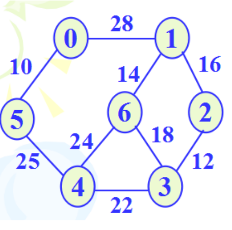

# 图的操作与实现

## 要求

- 图的邻接表和邻接矩阵存储
    - 建立下图的邻接表或邻接矩阵，并输出之；



- 思路：
    - 通过遍历邻接矩阵，采用头插法即可构造邻接表。
- 图的各种遍历算法实现
    - 以0结点为起点实现上述图的深度优先和广度优先遍历算法；
    - 思路：
        - 用堆栈实现深度优先遍历，用队列实现广度优先遍历。
- 最小生成树的算法实现
    - 利用普里姆（Prim）算法或克鲁斯卡尔(Kruskal)算法求上图的最小生成树，算法实现代码必需有注释。
    - 思路：
        - Prim：从0点出发每次取能到达的最小权重边，走完即为一颗最小生成树。
- 最短路径的算法实现
    - 利用狄克斯特拉（Dijkstra）算法求上图中0结点到其它结点的最短路径，算法实现代码必须有注释。
    - 思路：
        - 循环每次计算到每一个点的最小距离并记录，然后取最小距离的那个点合并。

* * *

## 源代码

若以下显示需要登录，请刷新页面或[点击此处](https://cloud.coolight.cool/#fileView&path=http%3A%2F%2Fcloud.coolight.cool%2F%3Fexplorer%2Fshare%2Ffile%26hash%3D1cafYYarubqC3CMdyT9pa6M8ZsDB0dihvhpjb9ePyM5_Mzp6T4L1yaY%26name%3D%2F%25E5%259B%25BE%25E7%259A%2584%25E6%2593%258D%25E4%25BD%259C%25E4%25B8%258E%25E5%25AE%259E%25E7%258E%25B0.zip%26_etag%3Dd152f)下载。

<iframe width="100%" height="800px" class="embed-show" src="https://cloud.coolight.cool/#fileView&amp;path=http%3A%2F%2Fcloud.coolight.cool%2F%3Fexplorer%2Fshare%2Ffile%26hash%3D7193gInb3xLObIRrs-NkTFlHyhxR5y0lzv9me-UdZSJyOiVhSKfvybs%26name%3D%2F%25E5%259B%25BE%25E7%259A%2584%25E6%2593%258D%25E4%25BD%259C%25E4%25B8%258E%25E5%25AE%259E%25E7%258E%25B0.zip%26_etag%3Dd152f" allowtransparency="true" allowfullscreen="true" webkitallowfullscreen="true" mozallowfullscreen="true" frameborder="0" scrolling="no"></iframe>

* * *

## 思考

若只求带权有向图G中从顶点i到顶点j的最短路径，如何修改Dijkstra 算法来实现这一功能？

```
void Dijkstra_way(int first_point)
{
	int* widget_list = new int[map_size];	//记录距离0的长度
	for (int i = map_size; i--;)
	{
		widget_list[i] = INF;
		adjList[i].weight = -1;
	}
	widget_list[first_point] = 0;
	adjList[first_point].weight = 0;
	for (int i = 1; i < map_size; ++i)
		for (int j = map_size; j--;)		//计算距离
			if (adjList[j].weight >= 0)
				for (node* node_p = adjList[j].next_p; node_p != NULL; node_p = node_p->next_p)
					if (widget_list[j] + node_p->weight < widget_list[node_p->data])
					{
						widget_list[node_p->data] = widget_list[j] + node_p->weight;
						adjList[node_p->data].weight = j;
					}
	cout << "<< Dijkstra 最短路径：" << endl;
	coolQueue<int> stack;
	for (int i = 0; i < map_size; ++i)
	{
		for (int j = i; j != first_point;)
		{
			stack.End_push(j);
			j = adjList[j].weight;
		}
		cout << "<< " << first_point;
		for (int pop_int = 0; stack.End_pop(pop_int);)
			cout << " -> " << pop_int;
		cout << endl;
		stack.clear();
	}
	adjList_reflush();
}
```
