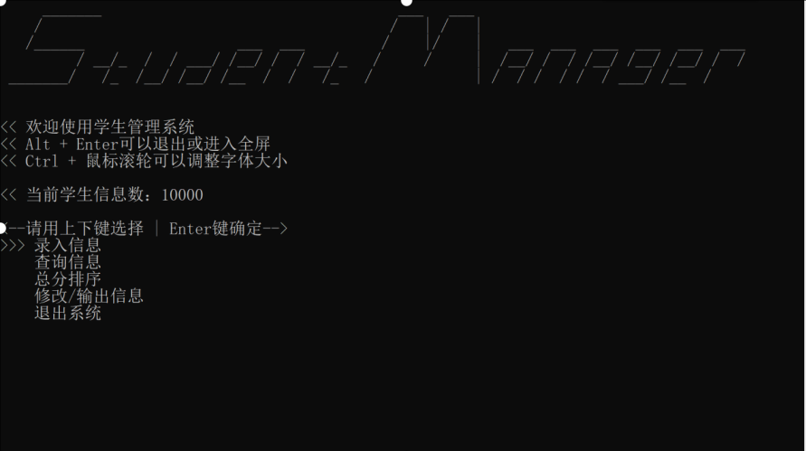
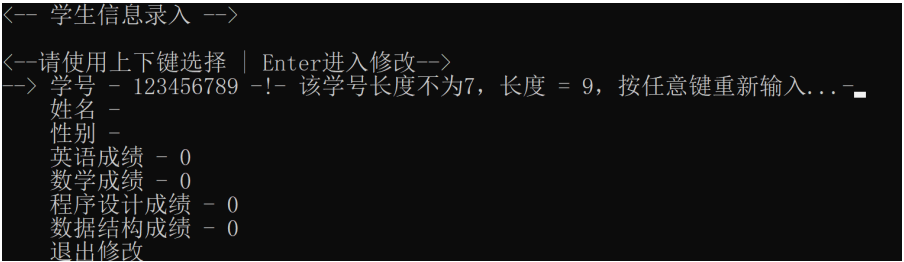
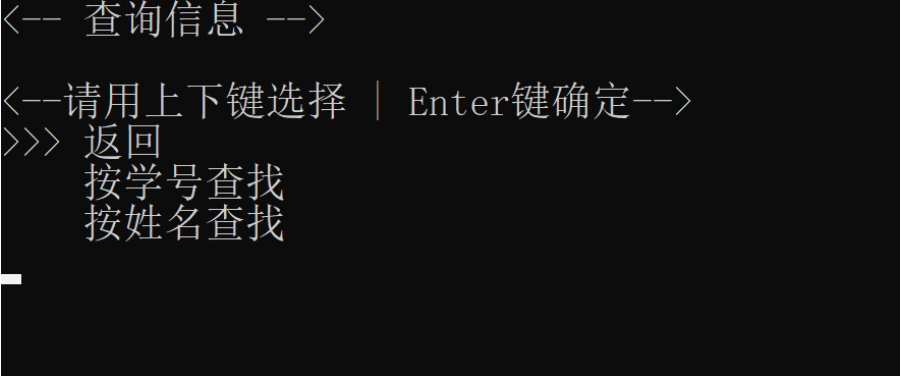
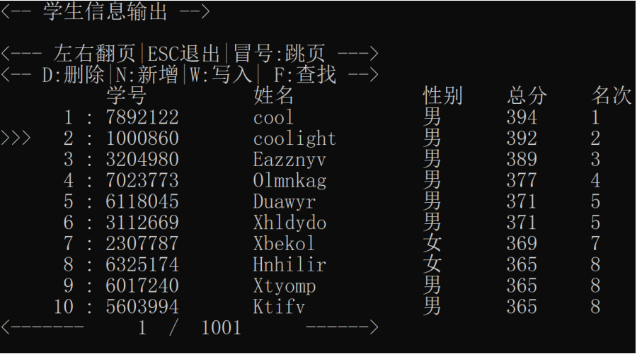
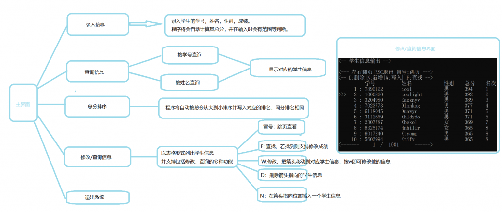

# 学生管理系统---数据结构/程序设计

## 要求

- 请设计一个学生成绩管理系统。学生信息包括学号、姓名、性别、英语、数学、程序设计、数据结构、总分、名次等内容。请实现如下功能：
    - 学生信息的录入（并能够检查学号重复者、成绩不超过100分检查，计算总分）；
    - 学生信息的查询（可以按照学号和姓名两种方式查询）；
    - 学生信息的修改（一律按照学号对应修改，仅对四门课程成绩修改）；
    - 学生总分的排序（要求稳定排序，有相同分数时按照并列名次处理）；
    - 学生信息的输出；
    - 退出管理系统；

* * *

## 效果图

### Gif 动图

* * *

### 各界面图

<figure>

<figcaption>

主界面

</figcaption>

</figure>

<figure>

<figcaption>

录入界面

</figcaption>

</figure>

<figure>

<figcaption>

查找界面

</figcaption>

</figure>

<figure>

<figcaption>

输出/修改界面

</figcaption>

</figure>

* * *

## 源代码下载

若以下显示需要登录，请刷新页面或[点击此处](https://cloud.coolight.cool/#fileView&path=http%3A%2F%2Fcloud.coolight.cool%2F%3Fexplorer%2Fshare%2Ffile%26hash%3De6ceLKnlIRDNbuxIXL7jAcdoIjMfEYHKPZqU8FoVre5QF5m5qEiLTKA%26name%3D%2F%25E5%25AD%25A6%25E7%2594%259F%25E7%25AE%25A1%25E7%2590%2586%25E7%25B3%25BB%25E7%25BB%259F.zip%26_etag%3De39c1)下载。

<iframe width="100%" height="800px" class="embed-show" src="https://cloud.coolight.cool/#fileView&amp;path=http%3A%2F%2Fcloud.coolight.cool%2F%3Fexplorer%2Fshare%2Ffile%26hash%3D869e1HW_2Y31KBKUvrUPnhlQ-KMxbByLI-UTmwHEHuZQxKzCyucRTU8%26name%3D%2F%25E5%25AD%25A6%25E7%2594%259F%25E7%25AE%25A1%25E7%2590%2586%25E7%25B3%25BB%25E7%25BB%259F.zip%26_etag%3De39c1" allowtransparency="true" allowfullscreen="true" webkitallowfullscreen="true" mozallowfullscreen="true" frameborder="0" scrolling="no"></iframe>

* * *

## 流程图

<figure>

<figcaption>

学生管理系统流程图

</figcaption>

</figure>

* * *

## 思路与算法

- 数据结构
    - 双向链表（使用STL的list）
- 算法
    - 插入：尾插法（list::push\_back()）
    - 排序：二路归并（其实最好是采用基数排序）
    - 查找：顺序查找

* * *

## 注意

- 本例中使用了SLT的list，但查找，排序算法是自己写的。其实用我自己的双向队列后实现查找排序会简单很多，但由于需要使用到coolfun中的一些控制台界面函数（coolfun::switch\_show\_change），因此骑虎难下。
- 本例中是使用了包含大部分自己写的函数的函数库coolfun，将会在后续文章中介绍它。
