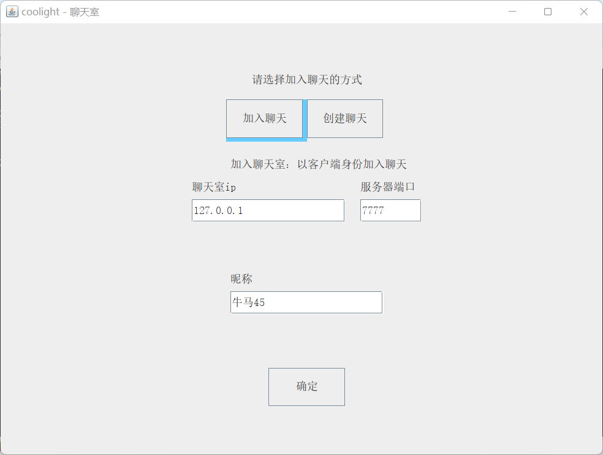
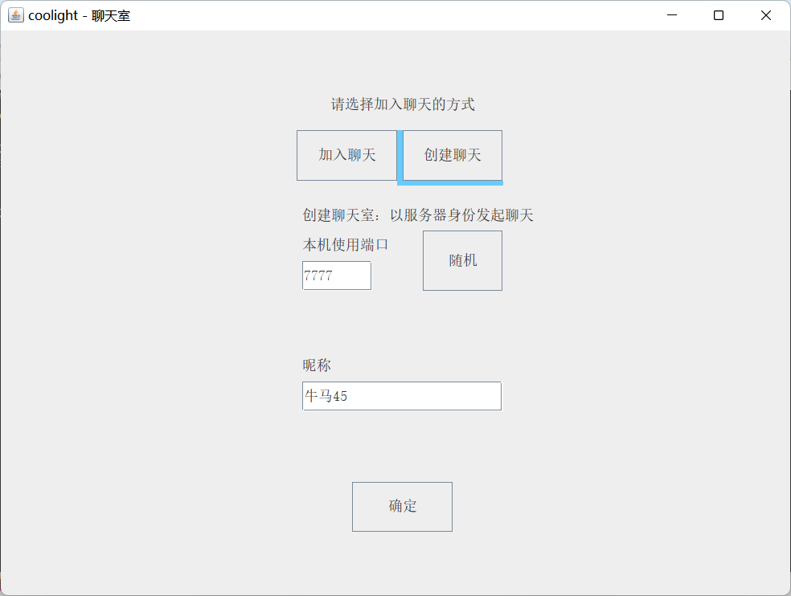
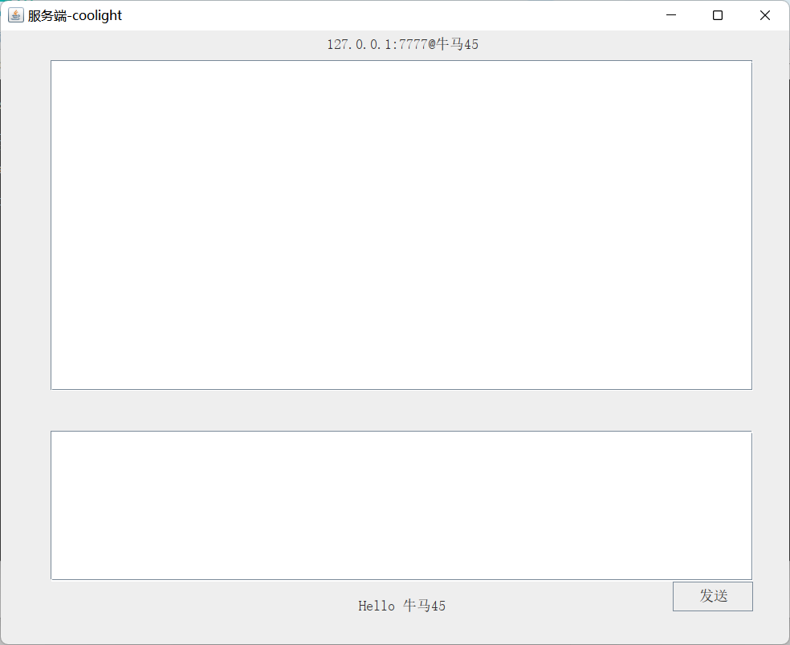
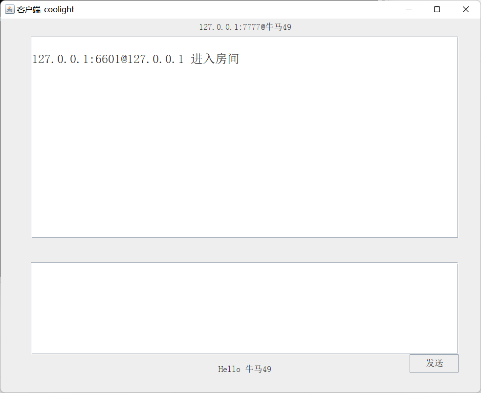

# 要求

- 编写一个 Java 应用程序，实现图形界面多人聊天室（多线程实现）

* * *

# 效果图

## 主界面 - 加入聊天室（作为客户端）

## 主界面 - 创建聊天室 （作为服务端）

## 服务端界面

## 客户端界面

* * *

# 源代码下载

若以下显示需要登录，请刷新页面或[点击此处](https://cloud.coolight.cool/#fileView&path=http%3A%2F%2Fcloud.coolight.cool%2F%3Fexplorer%2Fshare%2Ffile%26hash%3D4fb2VNGmdJb6nuqb0acaThLte2R9T45G9AcHXQnqwvpPsErIsvOJsGuK%26name%3D%2Fsocket%2520%2526%2520%25E5%259B%25BE%25E5%25BD%25A2%25E7%2595%258C%25E9%259D%25A2%25E5%25AE%259E%25E9%25AA%258C%2520-%2520%25E8%2581%258A%25E5%25A4%25A9%25E5%25AE%25A4.zip%26_etag%3D77c67)下载。

<iframe width="100%" height="800px" class="embed-show" src="https://cloud.coolight.cool/#fileView&amp;path=http%3A%2F%2Fcloud.coolight.cool%2F%3Fexplorer%2Fshare%2Ffile%26hash%3D0b5aAihV0h6YgbKionrcDfra2LcmPe8ZC6DJ6JuMUsfpRmuMN2N0g8js%26name%3D%2Fsocket%2520%2526%2520%25E5%259B%25BE%25E5%25BD%25A2%25E7%2595%258C%25E9%259D%25A2%25E5%25AE%259E%25E9%25AA%258C%2520-%2520%25E8%2581%258A%25E5%25A4%25A9%25E5%25AE%25A4.zip%26_etag%3D77c67" allowtransparency="true" allowfullscreen="true" webkitallowfullscreen="true" mozallowfullscreen="true" frameborder="0" scrolling="no"></iframe>
