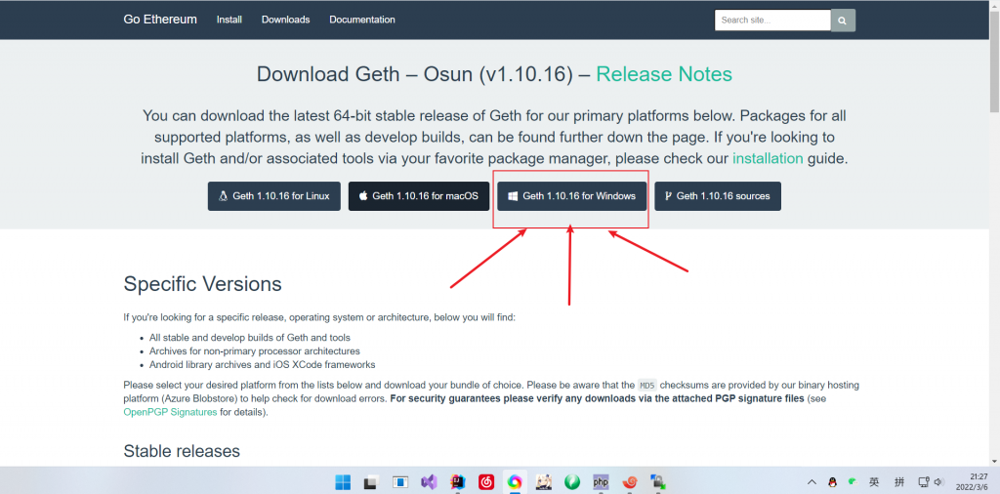
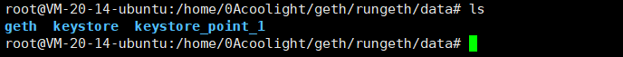

## 环境

- 腾讯云服务器 - linux - ubuntu - 20.04
    - 更新系统
        - $ apt update && apt upgrade -y
- 安装geth
    
    - 查看geth版本命令：
        - $ geth version
    
    - linux / ubuntu：
        - $ add-apt-repository -y ppa:ethereum/ethereum
        - $ apt update
        - $ apt install ethereum -y
        - geth版本：1.10.15-stable
    
    - win ：
        - [点击下载](https://geth.ethereum.org/downloads/)
        - 在链接中点击win版本下载安装即可。



- go （本文暂不需要用到）
    
    - 版本：1.17.5 linux/amd64
    
    - 查看go版本命令：$go version

* * *

## 注：

- 前置"$"的命令表示是在控制台里的命令
- 前置"/>"的命令表示在geth内的命令

* * *

## 私链搭建

- 创建一个geth数据的存放目录
    - $ mkdir rungeth
- 进入这个目录
    - $ cd rungeth
- 用geth命令创建一个账户
    - 在当前目录下创建文件夹data
        - $ sudo mkdir data
    - 创建账户
        - $ sudo geth --datadir ./data account new
        - 按照控制台的提示输入两次要给这个账户设置的密码
- 准备创世块文件 genesis.json 和 启动脚本文件 rungeth.sh
    - genesis.json
    - $ sudo vi genesis.json
    - 然后把下面的内容复制进去

```
{
   "config":{
      "chainId":7,
      "homesteadBlock":0,
      "eip150Block":0,
      "eip155Block":0,
      "eip158Block":0,
      "byzantiumBlock":0,
      "constantinopleBlock":0,
      "petersburgBlock":0,
      "istanbulBlock":0,
       "ethhash":{}
   },
   "alloc":{},
   "coinbase":"0x0000000000000000000000000000000000000000",
   "difficulty":"0x2",
   "extraData":"",
   "gasLimit":"0xffffffff",
   "nonce":"0x0000000000000042",
"mixhash":"0x0000000000000000000000000000000000000000000000000000000000000000", "parentHash":"0x0000000000000000000000000000000000000000000000000000000000000000",
   "timestamp":"0x00"
}
```

- rungeth.sh
    - $ sudo vi rungeth.sh
    - 然后把下面的内容复制进去

```
geth --datadir ./data --networkid 7  --http --http.addr 0.0.0.0 --http.vhosts "*" --http.api "admin,debug,web3,eth,txpool,personal,ethash,miner,net" --http.corsdomain "*" --snapshot --mine --miner.threads 1 --allow-insecure-unlock  console 2> 1.log
```

- 以上两个文件的中的参数说明见
    - [https://ansheng.me/geth-deploys-ethereum-private-chain-and-basic-operations/](https://ansheng.me/geth-deploys-ethereum-private-chain-and-basic-operations/)
- 初始化
    - $ sudo geth --datadir ./data init ./genesis.json
    - 执行成功则不会有Fatal报错，例如我的执行成功后只有一个警告

```
INFO [01-15|10:34:55.186] Maximum peer count                       ETH=50 LES=0 total=50
INFO [01-15|10:34:55.186] Smartcard socket not found, disabling    err="stat /run/pcscd/pcscd.comm: no such file or directory"
WARN [01-15|10:34:55.188] Sanitizing cache to Go's GC limits       provided=1024 updated=611
INFO [01-15|10:34:55.188] Set global gas cap                       cap=50,000,000
INFO [01-15|10:34:55.188] Allocated cache and file handles         database=/home/ubuntu/eth/rungeth/data/geth/chaindata cache=16.00MiB handles=16
INFO [01-15|10:34:55.213] Writing custom genesis block 
INFO [01-15|10:34:55.217] Persisted trie from memory database      nodes=1 size=149.00B time="45.27µs" gcnodes=0 gcsize=0.00B gctime=0s livenodes=1 livesize=0.00B
INFO [01-15|10:34:55.218] Successfully wrote genesis state         database=chaindata hash=6ef04e..bd9488
INFO [01-15|10:34:55.218] Allocated cache and file handles         database=/home/ubuntu/eth/rungeth/data/geth/lightchaindata cache=16.00MiB handles=16
INFO [01-15|10:34:55.231] Writing custom genesis block 
INFO [01-15|10:34:55.232] Persisted trie from memory database      nodes=1 size=149.00B time="40.785µs" gcnodes=0 gcsize=0.00B gctime=0s livenodes=1 livesize=0.00B
INFO [01-15|10:34:55.232] Successfully wrote genesis state         database=lightchaindata hash=6ef04e..bd9488
```

- 启动
    - $ sudo ./rungeth.sh
    - 启动后可以查看日志文件1.log， 或是控制台一直死循环输出"look for..."则说明创世块文件有问题，得重新搞一个。
    - 如果创世块文件内的参数和启动命令的参数有一些不兼容也会导致启动失败出现fatal错误提示。
    - 初次启动后得等一段时间才会开始挖矿，挖矿后才能部署合约，执行等等的操作。如果账户余额在增加就说明已经在挖矿了。

* * *

## 使用remix远程连接私链并部署合约

- 注意云服务器需要防火墙放行8545端口（远程连接以太坊端口）
- 打开remix网页版（打不开请挂梯子）
    - 中文版 [http://remix.app.hubwiz.com/#optimize=false&runs=200&evmVersion=null&version=soljson-v0.8.6+commit.11564f7e.js](http://remix.app.hubwiz.com/#optimize=false&runs=200&evmVersion=null&version=soljson-v0.8.6+commit.11564f7e.js)
    - 英文版 [http://remix.ethereum.org/#optimize=false&runs=200&evmVersion=null&version=soljson-v0.8.7+commit.e28d00a7.js](https://remix.ethereum.org/#optimize=false&runs=200&evmVersion=null&version=soljson-v0.8.7+commit.e28d00a7.js)
- 部署合约
    - 选择环境
        - 选择web3提供器
        - 然后在网址栏输入私链地址http//127.0.0.1:8545
            - 私链在本地则输入为127.0.0.1，如果在服务器上，请输入服务器公网ip
            - 后面的端口8545是geth的默认连接端口，如果没有修改过则为8545，有的话请看运行geth时的命令参数 --port
        - 然后即可想使用测试网络时一样的编译部署即可。

* * *

## 操作命令

- 列出所有账户
    - />eth.accounts
- 解锁账户
    - 如果要使用此账户转账或执行合约，则需要先给他解锁
    - 语法1：
        - />personal.unlockAccount(要解锁的账户, "密码", 解锁时间)
        - 示例：
            - />personal.unlockAccount(eth.accounts\[0\], ’123456‘, 100000)
    - 语法2：
        - />personal.unlockAccount(eth.accounts\[0\])
        - 这时控制台会询问你的密码，这样解锁显然好处是密码不会外显在控制台，但不能指定解锁时间，默认解锁时间为300
- 查看余额
    - />eth.getBalance(eth.accounts\[0\])
- 开始挖矿
    - />miner.start()
    - geth启动时，会自动启动挖矿，这时执行miner.start()则会返回null。
- 停止挖矿
    - />miner.stop()
- 转账
    - />eth.sendTransaction({from:user1, to:user2, value:web3.toWei(1, "ether")})
- 设置账户别名，方便命令输入
    - />user1 = eth.accounts\[0\]
- 创建账户
    - />personal.newAccount('密码')
- 设置挖矿账户
    - />miner.setEtherbase(eth.accounts\[0\])
- 查看挖矿账户
    - />eth.coinbase
- 查看区块高度
    - />eth.blockNumber
- geth远程连接私链
    - geth attach http://ip:8545
    - ip即为私链所在的服务器ip，如果是本地则为localhost
        - 本地：http://localhost:8545
        - 远程连接(举例ip为：100.10.1.0)：http://100.10.1.0:8545

* * *

## 常见问题

- Remix连接不了服务器的geth？
    - 检查服务器的防火墙是否放行8545端口。
    - 检查浏览器的地址栏Remix是不是用了https，如果是，改成http。
- 运行时错误提示：rpc未定义？
    - 目前geth要用http参数代替rpc参数，故请使用前面的rungeth.sh去执行
- Returned error: authentication needed: password or unlock
    - 需要先解锁账户
    - 解锁命令见"操作命令"中的"解锁账户"
- Status not available at the moment
    - 部署合约后，合约的status是上面的信息
    - 这是由于创世块文件中没有添加拜占庭和君士坦丁堡硬分叉语句导致的
    - 在创世块文件中添加下面两句，或使用"搭建私链"中的genesis.json文件

```
      "byzantiumBlock":0,
      "constantinopleBlock":0,
```

- Returned error: invalid opcode: SHR
    - 合约执行时提示错误
    - 请查看部署合约时，是否有上一个错误"Status not available at the moment"，有则解决上个错误即可。
- Fatal: Failed to write genesis block: database already contains an incompatible genesis block
    - 这是因为已经存在数据库了，不要重复去初始化创世块
    - 解决方法
        - 清空数据库
        - $geth removedb
        - 然后就可以执行初始化创世块了
    - 如果还不行：
        - 则进入我们一开始创建的data目录
        - 删除里面的geth目录：# rm -rf geth


