# [web3j]java使用web3j调用以太坊私链上的智能合约

## 环境

- 腾讯云服务器 - ubuntu - 20.04
- 前文已经介绍过如何安装：
    - geth版本 - 1.10.15-stable （[以太坊私链搭建](https://blog.coolight.cool/?p=145#环境)）
- web3j - 4.9.0 / 4.5.5

* * *

## web3j命令行工具

> \* 这个工具可以帮我们把合约生成为一个java类，供我们实现java调用智能合约。
> 
> \* [github项目链接](https://github.com/web3j/web3j/releases)

* * *

### 安装4.5.5以上的新版本（4.9）

- 注意：建议使用4.9，它在后面自动生成（Solidity 智能合约包装器）（Solidity smart contract wrappers）（即自动生成一个可以去调用智能合约的java类）时比较方便。
- linux / ubuntu系统下
    - 执行命令：
    - \# curl -L get.web3j.io | sh && source ~/.web3j/source.sh
- Win系统下
    - 打开powershell
        - 按下 Win + r 调出 运行窗口，输入powershell，然后回车
    - 执行命令：
        - Set-ExecutionPolicy Bypass -Scope Process -Force; iex ((New-Object System.Net.WebClient).DownloadString('https://raw.githubusercontent.com/web3j/web3j-installer/master/installer.ps1'))

* * *

### 安装4.5.5以及之前的旧版本

- 4.5.5以及之前的版本都有已经编译好的可以用
    - [https://github.com/web3j/web3j/releases/download/v4.5.5/web3j-4.5.5.zip](https://github.com/web3j/web3j/releases/download/v4.5.5/web3j-4.5.5.zip)
    - 下载后上传到服务器的/usr/local/sbin/中（或其他位置也是可以的），并在这个目录里新建一个web3j目录
        - 可以在windows系统中下载WinSCP，然后就可以远程链接服务器并管理其文件。

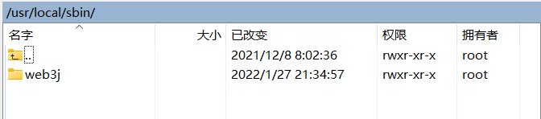

- - 解压刚刚下载的文件，到这个目录里。

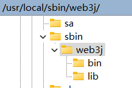

此时的目录结构

- - 然后进入bin目录，里面有2个文件:
        - web3j -linux下使用的命令行工具，可执行文件
        - web3j.bat - windows下使用的批处理文件
    - 配置web3j的环境变量
        - 如果不配置的话，就只能在这个bin目录里才能执行web3j相关的命令
        - 修改系统的配置文件
            - \# sudo vi /etc/profile
            - 在文件尾部添加如下代码
            - 如果你的web3j目录与本文不同，则需要修改下面的第一行为你的目录

```
web3j_home=/usr/local/sbin/web3j
PATH=$web3j_home/bin:$PATH
export PATH
```

- - 回到命令行，然后执行下面的命令使刚刚的修改生效，也可以直接重启。
        - \# sudo source /etc/profile
        - 如果是用ssh远程连接的话，此时还需要断开ssh，然后重新连。
    - 给可执行文件 /usr/local/sbin/web3j/bin/web3j添加可执行权限
        - \# sudo chmod 0755 web3j
    
    - 测试web3j
        - 命令行cd到随便其他目录中
        - 查看web3j版本
            - \# web3j version
        - 如果可以执行则说明配置成功了。

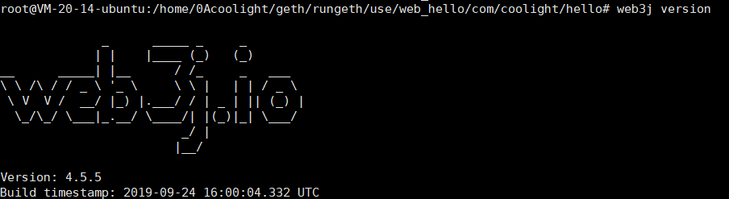

- - 在java中添加web3j的jar包路径
        - 本文的java是直接下载java压缩包，然后解压到服务器上并在/etc/profile中配置了环境变量
        - \# sudo vi /etc/profile
        - 找到JAVA\_HOME
            - 在vim中使用字符串匹配：
            - /JAVA\_HOME
        - 如果没有，可能你的java是直接apt install安装的，这样的话请百度如何添加jar包搜索路径

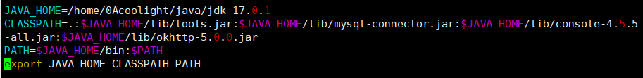

- - 修改CLASSPATH那一行，在原来的值后面添加
        - :/usr/local/sbin/lib/console-4.5.5-all.jar
        - 注意前面的冒号不要丢了！
- 智能合约 IDE - Remix
    
    - 中文版
        - [Remix - Ethereum IDE - 中文版](http://remix.app.hubwiz.com/#optimize=false&runs=200&evmVersion=null&version=soljson-v0.8.6+commit.11564f7e.js)
    
    - 英文版
        - [Remix - Ethereum IDE - http](http://remix.ethereum.org/#optimize=false&runs=200&evmVersion=null&version=soljson-v0.8.7+commit.e28d00a7.js)

* * *

### 在Maven中导入web3j

- 如果你的项目是在maven中，则需要做如下导入，以便其运行时可用。
- java

```
<dependency>
  <groupId>org.web3j</groupId>
  <artifactId>core</artifactId>
  <version>4.9.0</version>
</dependency>
```

- Android

```
<dependency>
  <groupId>org.web3j</groupId>
  <artifactId>core</artifactId>
  <version>4.9.0-android</version>
</dependency>
```

* * *

## 生成测试文件（java智能合约封装器）

### 准备sol，abi和bin文件

- 智能合约 hello.sol

```
// SPDX-License-Identifier: SimPL-2.0
pragma solidity >=0.4.0 <=0.7.0;

contract HelloWorld {
    uint count = 2022;
    
    function setCount(uint in_count) public
    {
        count = in_count;
    }

    function GetCount()public view returns(uint)
    {
        return count;
    }
}
```

- 把合约复制到Remix中

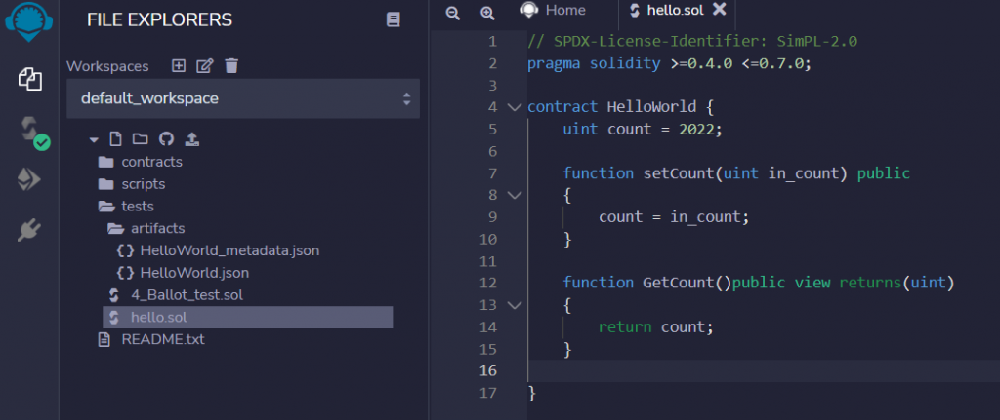

- 编译
    - 如图顺序编译后就可以获得图中 3 箭头指向的 ABI 和Bytecode


- 分别将ABI和Bytecode复制写入到服务器上的文件中
    - hello.abi 写入到 hello.abi
    - Bytecode 内容写入到 hello.bin


* * *

### 使用web3j把智能合约生成java类

```sh
web3j generate solidity -a hello.abi -b hello.bin -o ./web_hello -p com.coolight.hello
```

- 执行上述代码，将hello.abi 和 hello.bin 生成java类到web\_hello目录中
    - 注意：
        - generate 和 solidity 的位置不能错，generate得在solidity前面，否则会报错。
- 分析
    - \-a 后面接abi文件路径
    - \-b 后面接bin文件路径
    - \-o 输出路径
    - \-p 类所属的包名
    - 执行成功后就会有 ./web\_hello/com/coolight/hello/Hello.java

### 修改web3j自动生成的java类

- 注意：
    - web3j - 4.5.5需要做这一步。
    - web3j - 4.9跳过这一步，到 [测试调用智能合约](#测试调用这个智能合约)
- 修改生成文件Hello.java
    
    - 删除Hello.java中第一行 ： package com.coolight.hello
    
    - 在类中添加如下函数
    - 增加这段代码后，调用智能合约中的GetCount()时改为调用这个增加的函数GetCountReturn()
    - 由于GetCount()本应返回uint，但生成的代码中是返回TransactionReceipt，如果不加这个函数，到时候运行时会有麻烦。

```java
    //web3j自动生成的函数
    public RemoteFunctionCall<TransactionReceipt> GetCount() {
        final Function function = new Function(
                FUNC_GETCOUNT, 
                Arrays.<Type>asList(), 
                Collections.<TypeReference<?>>emptyList());
        return executeRemoteCallTransaction(function);
    }
    //增加的函数
    public RemoteFunctionCall<BigInteger> GetCountReturn() {
        final Function function = new Function(
                FUNC_GETCOUNT,
                Collections.emptyList(),
                Arrays.asList(new TypeReference<Uint256>(){}));
        return executeRemoteCallSingleValueReturn(function, BigInteger.class);
    }
```

- 分析这个要增加的函数
    - 第一行：`public RemoteFunctionCall<BigInteger> GetCountReturn()`
        - `RemoteFunctionCall<BigInteger>`就是这个函数的返回值类型，`<>`里面替换填入了合约函数的返回值类型对应java的类型。
        - 合约类型 --> java类型
        - uint --> BigInteger
        - string --> String
    - 第 二 ~ 五行：
        
        - 这几行实际上就是个Function()函数
            - Function("调用的合约函数名", 合约函数的传参列表， 合约函数的返回值列表)
        
        - FUNC\_GETCOUNT：
            - 这个是一个String ，存的是"GetCount"。
            - 在文件Hello.java里对应智能合约GetCount()的函数名的一个静态变量，可以在类的开头中找到。
            - 如果写智能合约中其他函数的对应的修改函数时，这个值是要修改的。
        - `Collections.emptyList()`：
            - 空列表
            - 这一行是要调用的合约函数的传参列表，因为GetCount()没有传参，所以这里是空。
        - `Arrays.asList(new TypeReference<Uint256>(){})`
            - 返回值列表
            - 如果是无返回值函数则如上，这行填入Collections.emptyList()
            - 注意`<>`中的数据类型是Uint256，因为合约函数GetCount()的返回值类型是uint。
            - 如果合约函数返回值类型是string，则应填入Utf8String。
    - 第六行：return executeRemoteCallSingleValueReturn(function, BigInteger.class)
        - 明显的返回语句，注意原本web3j自动生成的一般是executeRemoteCallTransaction(function)，两者不是一个函数，是要修改的！
        - 后面的BigInterger.class则跟着第一行的返回值类型而定，第一行如果是String，则改为String.class。
- 举例：
    - 例子1 - 为一个有传参String，有返回值String的合约函数增加一个返回值函数。
    - 合约函数为：`getUserEvent(string memory user_name) public view returns(string memory){}`

```java
    //web3j自动生成的函数
    public RemoteFunctionCall<TransactionReceipt> getUserEvent(String user_name) 
    {
        final Function function = new Function(
                FUNC_GETUSEREVENT,
                Arrays.<Type>asList(new org.web3j.abi.datatypes.Utf8String(user_name)),
                Collections.<TypeReference<?>>emptyList());
        return executeRemoteCallTransaction(function);
    }

    //增加的函数
    public RemoteFunctionCall<String> getUserEventReturn(String user_name) {
        final Function function = new Function(
                FUNC_GETUSEREVENT,
                Arrays.asList(new org.web3j.abi.datatypes.Utf8String(user_name)),
                Arrays.asList(new TypeReference<Utf8String>(){}));
        return  executeRemoteCallSingleValueReturn(function, String.class);
    }
```

- \-
    - 例子2：为一个有传参String，有返回值uint的合约函数增加一个返回值函数
    - 合约函数为：getUserLen(string user\_name) public view returns(uint){}

```java
    //web3j自动生成的函数
    public RemoteFunctionCall<TransactionReceipt> getUserLen(String user_name) {
        final Function function = new Function(
                FUNC_GETUSERLEN,
                Arrays.<Type>asList(new org.web3j.abi.datatypes.Utf8String(user_name)),
                Collections.<TypeReference<?>>emptyList());
        return  executeRemoteCallTransaction(function);
    }

    //增加的函数
    public RemoteFunctionCall<BigInteger> getUserLenReturn(String user_name) {
        final Function function = new Function(
                FUNC_GETUSERLEN,
                Arrays.asList(new org.web3j.abi.datatypes.Utf8String(user_name)),
                Arrays.asList(new TypeReference<Uint256>(){}));
        return executeRemoteCallSingleValueReturn(function, BigInteger.class);
    }
```

- 最终的Hello.java文件

```java
import java.math.BigInteger;
import java.util.Arrays;
import java.util.Collections;
import org.web3j.abi.TypeReference;
import org.web3j.abi.datatypes.Function;
import org.web3j.abi.datatypes.Type;
import org.web3j.abi.datatypes.generated.Uint256;
import org.web3j.crypto.Credentials;
import org.web3j.protocol.Web3j;
import org.web3j.protocol.core.RemoteCall;
import org.web3j.protocol.core.RemoteFunctionCall;
import org.web3j.protocol.core.methods.response.TransactionReceipt;
import org.web3j.tx.Contract;
import org.web3j.tx.TransactionManager;
import org.web3j.tx.gas.ContractGasProvider;

/**
 * <p>Auto generated code.
 * <p><strong>Do not modify!</strong>
 * <p>Please use the <a href="https://docs.web3j.io/command_line.html">web3j command line tools</a>,
 * or the org.web3j.codegen.SolidityFunctionWrapperGenerator in the 
 * <a href="https://github.com/web3j/web3j/tree/master/codegen">codegen module</a> to update.
 *
 * <p>Generated with web3j version 4.5.5.
 */
@SuppressWarnings("rawtypes")
public class Hello extends Contract {
    private static final String BINARY = "{\n"
            + "\t\"linkReferences\": {},\n"
            + "\t\"object\": \"60806040526107e660005534801561001657600080fd5b5060c7806100256000396000f3fe6080604052348015600f57600080fd5b506004361060325760003560e01c80630ab93971146037578063d14e62b8146053575b600080fd5b603d607e565b6040518082815260200191505060405180910390f35b607c60048036036020811015606757600080fd5b81019080803590602001909291905050506087565b005b60008054905090565b806000819055505056fea26469706673582212205f4a89ec8a6affc1a5970dfedafa55c57435fd83a7635cd22b59193fcb6e42e964736f6c63430007000033\",\n"
            + "\t\"opcodes\": \"PUSH1 0x80 PUSH1 0x40 MSTORE PUSH2 0x7E6 PUSH1 0x0 SSTORE CALLVALUE DUP1 ISZERO PUSH2 0x16 JUMPI PUSH1 0x0 DUP1 REVERT JUMPDEST POP PUSH1 0xC7 DUP1 PUSH2 0x25 PUSH1 0x0 CODECOPY PUSH1 0x0 RETURN INVALID PUSH1 0x80 PUSH1 0x40 MSTORE CALLVALUE DUP1 ISZERO PUSH1 0xF JUMPI PUSH1 0x0 DUP1 REVERT JUMPDEST POP PUSH1 0x4 CALLDATASIZE LT PUSH1 0x32 JUMPI PUSH1 0x0 CALLDATALOAD PUSH1 0xE0 SHR DUP1 PUSH4 0xAB93971 EQ PUSH1 0x37 JUMPI DUP1 PUSH4 0xD14E62B8 EQ PUSH1 0x53 JUMPI JUMPDEST PUSH1 0x0 DUP1 REVERT JUMPDEST PUSH1 0x3D PUSH1 0x7E JUMP JUMPDEST PUSH1 0x40 MLOAD DUP1 DUP3 DUP2 MSTORE PUSH1 0x20 ADD SWAP2 POP POP PUSH1 0x40 MLOAD DUP1 SWAP2 SUB SWAP1 RETURN JUMPDEST PUSH1 0x7C PUSH1 0x4 DUP1 CALLDATASIZE SUB PUSH1 0x20 DUP2 LT ISZERO PUSH1 0x67 JUMPI PUSH1 0x0 DUP1 REVERT JUMPDEST DUP2 ADD SWAP1 DUP1 DUP1 CALLDATALOAD SWAP1 PUSH1 0x20 ADD SWAP1 SWAP3 SWAP2 SWAP1 POP POP POP PUSH1 0x87 JUMP JUMPDEST STOP JUMPDEST PUSH1 0x0 DUP1 SLOAD SWAP1 POP SWAP1 JUMP JUMPDEST DUP1 PUSH1 0x0 DUP2 SWAP1 SSTORE POP POP JUMP INVALID LOG2 PUSH5 0x6970667358 0x22 SLT KECCAK256 0x5F 0x4A DUP10 0xEC DUP11 PUSH11 0xFFC1A5970DFEDAFA55C574 CALLDATALOAD REVERT DUP4 0xA7 PUSH4 0x5CD22B59 NOT EXTCODEHASH 0xCB PUSH15 0x42E964736F6C634300070000330000 \",\n"
            + "\t\"sourceMap\": \"75:231:0:-:0;;;115:4;102:17;;75:231;;;;;;;;;;;;;;;;\"\n"
            + "}\n";

    public static final String FUNC_GETCOUNT = "GetCount";

    public static final String FUNC_SETCOUNT = "setCount";

    @Deprecated
    protected Hello(String contractAddress, Web3j web3j, Credentials credentials, BigInteger gasPrice, BigInteger gasLimit) {
        super(BINARY, contractAddress, web3j, credentials, gasPrice, gasLimit);
    }

    protected Hello(String contractAddress, Web3j web3j, Credentials credentials, ContractGasProvider contractGasProvider) {
        super(BINARY, contractAddress, web3j, credentials, contractGasProvider);
    }

    @Deprecated
    protected Hello(String contractAddress, Web3j web3j, TransactionManager transactionManager, BigInteger gasPrice, BigInteger gasLimit) {
        super(BINARY, contractAddress, web3j, transactionManager, gasPrice, gasLimit);
    }

    protected Hello(String contractAddress, Web3j web3j, TransactionManager transactionManager, ContractGasProvider contractGasProvider) {
        super(BINARY, contractAddress, web3j, transactionManager, contractGasProvider);
    }

    public RemoteFunctionCall<TransactionReceipt> GetCount() {
        final Function function = new Function(
                FUNC_GETCOUNT, 
                Arrays.<Type>asList(), 
                Collections.<TypeReference<?>>emptyList());
        return executeRemoteCallTransaction(function);
    }

    // 新增获取返回值方法
    public RemoteFunctionCall<BigInteger> GetCountReturn() {
        final Function function = new Function(
                FUNC_GETCOUNT, 
                Collections.emptyList(),
                Arrays.asList(new TypeReference<Uint256>(){}));
        return executeRemoteCallSingleValueReturn(function, BigInteger.class);
    }

    public RemoteFunctionCall<TransactionReceipt> setCount(BigInteger in_count) {
        final Function function = new Function(
                FUNC_SETCOUNT, 
                Arrays.<Type>asList(new org.web3j.abi.datatypes.generated.Uint256(in_count)), 
                Collections.<TypeReference<?>>emptyList());
        return executeRemoteCallTransaction(function);
    }

    @Deprecated
    public static Hello load(String contractAddress, Web3j web3j, Credentials credentials, BigInteger gasPrice, BigInteger gasLimit) {
        return new Hello(contractAddress, web3j, credentials, gasPrice, gasLimit);
    }

    @Deprecated
    public static Hello load(String contractAddress, Web3j web3j, TransactionManager transactionManager, BigInteger gasPrice, BigInteger gasLimit) {
        return new Hello(contractAddress, web3j, transactionManager, gasPrice, gasLimit);
    }

    public static Hello load(String contractAddress, Web3j web3j, Credentials credentials, ContractGasProvider contractGasProvider) {
        return new Hello(contractAddress, web3j, credentials, contractGasProvider);
    }

    public static Hello load(String contractAddress, Web3j web3j, TransactionManager transactionManager, ContractGasProvider contractGasProvider) {
        return new Hello(contractAddress, web3j, transactionManager, contractGasProvider);
    }

    public static RemoteCall<Hello> deploy(Web3j web3j, Credentials credentials, ContractGasProvider contractGasProvider) {
        return deployRemoteCall(Hello.class, web3j, credentials, contractGasProvider, BINARY, "");
    }

    @Deprecated
    public static RemoteCall<Hello> deploy(Web3j web3j, Credentials credentials, BigInteger gasPrice, BigInteger gasLimit) {
        return deployRemoteCall(Hello.class, web3j, credentials, gasPrice, gasLimit, BINARY, "");
    }

    public static RemoteCall<Hello> deploy(Web3j web3j, TransactionManager transactionManager, ContractGasProvider contractGasProvider) {
        return deployRemoteCall(Hello.class, web3j, transactionManager, contractGasProvider, BINARY, "");
    }

    @Deprecated
    public static RemoteCall<Hello> deploy(Web3j web3j, TransactionManager transactionManager, BigInteger gasPrice, BigInteger gasLimit) {
        return deployRemoteCall(Hello.class, web3j, transactionManager, gasPrice, gasLimit, BINARY, "");
    }
}
```

* * *

## 测试调用智能合约

- 在Remix上部署合约
    - 操作过程在 文章 - 以太坊私链搭建 / 使用remix远程连接私链并部署合约
- 写一个java主类调用它
    - vi App.java
    - 对应你的链修改以下代码
        - 1 - 在Remix部署后的智能合约地址填入静态变量String contractAddress
        - 2 - 私链ID填入long chainId
        - 3 - 账户私钥文件名填入String fileName
            - 私钥一般在geth生成账户时指定的data目录中的

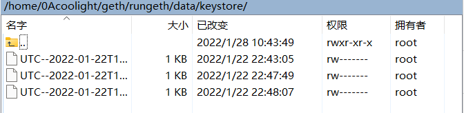

- \-
    - \-
        - 4 - 私链节点链接填入Web3j web3所在行
        - 5 - 把密码和私钥文件路径填入Credentials credentials所在行
        - 6 - 修改Hello contract所在行
            - 前面的Hello类型是合约名，因此如果你的合约是其他名字，则这个类型就要修改
        - 7 - 调用智能合约部分，使用的函数应修改为你所使用的智能合约中有的函数

```java
import java.math.BigInteger;

import org.web3j.crypto.Credentials;
import org.web3j.crypto.RawTransaction;
import org.web3j.crypto.TransactionEncoder;
import org.web3j.crypto.WalletUtils;
import org.web3j.protocol.Web3j;
import org.web3j.protocol.admin.Admin;
import org.web3j.protocol.admin.methods.response.PersonalUnlockAccount;
import org.web3j.protocol.core.DefaultBlockParameterName;
import org.web3j.protocol.core.methods.response.EthGetBalance;
import org.web3j.protocol.core.methods.response.EthGetTransactionCount;
import org.web3j.protocol.core.methods.response.EthSendTransaction;
import org.web3j.protocol.core.methods.response.TransactionReceipt;
import org.web3j.protocol.http.HttpService;
import org.web3j.tx.RawTransactionManager;
import org.web3j.tx.TransactionManager;
import org.web3j.tx.gas.ContractGasProvider;
import org.web3j.tx.gas.StaticGasProvider;
import org.web3j.utils.Convert;
import org.web3j.utils.Numeric;

public class App
{
   // 1 - 智能合约地址
   private static String contractAddress = "0x62f7ca98490B199857ccDf9e68C218DEf5000d50";

    //燃料消耗
    private static final BigInteger gasPrice = new BigInteger("100000");

    //消耗限制
    private static final BigInteger gasLimit = new BigInteger("300000");

    //2 - 私链ID
    private static final long chainId = 7;


   // main method
   public static void main(String[] args) {

        //3 - 私钥的文件名
        String fileName = "UTC--2022-01-22T14-43-04.829667987Z--7cbad9dbed1f3ef418de1f0c6412cfec197c7751";
        try{
        // 4 - 加载 web3j - 这里需要修改为你要连接的节点链接
       Web3j web3 = Web3j.build(new HttpService("http://localhost:8545/"));

        // 5 - 加载账号 - 第一个String是密码，第二个是私钥的文件路径
       Credentials credentials = WalletUtils.loadCredentials("123456", "/home/0Acoolight/geth/rungeth/data/keystore/" + fileName);
       // 6 - 加载合约
       Hello contract = Hello.load(
           contractAddress, web3,
           new RawTransactionManager(web3, credentials, chainId),
           new StaticGasProvider(gasPrice, gasLimit)
       );
       // say hello
       System.out.println("Welcome coolight - " + credentials.getAddress());
       // 7 - 调用智能合约
           BigInteger currentValue;
           // 获取Count的值 - 调用GetCountReturn() 相当于合约中的GetCount()
           currentValue = contract.GetCountReturn().send();
           System.out.println(currentValue);
           // 修改Count的值 - 调用setCount()
           contract.setCount(new BigInteger("1")).send();
           // 获取Count的值
           currentValue = contract.GetCountReturn().send();
           System.out.println(currentValue);
       } catch (Exception e) {
           e.printStackTrace();
       }
   }
}
```

- 编译
    - \# javac Hello.java App.java

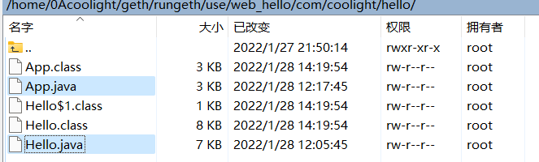

- 运行
    
    - 注意私链geth节点要在挖矿运行中，并且使用的账户要解锁
        - 操作见文章 - 以太坊私链搭建
    
    - \# java App
    - 稍作等待，即可运行完成

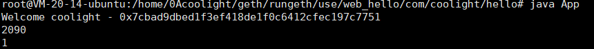

## 本文所用文件打包

如果显示需要登录，请刷新页面或[点击此处](https://cloud.coolight.cool/#fileView&path=http%3A%2F%2Fcloud.coolight.cool%2F%3Fexplorer%2Fshare%2Ffile%26hash%3D1137m4V4f14R9n4N9QrIkdHDOmpAPfE3SMhvkr9ZpJsZUm84I_YXTwD0%26name%3D%2Fhello.zip%26_etag%3Dc67e1)下载

## 常见问题

- 节点意外关闭后再重新连接，已部署的合约能调用函数，但返回值一直是0？
    - 可能这是因为意外关闭时导致区块回滚，因此合约其实已经不在链上了，得重新部署，下次注意关闭节点要执行exit，而不是直接关闭ssh连接等方式。
- 利用web3j工具把sol转换java编译报错: Unsupported type encountered: tuple？
    - 目前Java SDK还不支持`struct`类型的`sol`到`Java`的转换，要等待后续版本支持。
- 利用web3j工具把sol转换java编译报错：Unknown options: '-a', 'SolHello.abi', '-b', 'SolHello.bin', '-o', './webtest', '-p', 'com.coolight.hello'
    - 检查命令是不是敲错了。
    - 检查命令中的 generate 是否在 solidity 前面，如果在其后面则会报错。
- 修改web3j生成的有返回值（String）函数时编译错误：
    - 报错类型 - 1：error: type argument String is not within bounds of type-variable T
        - 意思是String类型不能用在这个模板里
        - 如果是在修改`Arrays.asList(new TypeReference<T>(){})`的话，可以把T替换为Utf8String（所在包见文章末尾），然后返回值等其他地方保持String即可
        - 如下图中第一个函数是web3j自动生成的，第二个函数是我修改增加的。

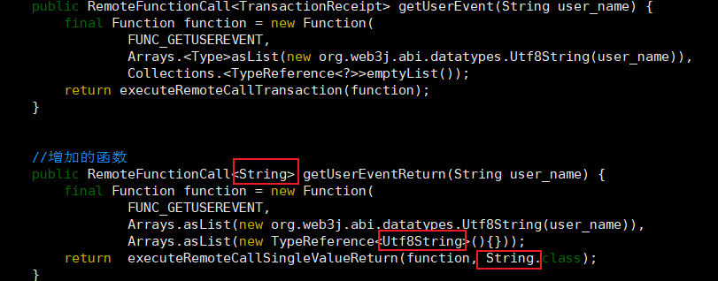

- \-
    - 报错可能 - 2：Unable to convert response: xxxxxxx to expected type: Utf8String
        - 无法将返回内容转换为Utf8String类型。
        - 修改方法同上一个问题（error: type argument String is not within bounds of type-variable T），仅在Arrays的那一行修改为Utf8String，其他的改为String即可。
- 运行时，执行调用有返回值的智能合约函数时报错：Empty value (0x) returned from contract
    
    - 合约函数返回值为空。
    
    - 这个原因可能是你没有修改web3j生成的函数的返回值部分，因此函数调用后返回值为空。
    - 请按 本文 / 使用web3j把智能合约生成java类 进行修改。

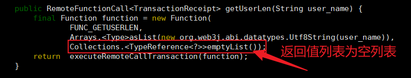

- 调用函数后返回值是一串很长的合约信息？

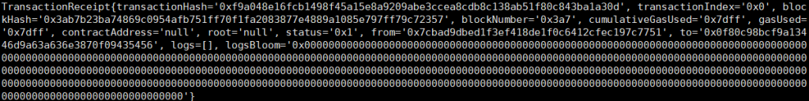

- \-
    - 可能因为是没有对web3j生成的函数做修改，函数的返回值类型是TransactionReceipt，然后直接将它转String后输出了。

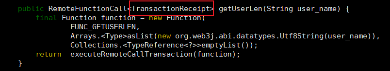

- \-
    - 请按 本文 / 使用web3j把智能合约生成java类 进行修改。

* * *

## 常见数据类型所在包

- BigInteger
    - java.math.BigInteger
- Utf8String
    - org.web3j.abi.datatypes.Utf8String （需要下载web3j）
- HttpService
    - org.web3j.protocol.http.HttpService （需要下载web3j）
