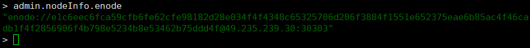
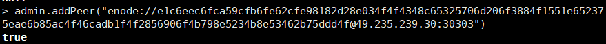
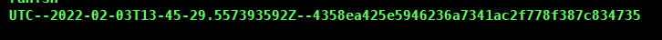

## 环境

- 主节点：腾讯云服务器 - linux - ubuntu - 20.04
- 副节点：腾讯云服务器 - linux - ubuntu - 18.04
- [安装geth](http://blog.coolight.cool/?p=145#环境)
- [搭建以太坊私链](https://blog.coolight.cool/?p=145#私链搭建)

* * *

## 想法

- 由于挖矿很费性能，对于手上的垃圾服务器来说，要挂nginx和tomcat还要挖矿实在是难为它了。
- 因此想把挖矿的任务分给另一台服务器。
- 目标效果即为：
    - 副节点连上主节点，两者的数据同步。
    - 主节点关闭挖矿，节省性能，由副节点挖矿。

* * *

## 开搞

### 让副节点连上主节点

- 注意：
    - 不要在副节点上直接打开geth执行
        - $ geth attach http://your\_ip:8545
    - 这样相当于远程连接控制主节点了，就像我们在windows上用ssh远程连接linux去控制geth挖矿的开启和关闭一样，链上仍然只有主节点一个，只不过有主节点本机和另一台机可以去控制主节点。
- 副节点需要和主节点用一样的创世块文件
    - 这里就用和之前的文章（[以太坊私链搭建](https://blog.coolight.cool/?p=145#私链搭建)）所用的创世块一致
    - genesis.json

```
{
   "config":{
      "chainId":7,
      "homesteadBlock":0,
      "eip150Block":0,
      "eip155Block":0,
      "eip158Block":0,
      "byzantiumBlock":0,
      "constantinopleBlock":0,
      "petersburgBlock":0,
      "istanbulBlock":0,
       "ethhash":{}
   },
   "alloc":{},
   "coinbase":"0x0000000000000000000000000000000000000000",
   "difficulty":"0x2",
   "extraData":"",
   "gasLimit":"0xffffffff",
   "nonce":"0x0000000000000042",
"mixhash":"0x0000000000000000000000000000000000000000000000000000000000000000", "parentHash":"0x0000000000000000000000000000000000000000000000000000000000000000",
   "timestamp":"0x00"
}
```

- 还要准备启动脚本，这里也保持和主节点一致
    - rungeth.sh

```
geth --datadir ./data --networkid 7  --http --http.addr 0.0.0.0 --http.vhosts "*" --http.api "admin,debug,web3,eth,txpool,personal,ethash,miner,net" --http.corsdomain "*" --snapshot --mine --miner.threads 1 --allow-insecure-unlock  console 2> 1.log
```

- 在副节点所在机新建一个用户
    - $ geth --datadir ./data account new
- 然后在副节点所在机初始化创世块
    - $ sudo geth --datadir ./data init ./genesis.json
- 启动geth
    - $ sudo ./rungeth.sh
    - 如果是在一台机子上搞两个节点，则要修改他们的运行端口，使之不要重复，不然其中一个会启动不起来。
- 至此，副节点就部署完成了，接下来要在主节点中添加副节点。
    - 首先查看一下副节点的enode
        - \> admin.nodeInfo.enode



- \-
    - 在主节点添加副节点的enode
        - \>admin.addPeer("encode")



- 查看是否添加成功
    - 方法1：
        - 直接对比两者的块高度看看是否相等，如果块比较多，可能需要等待一下同步。
        - \> eth.blockNumber
    - 方法2：
        - net.peerCount
        - admin.peers
- 让副节点代替主节点挖矿
    - 把主节点挖矿停掉，在主节点所在机执行：
        - \> miner.stop()
    - 让副节点挖矿，在副节点所在机执行：
        - \> miner.start()

* * *

### 修改java程序连接副节点

- 上一篇的文章：[java使用web3j调用以太坊私链上的智能合约](https://blog.coolight.cool/?p=156)
    - 上文中讲到，java程序连接单节点（主节点）的私链去调用智能合约。
- 注意：
    - 如果不修改的话，此时主节点虽然开着geth，但关闭了挖矿，只能和副节点进行数据同步，而连接主节点发送的请求都是不能执行的。
    - 而且主节点的geth不能关闭，否则副节点也会出问题。
    - 不要在开着geth的时候直接关闭ssh窗口，否则会导致链的数据丢失，要在geth里执行> exit 退出。
- 复制副节点的用户私钥文件到java程序执行的机子上，



- 修改java程序使用这个私钥文件，并把用户地址也改成这个私钥文件的用户。
- 修改java程序连接副节点所在的服务器ip地址。
- 到这里就可以了，如此就实现了让副节点代替主节点挖矿的任务了。

* * *

## 存在的问题

- 主节点的账号是不能在连接副节点后使用的，也就是说，两个节点实际上只有链上的数据是互通的，账号是不互通的。因此java程序连接副节点时需要修改。
- 此时主节点只能同步数据，不能挖矿，连接到主节点后发送的交易并不会由副节点代替挖矿完成。
