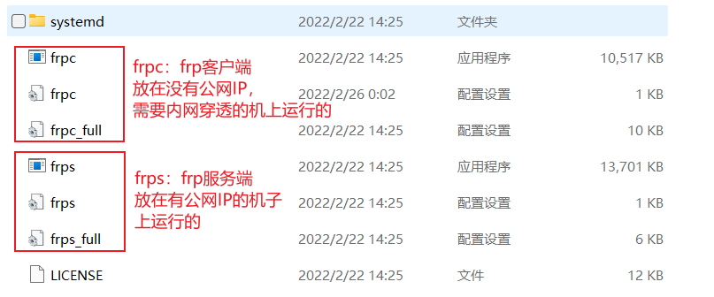
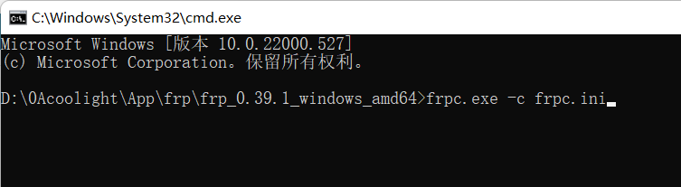

# [frp+nginx]实现校园网内网穿透提供http服务

## 注意

- 如果你遇到了不符合预期的效果，强烈建议先清理一下浏览器的缓存。
- 建议使用不怎么使用的浏览器来测试，就可以随意清理缓存而不影响日常使用。
- 如果win系统有edge而你找不到的话：
    - win + r调出运行窗口
    - 输入msedge，然后回车即可调出edge。


* * *

## 环境

- Win11（无公网IP，frp客户端）
- 腾讯云服务器 Ubuntu20.04 - Linux（有公网IP，frp服务端）
- nginx
    
    - [安装/配置教程](https://blog.coolight.cool/?p=216)
    
    - ubuntu上安装的版本：1.18.0
        - 实际上没有nginx也可以实现内网穿透，但后续在这台服务器上同时跑tomcat等其他服务时比较麻烦，所以用nginx来当个管理者，把80端口（http的默认端口，一般http链接不写端口即为访问80端口）上不同的链接转发到服务器上不同的端口。
    
    - win11上安装的版本 ：1.20.2
        - 可选，客户端待穿透端口无所谓是啥，能提供服务即可，可以是nginx，tomcat，ssh等等。
- frp - 版本：0.39.1
    - 建议两端的版本一致。

* * *

## 目标效果

- 存在问题：
    - win11所在机比云服务器强很多，在它上面运行nginx在80端口提供网络服务，但它处在校园网里没有公网IP，一般只能在WIFI等局域网内访问到，出门就不行了。
    - 云服务器Linux有公网IP，但性能弱，所以希望把服务放在Win11所在机上跑。
- 假设：
    - 有一个能用的域名：abc.coolight.com。
    - 有一台性能比较弱的云服务器Linux；安装了 nginx 和 frp；假设公网IP为100.7.7.7。
    - 有一台性能比较强的电脑（安装了Win11），日常使用，并且能跑web服务；安装了 nginx 和 frp；无公网IP。
- 期望
    - 当我在我们访问abc.coolight.com时，DNS解析到我的云服务器（100.7.7.7）
    - 云服务器上的nginx 把这个请求转给 frp服务端。
    - 云服务器的frp服务端 把请求转给 Win的frp客户端。
    - Win的frp客户端 把请求转给 Win上的nginx。
    - Win上的nginx把网页返回回去，或再转给Win上的其他端口。
    - 由于我的习惯，会想把所有请求让frpc转发到nginx，然后在转给tomcat等其他程序。
        - 实测后是可行的，frpc转发后，win上的nginx依然可以在同一端口（80），通过判断域名来区分是否需要再转发等操作。


* * *

## 配置Linux服务端frps

- [下载frp的服务端frps](https://github.com/fatedier/frp)


- 下载后上传压缩包到linux中，可以使用WinSCP。
- 解压文件
    - tar -zxvf 文件名
- 解压后可以把里面的frpc部分删除，也可以保留，对本文的使用无影响。
    - 注意：



- 配置服务端配置文件：frps.ini

```
[common]
bind_addr = 0.0.0.0              #允许客户端连接的IP；0.0.0.0表示接受所有来源
bind_port = 7000                 #frps监听端口，等待客户端来连接的端口
token = cool                     #相当于连接的密码

vhost_http_port = 10080          #服务器http服务端口

                                 #web后台管理是可以不要的
dashboard_port = 7500            #frps后台web管理端口
dashboard_user = cool            #后台管理的用户名
dashboard_pwd = coolpw           #后台管理的密码
```

- 运行frps，等待客户端连接，注意ssh窗口不能关闭。
    - \# frps -c frps.ini
    - 后续如果想关闭ssh窗口后也保持frps的运行的话请参考：
        - [使用scr**\[screen\]Linux上保持程序在关闭ssh窗口后继续运行**](https://blog.coolight.cool/?p=228)
- 注意：
    - 云服务器需要防火墙放行配置文件中设置的7000端口用于客户端连接。
    - （可选）放行7500端口用于访问后台管理平台
        - 直接在浏览器中输入：http://公网IP:7500。
        - 然后输入配置文件中的后台管理的用户名和密码。

* * *

## 配置Win客户端frpc

- [下载frp的win版本](https://github.com/fatedier/frp)
- 解压，并进入文件夹
- 配置frp客户端配置文件frpc.ini
    - 注意最后的 custom\_domains ：
        - 这个域名一般是需要已经备案了能用的，也就是在公网中访问这个域名会由DNS解析到你服务端的服务器去。
        - 支持通配符 \* 。
        - 支持指定多个域名，用英文的逗号隔开。
    - 如果你复制以下代码并修改配置完成后报错，请先删除注释后尝试

```
[common]
server_addr = 1.2.3.4     #服务端的机子的公网IP
server_port = 7000        #服务端的frps监听端口，需要和上面frps.ini中配置的一致
token = cool              #连接密码，需要和上面frps.ini中配置的一致

[ssh]
type = tcp                #类型
local_ip = 127.0.0.1      #要转发的端口所在的Ip
local_port = 22           #要转发的端口
remote_port = 10022       #转发到服务端的端口号

[http]
type = http               #类型
local_port = 80           #要转发的本地端口
custom_domains= *.frp.coolight.cool  #对应的域名，改成你的Linux云服务器能用的域名
```

- 运行客户端frpc去连接服务端
    - 如图，启动cmd。


- \-
    - 输入 frpc.exe -c frpc.ini回车即可运行



- \-
    - 注意运行后cmd窗口不能关闭。
    - 如图，运行后的提示只有 \[I\] 即为成功。
    - 有 \[W\] 的话就需要百度查看相关解决方法。


- \-
    - 后续如果需要关闭cmd窗口后仍然可以运行则可以考虑[注册为windows系统服务](https://blog.coolight.cool/?p=263)。
- 至此，frp就连接成功了。
    - linux的10080端口的请求会被转发到Win的80端口上。
        - 需要访问时的域名为配置中的\*.frp.coolight.cool
    - linux的10022端口的请求会被转发到Win的22端口上。

* * *

## 配置Linux上的nginx

> 接下来就是要配置linux云服务器的nginx，来监听\*.frp.coolight.cool的请求，并转发给Linux上的10080端口，后再由frps转发给frpc，即到达Win的80端口。

- cd到nginx的配置文件目录
    - \# cd /etc/nginx/conf.d
- 创建一个监听 \*.frp.coolight.cool 的配置文件
    - \# vi \_.frp.cooligth.cool.conf
        - 由于 \* 有特殊意义，不建议作为文件名，故使用 \_ 代替。
    - 如果你复制以下代码并修改配置完成后报错，请先删除注释后尝试

```
    # frp的接收http请求的反向代理
    server {
        listen 80;
        server_name *.frp.coolight.cool;        # 域名，需要改成你的

        location / {
            proxy_pass http://127.0.0.1:10080;  #你的frps监听端口
            proxy_set_header Host $host:80;
            proxy_set_header X-Real-IP $remote_addr;
            proxy_set_header X-Forwarded-For $proxy_add_x_forwarded_for;

            #proxy_set_header Upgrade $http_upgrade;
            #proxy_set_header Connection "upgrade";

            proxy_connect_timeout 7d;
            proxy_send_timeout 7d;
            proxy_read_timeout 7d;

            }


        # 防止爬虫抓取
        if ($http_user_agent ~* "360Spider|JikeSpider|Spider|spider|bot|Bot|2345Explorer|curl|wget|webZIP|qihoobot|Baiduspider|Googlebot|Googlebot-Mobile|Googlebot-Image|Mediapartners-Google|Adsbot-Google|Feedfetcher-Google|Yahoo! Slurp|Yahoo! Slurp China|YoudaoBot|Sosospider|Sogou spider|Sogou web spider|MSNBot|ia_archiver|Tomato Bot|NSPlayer|bingbot")
            {
                return 403;
            }
}
```

- 保存退出后让nginx重新加载配置文件
    - \# nginx -s reload
- 这样操作后，Linux云服务器就不需要在云防火墙放行10080端口。

* * *

## 测试运行

- 让Win的nginx跑起来
    - 进入Win的nginx所在目录。
    - 双击nginx.exe即可。
- 假如你的Win上的nginx刚刚安装，还没有配置过，那么现在在公网访问域名（假设为hello.frp.coolight.cool）时，就会出现nginx的默认页面。


* * *

## 配置Win的nginx

> 现在需要让win的nginx通过判断域名的不同，来执行不同的操作（直接返回静态资源，或者再进行转发）。

- 配置方法和Linux上是一样的，需要修改nginx的配置文件，然后执行nginx -s reload刷新即可。

* * *

## nginx详细安装配置教程

> 参考文章：**[\[nginx\]安装配置（ubuntu/windows）](https://blog.coolight.cool/?p=216)**
