## nginx

> 这是一个使用c发高性能免费开源软件，被用于网络中的负载均衡，端口转发，反向代理等。
> 
> 我常用它来监听80端口中的http请求，通过判断这些http请求的域名，

* * *

## ubuntu环境

- 腾讯云 - linux - ubuntu20.04
- nginx版本：1.18.0

* * *

### 下载安装nginx

- 如果想下载压缩文件的话参考本文后面的 Win环境安装nginx
- 直接执行：# sudo apt-get install nginx
- 完成后，nginx的配置文件目录在 /etc/nginx 里面

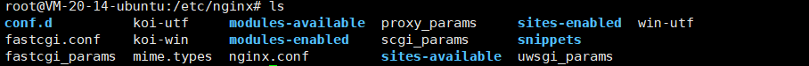

- 目录结构
    - conf.d
        - 存放nginx的server配置文件，在这里面可以配置nginx去监听不同端口，对不同域名进行不同的响应操作。
    - nginx.conf
        - nginx的配置文件
        - 里面有对nginx的相关配置。
        - 可以在这里面写同conf.d存放的文件相同的东西，因为nginx.conf里面就是会include导入conf.d目录下的配置文件。

* * *

### 编写server配置文件

#### 直接由nginx提供服务

- \-
    
    - 一般就是静态资源，如html文件，文件下载等
    - 在conf.d目录下
    
    - 新建一个后缀为conf的文件
    - 这里以域名www.coolight.cool为例，让nginx监听80端口，如果http请求的域名是www.coolight.cool，就去访问/home/0Acoolgiht/nginx/root目录下的index.html或index.htm文件。
    - 文件名 www.coolight.cool.conf
    - \# vi www.coolight.cool.conf

```
server {
        listen       80;                  #监听端口
        server_name  www.coolight.cool;   #域名
        #-------nginx----------
        location / {                      #链接的后半部分为空时
           root /home/0Acoolight/nginx/root;  #访问的文件所在目录
           index index.html index.htm;        #访问的文件名
        }

        location /hello {
           root /home/0Acoolight/nginx/root/hello;  #访问的文件所在目录
           index index.html index.htm;        #访问的文件名
        }
}
```

- \-
    
    - 端口80
        - 因为http请求如果不写端口，默认就是访问80端口
        - 也就是说，访问 http://www.coolight.cool/ 时
        - 其实就是 http://www.coolight.cool:80/
    
    - 注意这一行： location / { #链接的后半部分为空时
        - 这里的 / 是请求链接中域名后面的部分，这里写 / 就表示当我访问 http://www.coolight.cool/ 时，就去调用/home/0Acoolight/nginx/root/index.html。
        - 如果是下面那样：location /hello { ，则是当我访问 http://www.coolight.cool/hello 时，去调用 /home/0Acoolight/nginx/root/hello/index.html。

* * *

#### nginx提供php服务

- \-
    - \-

* * *

#### nginx转发给其他端口

- \-
    - 这里以tomcat为例，nginx监听tomcat.coolight.cool，然后转发给本地的tomcat（8080端口）

```
server {
        listen       80;
        server_name  tomcat.coolight.cool;
        #-------Tomcat---------
        location / {
            proxy_pass  http://localhost:8080/;

            proxy_set_header        Host            $host;
            proxy_set_header        X-Real-IP       $remote_addr;
            proxy_set_header        X-Forwarded-For $proxy_add_x_forwarded_for;
            
            client_max_body_size 10m;
            client_body_buffer_size 128k;
            proxy_connect_timeout 90;
            proxy_send_timeout 90;
            proxy_read_timeout 90;
            proxy_buffer_size 4k;
            proxy_buffers 4 32k;
            proxy_busy_buffers_size 64k;
            proxy_temp_file_write_size 64k;
        }
}
```

- \-
    - proxy\_set\_header
        - 这个参数是让nginx把一些链接的参数加到这个链接中一起转发过去
        - 因为转发后，对于接收方（tomcat），其实是本地的nginx在访问tomcat，这样的话，tomcat会认为访问者（nginx）的IP就是本机127.0.0.1，因此nginx在转发时，需要把真实的IP一起发过去。
        - Host
            - 这个的作用是把原http请求的Host字段放到转发的请求中去
            - 如果不加这个，nginx转发后的请求里就不会有host字段
            - 服务器（程序）是靠这个字段来判断你这个请求的域名
        - X-Real-IP
            - 这个其实意思很明显了，就是请求的真实IP发过去，不然服务器（程序）获取到的IP就是本机127.0.0.1
        - X-Forwarded-For
            - 表示经过的代理的IP。
            - 如果一个 HTTP 请求到达服务器之前，经过了三个代理 Proxy1、Proxy2、Proxy3，IP 分别为 IP1、IP2、IP3，用户真实 IP 为 IP0，那么按照 XFF 标准，服务端最终会收到以下信息：
            - X-Forwarded-For: IP0, IP1, IP2

* * *

## Win环境

- Win11
- nginx版本：1.20.2

### 下载安装nginx

- [下载nginx的Win版](http://nginx.org/en/download.html)

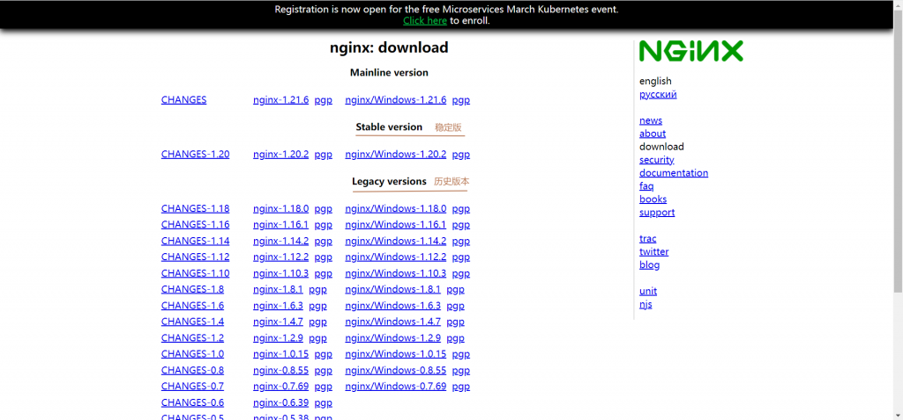

- 下载后解压zip，并转到解压目录中

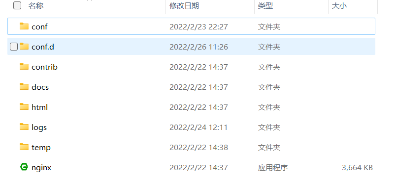

- 测试运行
    - 双击目录里的nginx.exe程序运行
        - 成功启动的话，是没有提示的。
    - 然后去浏览器中输入 http://127.0.0.1
    - 如果出现nginx的欢迎页面就是成功了。

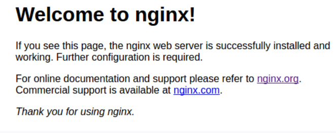

- win下nginx的目录结构和ubuntu基本一致，如果没有conf.d目录，就新建一个。
- 然后编辑 conf/nginx.conf 文件
    - 找到 http{} 代码段

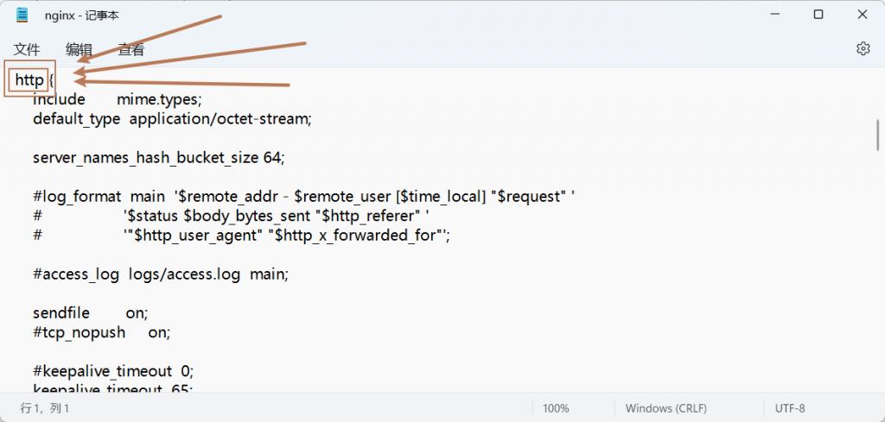

- \-
    - 找到这一段的末尾，加上一行：
        - include D:/0Acoolight/App/nginx/nginx-1.20.2/conf.d/\*.conf;
        - 注意include后面的路径需要改成你的nginx的安装目录
        - 这一句的意义就是让nginx去导入你放在nginx安装目录下的conf.d文件夹下所有conf后缀的文件。
- 然后在conf.d目录里，就和ubuntu中一样，新建后缀为conf的配置文件，然后在命令行让nginx重新读取配置文件即可。
    - 直接在这个目录下右键，新建一个文本文件

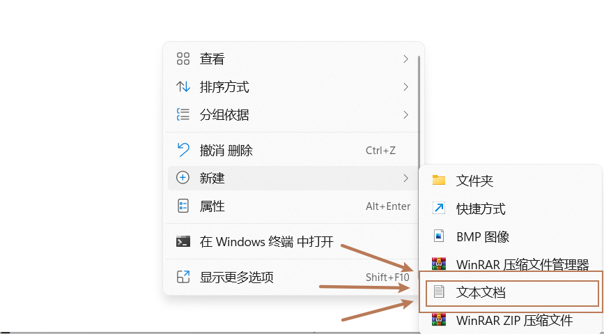

- \-
    - 举例，监听80端口域名为tomcat.coolight.cool的请求，然后转发给tomcat（8080端口）。
    - 写入如下内容，注意里面的域名 tomcat.coolight.cool 需要改成你的。

```
server {
        listen       80;
        server_name  tomcat.coolight.cool;
        #-------Tomcat---------
# [nginx]安装配置（ubuntu/windows）
        location / {
            proxy_pass  http://localhost:8080;
            proxy_set_header        Host            $host;
            proxy_set_header        X-Real-IP       $remote_addr;
            proxy_set_header        X-Forwarded-For $proxy_add_x_forwarded_for;
            client_max_body_size 10m;
            client_body_buffer_size 128k;
            proxy_connect_timeout 90;
            proxy_send_timeout 90;
            proxy_read_timeout 90;
            proxy_buffer_size 4k;
            proxy_buffers 4 32k;
            proxy_busy_buffers_size 64k;
            proxy_temp_file_write_size 64k;
        }
}
```

- \-
    - 然后在记事本另存为tomcat.coolight.cool.conf，注意后缀一定是要conf。
    - 如果不 另存为 的话，这个文件是以txt结尾的。

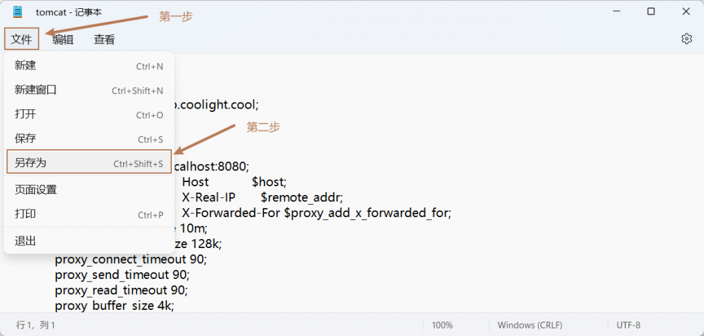

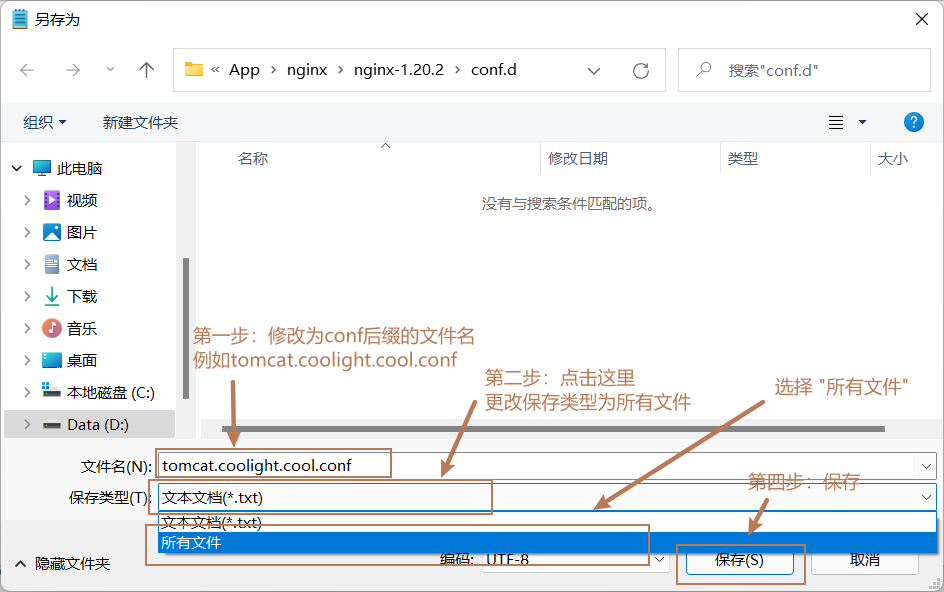

- \-
    - 让nginx重新读取配置文件
        - 回到nginx安装目录


- \-
    - \-
        - 输入 nginx -s reload 回车执行。
        - 如果执行后没有提示就是成功了

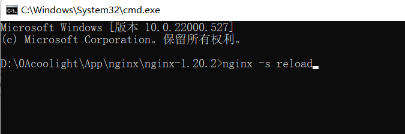

- 测试运行
    - 在浏览器输入刚刚在配置文件中写的域名
    - http://tomcat.coolight.cool

* * *

## 常用命令

- 启动nginx，直接到nginx的安装目录执行：
    - ./nginx
- 快速停止nginx
    - nginx -s stop
- 完整有序的停止nginx，这个命令会等待所有请求结束后再关闭
    - nginx -s quit
- 重新加载配置文件
    - nginx -s reload
    - 这个需要nginx在运行中，并且执行后nginx也是在运行中。
- 检查配置文件是否有语法错误
    - nginx -t
- 检查指定的配置文件是否有语法错误
    - nginx -t -c /etc/nginx/conf.d/nginx.conf

* * *

## 常见问题

- Win：'nginx' 不是内部或外部命令，也不是可运行的程序或批处理文件。
    - ubuntu：Command 'nginx' not found。
    - nginx命令未找到，明明已经安装了。
    - 如果你没有配置环境变量的话，需要cd到nginx的安装目录下，才能执行nginx，不然系统会找不到nginx这个命令。

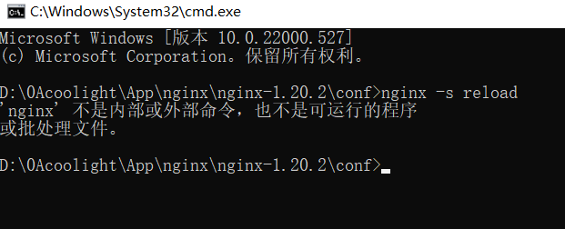

- unknow directive “xxx” in xxx:x
    - 配置文件写错了。
    - 到提示的文件，和行数中检查。

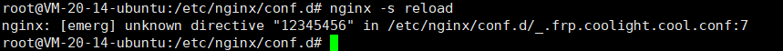

- nginx: \[warn\] conflicting server name "xxx" on 0.0.0.0:80, ignored
    - 监听服务监听的域名重复了，也就是说，你所有的文件中，server的（域名 + 端口）不能一样，一样的话请写到一起。


- \[error\] CreateFile() "xxx/nginx.pid" failed (2: The system cannot find the file specified)
    - 找不到nginx的pid文件。
    - 一般就是nginx没有在运行中，请先启动nginx。

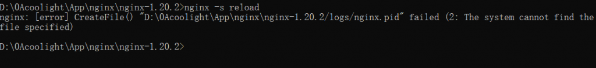
