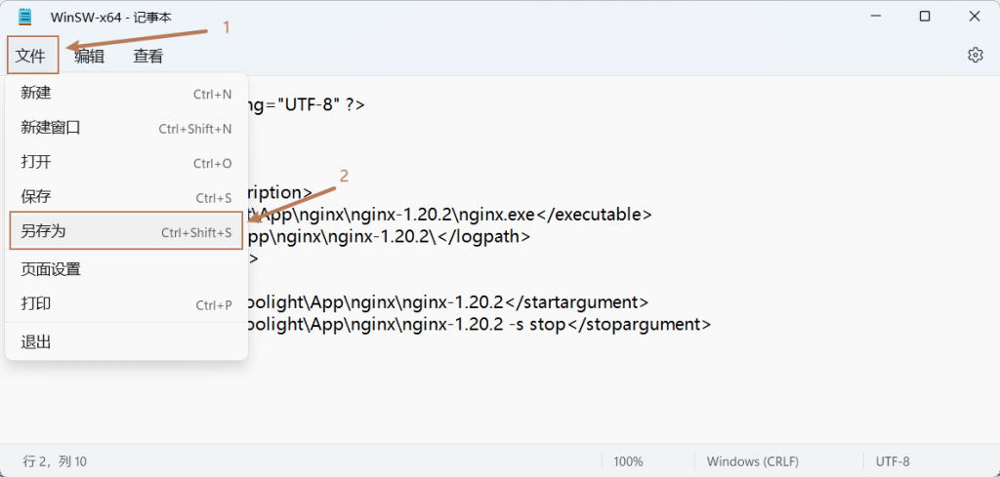

# [WinSW]Windows下把程序注册为系统服务（程序后台运行/自启动）

## WinSW

> \* WinSW（Windows Service Wrapper）是一个开源项目，它可以让我们快速把一个可执行的程序注册为Windows的系统服务。
> 
> \* 可以使得程序可以自启动，或者是可以关闭cmd窗口后保持运行。

* * *

## 环境

- Windows系统：Win11
    - 系统自带的服务控制：services.msc


- \-
    - \-
        - 如果找不到的话可以通过运行窗口调用起来
        - 首先按 win + r 调出运行窗口
        - 然后输入 services.msc ,回车


- WinSW
    
    - 版本：v3.0.0
    
    - github地址：[https://github.com/winsw/winsw](https://github.com/winsw/winsw)

* * *

## 使用方法

- [下载WinSW](https://github.com/winsw/winsw)
- 复制 WinSW-x64.exe 到想要注册为服务的程序所在目录。
- 这里以注册nginx为例：
- 记住你下载的WinSW的名字，比如我的是WinSW.exe，那就新建一个同名的WinSW.xml.
    - 当然你可以修改程序的名字，比如改为hello.exe，那就要新建一个同名的hello.xml.
    - 直接在当前目录下右键新建文本文件


- \-
    - 写入如下内容
    - 分析（仅说明需要修改的地方）：
        
        - 具体见相关外链：[winsw配置文件参数解释说明](https://blog.csdn.net/qq_40763549/article/details/117932091) - [安夜的cookie](https://blog.csdn.net/qq_40763549)
        
        - <id>：指定Windows内部用户标识服务的id；在系统安装的所有服务中id必须是唯一的，并且完全由字母数字字符组成。
        - <name>：服务的简短显示名称，可以包含空格和其他字符；在系统的所有服务中name也必须是唯一的。
        - <description>：对服务的完整描述。
        - <executable>：指定要启动的可执行文件，可以是绝对路径，也可以只指定可执行文件名称并从PATH中搜索。
        
        - <startargument>启动时的传递参数
        - <stopargument>停止时的传递参数
    - 一般修改<id> <name> <description> 都写为服务名就可以了。
    - <executable>写exe程序所在的路径，且路径尾部包含程序名
    - <logpath>写exe程序所在路径即可
    - <startargument>一般改成程序的路径，后面添加对应的程序启动的命令
        - 比如frps一般的启动命令是frps -s frps.ini
        - 这样的话这里就可以在路径后面增加 -s D:\\frp\\frps.ini
        - 注意所有文件路径最好都用绝对路径
    - <stopargument>一般改成程序路径，并且后面的-s stop改为对应的程序停止的命令
        - 同<startargument>的写法。

```
<?xml version="1.0" encoding="UTF-8" ?>
<service>
  <id>nginx</id>
  <name>nginx</name>
  <description>nginx</description>
  <executable>D:\0Acoolight\App\nginx\nginx-1.20.2\nginx.exe</executable>
  <logpath>D:\0Acoolight\App\nginx\nginx-1.20.2\</logpath>
  <logmode>roll</logmode>
  <depend></depend>
  <startargument>-p D:\0Acoolight\App\nginx\nginx-1.20.2</startargument>
  <stopargument>-p D:\0Acoolight\App\nginx\nginx-1.20.2 -s stop</stopargument>
</service>
```

- \-
    - 把文本文件另存为xml文件，如果不另存为的话，其后缀仍是txt




- 在当前目录下启动cmd。


- 安装服务，在cmd中输入以下命令并回车执行：
    - WinSW-x64.exe install
- 至此，系统的服务管理中已经会有nginx这个服务了
    - 调出服务管理的方法参见本文开头


## 调整服务为自启动

- 选中nginx服务项
- 右键，然后点击属性


- 如图，启动类型选择自动，并保存即可。


## 手动启动服务

- 如果服务没有启动，可以手动启动一下它
- 在服务管理中选中nginx，然后右键，点击 “启动” 即可。


