# [JAVA]安装JDK环境 / 安装多个JAVA版本(ubuntu/Win)

## JDK

### 简介

> JDK：java development kit （java开发工具）

* * *

### JDK / JRE / JVM 区别

- JRE：java runtime environment （java运行时环境）
- JVM：java virtuak machine （java虚拟机）
- 一般来讲
    - JDK 会包含 JRE 和 JVM
    - JRE 会包含 JVM

* * *

## 环境

- ubuntu - 20.04
- Win11
- JDK - 17.0.2

* * *

## 官网下载

- [https://www.oracle.com/java/](https://www.oracle.com/java/)
- 如图即可找到jdk的下载

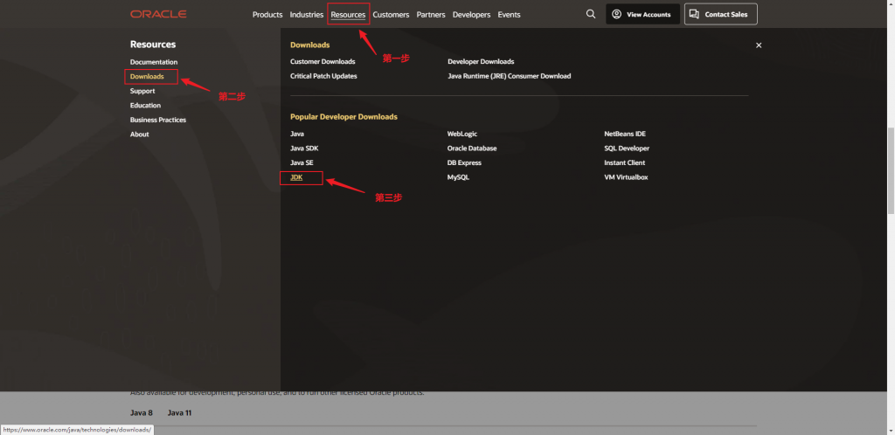

- linux系统
    - 后缀为tar.gz的下载后上传到linux（建议使用WinSCP），然后解压
        - linux解压tar.gz命令：tar -zxvf 压缩包名.tar.gz
    - 其他类型的根据对应系统的安装命令执行即可
    - [linux的JAVA环境变量配置](#linuxPATH)

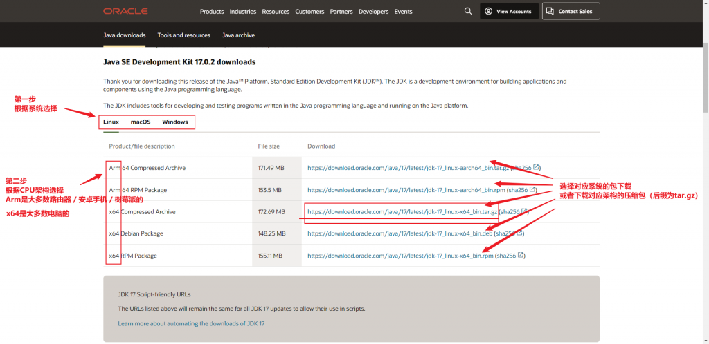

- Win
    - 后缀为zip的压缩包下载后需要同Linux的tar.gz类型的操作一致（见本文的上文）
    - 后缀是exe的就是有图形界面的安装程序，新手可以用这个，安装比较简单
    - 像我的习惯是在win也使用**zip压缩包**，因为这个在同时安装多个java版本时，配置环境变量挺简单的，安装程序的环境变量配置没试过。
    - 如果你使用的是压缩包，则需要：[win的JAVA环境变量配置](#winPath)
    - 如果你使用的是安装程序，则跟着安装程序走就可以了。

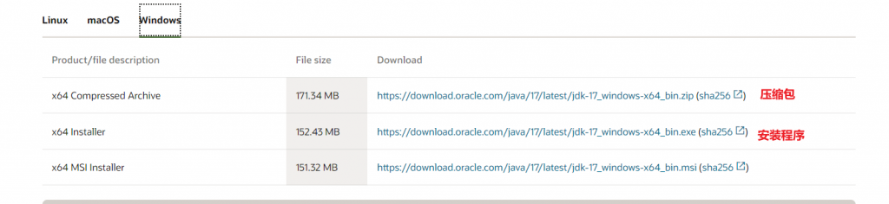

* * *

## 配置环境变量

> 当我们在cmd命令行敲命令时，cmd如何知道这个命令对应的可执行文件在哪里？这就要配置环境变量来告诉cmd去哪里找。当然环境变量还有其他用途，比如我们下面配置的CLASSPATH就关系到javac的编译。

### Linux

- 修改配置文件 /etc/profile
    - \# vi /etc/profile
    - 然后按大写的 G，就会跳到文件末尾
    - 按 i，进入编辑模式
- 配置JAVA\_HOME
    - 输入：
        - JAVA\_HOME = 刚刚解压的java文件夹目录
        - 比如：JAVA\_HOME=/home/0Acoolight/java/jdk-17.0.1
        - 注意：这个java路径的下一级就包含bin，conf等目录和文件，千万不能搞错了。
    - 配置这个可以让你在cmd的任意目录下都可以执行 java / javac 命令。
        - 比如：java -version ；javac -version 等。

- 配置CLASSPATH
    - 这个是固定的，你也可以在这里加附加的jar包，新手复制下面的内容进去就可以了。
    - CLASSPATH=.:$JAVA\_HOME/lib/tools.jar:$JAVA\_HOME/lib
    - 配置这个是给 javac 编译时用的。
- 配置PATH
    
    - 直接复制进去即可
    
    - PATH=$JAVA\_HOME/bin:$PATH
- 最后设置PATH生效：
    - export PATH
- 完成后就是这个样子：

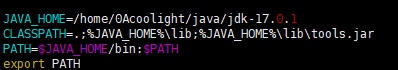

- 保存退出
    - 按英文的冒号 :
    - 输入wq，然后回车即可保存退出vi并回到cmd。
- 令配置文件生效：
    - \# source /etc/profile
- [测试是否成功](#test)

### Win

- 按 win + i 打开设置

- 点 高级系统设置

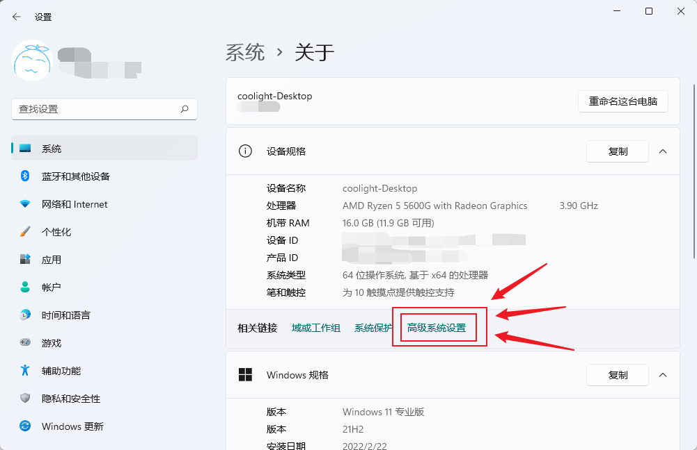

- 点 环境变量

- 点 新建
    - 输入变量名：JAVA\_HOME
    - 输入变量值：刚刚的java压缩包解压后的目录
        - 注意：这个变量值的目录的下一级就包含着bin conf等目录，千万不能错

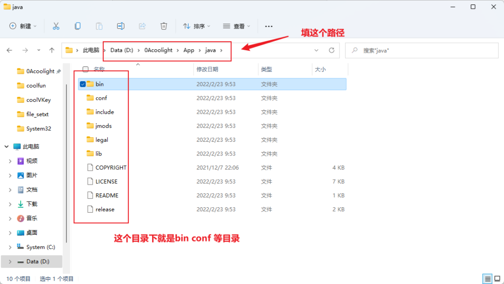

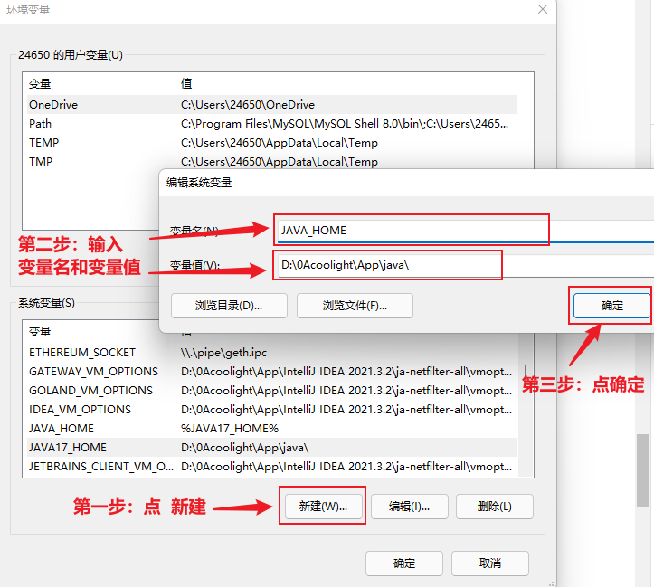

- 再点一次新建：
    - 输入变量名：CLASSPATH
    - 输入变量值：.;%JAVA\_HOME%\\lib;%JAVA\_HOME%\\lib\\tools.jar
    - 强烈建议复制进去，注意变量值的最前面，是有一个英文的句号 . 和分号 ;

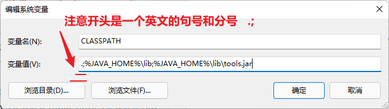

- 修改Path
    - 在系统变量里找变量名为 Path 的那一行
    - 选中它，然后点编辑

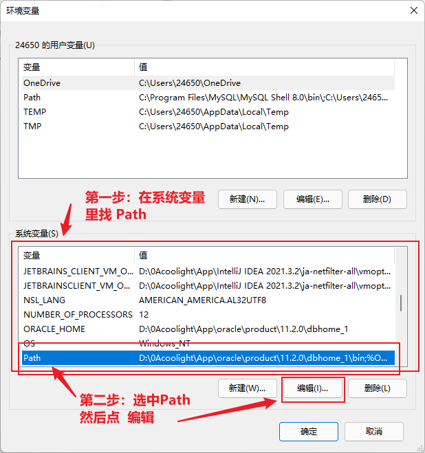

- 点 新建
    - 输入 %JAVA\_HOME%\\bin
    - 点上移，直到刚刚新建的那一行到第一行
    - 最后点确定即可

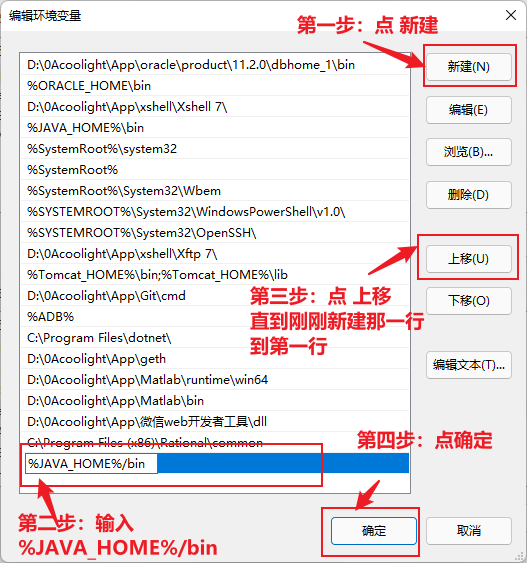

- 至此环境变量配置就完成了
- 测试是否成功：
    - 如果你已经打开cmd，请关掉重开或者重新开一个，然后进行下面的测试。

### 测试是否成功

- 在cmd输入 java -version，然后回车
- 在cmd输入 javac -version，然后回车
- 如果配置成功，效果如图：
    - 由于你的java版本号不一定和我一样，所以只要提示信息不是报错就行。

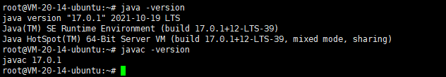

* * *

## 多个JAVA版本的配置

> 由于有些软件对JAVA版本有要求，所以可以会要安装多个JAVA版本。

- 思路：
    - 还记得我们之前配置的环境变量 JAVA\_HOME 吗
    - 我们只需要搞一个多个中间变量去指向各自的java版本的路径，然后想启动哪个版本就让JAVA\_HOME指向哪个中间环境变量即可。
- 实践：

### win环境：

- 比如我同时安装了 JAVA8 和 JAVA17：
    - 那么就先新建两个中间环境变量：JAVA8\_HOME 和 JAVA17\_HOME ，并输入对应的JAVA所在路径。

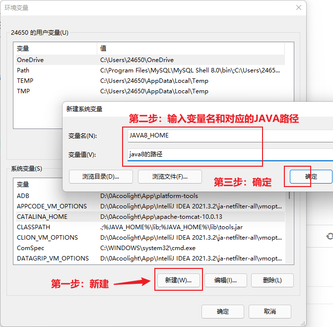

- 然后修改环境变量：JAVA\_HOME

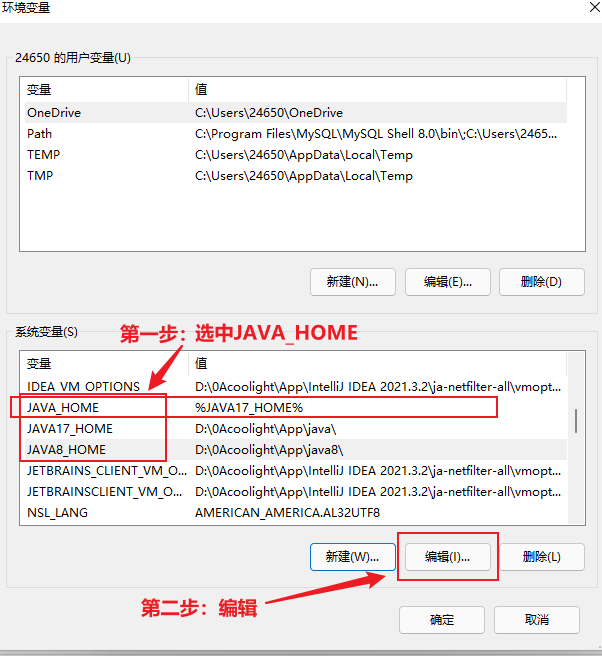

- 比如我现在想要使用JAVA17，那就把JAVA\_HOME的变量值改为 %JAVA17\_HOME%
- 如果我又想用回JAVA8，则把JAVA\_HOME的变量值改为 %JAVA8\_HOME%

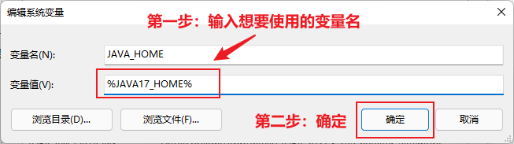

- 到这里就完成了，打开cmd，输入：java -verison 查看java版本

### linux环境

- linux和win基本一致，不过要注意:
    - 变量值引用变量时，win下写%JAVA17\_HOME%，linux要写$JAVA17\_HOME
    - 路径分隔在win下是分号 ; ，在linux是冒号 :
    - 路径在win下是反斜杠 \\ ，在linux是斜杠 /
    - 保存并退出vi后，在cmd执行命令让配置文件生效：
        - \# source /etc/profile
- 如图是使用JAVA17。如果想使用JAVA8：
    - 把 JAVA\_HOME=$JAVA17\_HOME
    - 改为JAVA\_HOME=$JAVA8\_HOME

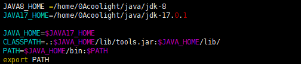
