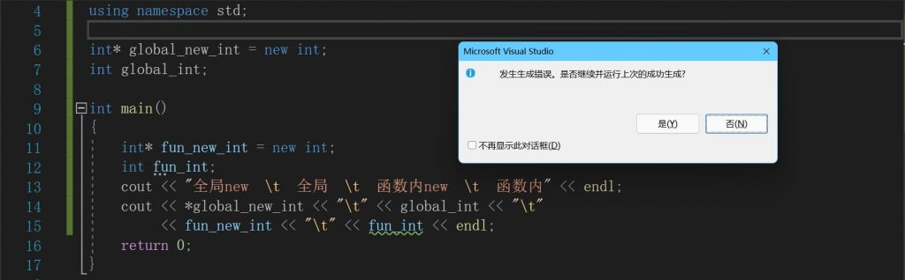
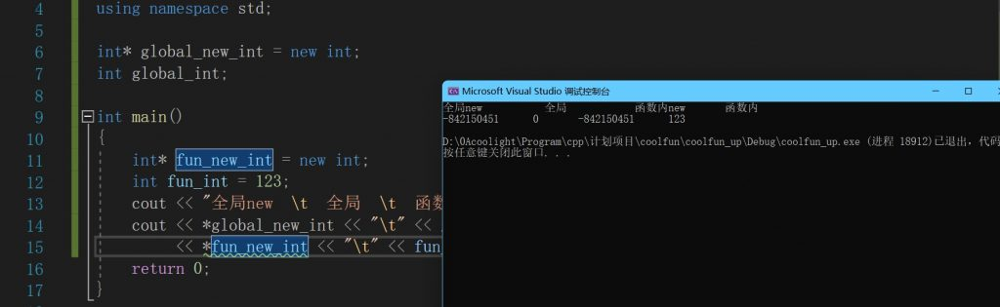

# [c++]new运算符并不确保会自动初始化

## new运算符

> new运算符会在堆上申请一段内存空间，一般的变量是在栈上的。
> 
> new出来的变量只要不delete释放，在其他函数等任意位置都可以使用，
> 
> new会返回这段内存空间的首地址。
> 
> new并不确保会自动初始化

* * *

## 测试

- 这里我们使用vs2019运行测试
- 待测试的一共有4种变量申请方法：
    - 全局区new - 图中global\_new\_int
    - 全局区声明 - 图中global\_int
    - 函数内new - 图中fun\_new\_int
    - 函数内声明 - 图中fun\_int

- 直接运行是过不了vs2019的编译的
- 提示fun\_int没有进行初始化就被使用
- 因此 函数内声明的变量 就显然是需要自己手动初始化的，编译器不会帮我们。
- 接下来给fun\_int手动初始化，改为int fun\_int = 123;

- 运行结果
    
    - 全局区new - 不会自动初始化
    
    - 全局区声明 - 会自动初始化为0
    - 函数内new - 不会自动初始化
    - 函数内声明 - 不会自动初始化，而且不手动初始化的话连编译都过不了

* * *

## 结论

- 可见new的不管是在全局区还是函数内都不会自动初始化。
- 而在全局区直接定义变量是会自动初始化的。
- 自己习惯手动初始化才是最保险的。
