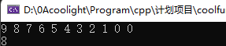

# [c++]记录使用vector遇到过的天坑问题

## vector

> \* vector是c++的一个模板容器，同时也是一个动态数组，是数组就意味着它支持随机访问。
> 
> \* 它几乎与arraylist一样，但vector是线程安全的，因此vector的性能比arraylist弱。
> 
> \* 使用时需要#include <vector>

## 注意

- 指向vector里面的元素的指针是迭代器iterator，而不是一般的变量的那个星号\*。
- back()：返回最后一个元素的引用。
- end()： 返回的迭代器不可用，它返回的是指向最后一个元素的下一位置，因此想要访问最后一个元素，应该写end()-1，或使用back()。
- 当vector内没有元素时，begin()和end()的返回值一样。
- 注意对迭代器的运算顺序
    - 末尾两行如果执行会在运行时报错：
        - cannot seek vector iterator before begin
        - 即迭代器移动越界了

```
vector<int> arr;
for (int i = 10; i--;)		//向vector压入数据
	arr.push_back(i);

vector<int>::iterator it_p = arr.begin();//获取vector第一个的迭代器
for (; it_p < arr.end(); ++it_p)//依次顺序输出
	cout << *it_p << " ";

cout << arr.back() << endl;	//输出最后一个元素的值

it_p = arr.begin();
it_p += 4;			//把迭代器移动4个位置
cout << *(it_p - 3) << endl;	//不会报错
//cout << *(it_p - 6 + 3) << endl;//如果编译器有优化提前计算出了结果-3，则不会报错
int a = 6, b = 3;
//cout << *(it_p - a + b) << endl;//会报错
```

- \-
    - 运行结果：



- \-
    - 在末尾的两行，it\_p本来是指向第5个位置（下标为4），此时（it\_p - 6 + 3）先算 it\_p - 6 则会因为越界而在运行时报错。尽管它最终的结果等同于it\_p - 3 是不会越界的。最后一句也是如此。
    - 解决方法当然也很简单，把后面的数值计算加个括号，注意符号可能需要改变
        - 如 （it\_p - 6 + 3）改为（it\_p - (6 - 3)）或（it\_p + (3 - 6)）
        - 同理（it\_p - a + b）改为 (it\_p - (a - b)) 或 （it\_p + (b - a)）
    - 当然vector是动态数组，是可以用\[\]随机访问的，即支持arr\[-6 + 7\]，这样写是没有问题的，它会先计算最终结果（-6 + 7）= 1。
