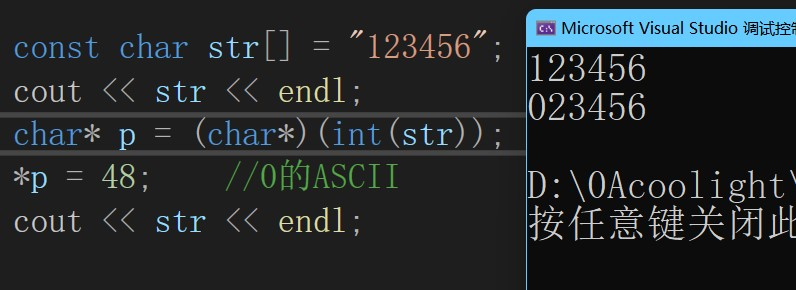
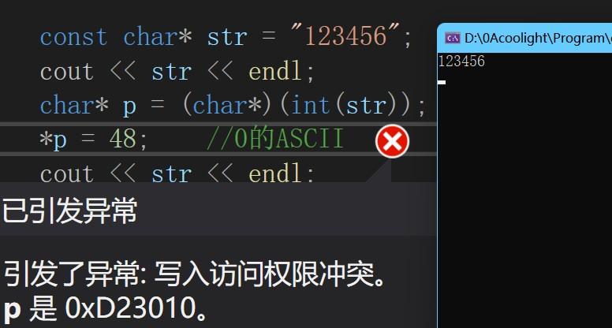

# [c++]使用int()显式类型转换指针来修改const char的值

## 摘要

> 记得之前看过一篇文章说所有的指针其实都可以视为一个int类型，这句话催生了我很多想法，这篇博文即为其一。

## 示例

- 示例代码：

```
#include<iostream>
using namespace std;

int main()
{
    const char str[] = "123456";
    cout << str << endl;
    char* p = (char*)(int(str));
    *p = 48;    //0的ASCII
    cout << str << endl;

    return 0;
}
```

- 编译可以通过，运行也正常；运行结果：



- 分析
    - 可以看到原本定义为const char的str\[\]的第一个字符"1"被程序在运行时修改为“0”。
    - 显然重点在于　char\* p = (char\*)(int(str));
    - 在代码中声明为const限制的变量，其实在内存层面和没有const的是一样的。
    - 区别在于如果声明为const，则编译器会在编译时检查是否有对这个变量进行修改，但它不保证运行时不会被修改，因此可以用间接的方法去修改它。
    - 指针存放的地址可以看做是一个int类型的值，因此显式把const char\*转为int，再转为char\*即可，接着我们就可以用char\* p来修改身为const char的str了。
    - 这不仅对于const char的数据，对于其他声明为const的数据都可以用这个方法去修改。
    - 特例：
        - 有些const变量（如const int）由于编译器会优化，采用宏定义直接替代，然后运行时也是可以执行修改，虽然不会报错，但修改是没有效果的，这个时候如果真要修改，得修改程序运行时代码区。

## 不可修改的特例

- 如果我们把str的声明由 const char\[\] 改为 const char \* 呢？
- str声明为 const char\[\] 时：
    - str是一个数组，数组大小取决于初始化的内容的长度，即后面"123456"的长度，除了6个数字外，还有末尾1个 "\\0" 的结束符，因此是7个长度；即str的类型是const char\[7\]。
    - 由于是在main函数内声明的，因此存放是在栈上的。
- str声明为 const char\*时：
    - str是一个指向const char的指针。

```
#include<iostream>
using namespace std;

int main()
{
    const char* str = "123456";
    cout << str << endl;
    char* p = (char*)(int(str));
    *p = 48;    //0的ASCII
    cout << str << endl;

    return 0;
}
```

- 此时编译可以通过，但运行时报错；运行结果：



- 此时在用p修改str时出现写入失败，那同为const char的str，为什么这里就不能修改呢？
    - 因为这里是把str声明为一个指向const char的指针，字符串“123456”是位于静态常量区的一块内存，静态常量区是程序运行时也不可修改的，而str就指向了这块内存，因此修改就报错了。
    - 但上面的例子不一样，声明为const char str\[\]时，是给str分配了一块内存，然后把字符串"123456“写到这块内存中，由于这是在栈上的，是可以修改的，因此虽然声明是const char，但只是编译时会检查你有没有去修改它，有则不会编译通过。显然我们显示转换类型成功绕过了编译器的检查。

## 写在最后

> \* c++本身也提供了一些方法可以去掉str的const限制：比如const\_cast<>，它的使用方法在百度上很多，如果需要请自行百度了解。
> 
> \* 指针着实是相当有意思的东西。
