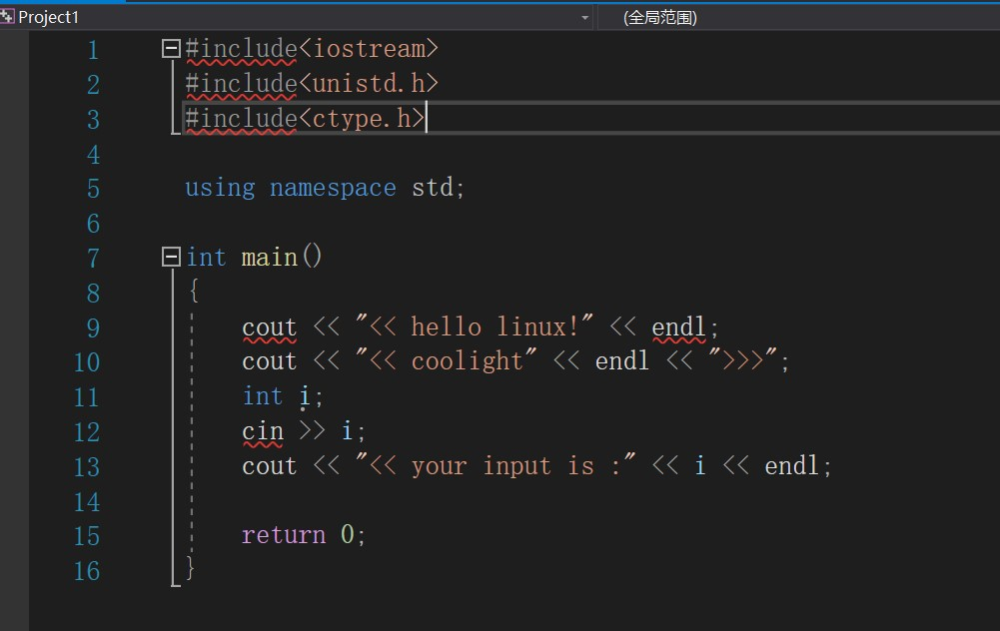

## 树莓派4B

> 树莓派4B是一块cpu架构为Arm的开发板，可以看作是一个小型的电脑主机，只要刷入系统即可和正常电脑一样使用。

## 环境

- 树莓派4B - 4G内存版本
    
    - Cpu架构：arm
    
    - 系统：linux / openwrt
- VS2019 - win10

## 预期想法

> 通过Vs2019远程连接树莓派，然后在win上使用vs开发c++项目，最后部署到树莓派上运行

## 遇到的问题

- \*\*\*主机上的缺少工具：gcc，gdb，gdbsevice，zip？
    - 就是你的linux里没有安装上述程序，得去安装。
    - 问题主要在zip这个程序，在openwrt的web管理里搜索后居然没有zip程序，最后我是去到中科大软件源里：
        - http://mirrors.ustc.edu.cn/openwrt/releases/18.06.6/packages/aarch64\_cortex-a72/packages/
    - 手动找到zip.ipk然后上传到openwrt里的 /tmp目录安装的（opkg install /tmp/zip.ipk）。
    - 如果你也遇到此问题，需要到链接里回退找对应的openwrt版本（18.06.6）和对应的cpu类型（aarch64\_cortex-a72）的zip.ipk包。
    - 本来是把这个连接放到openwrt的自定义软件源里，但在web里搜索还是没有zip包，就像被过滤了一样暂不知道原因。
- VS里满屏的报错？头文件全都提示无法找到源文件？

- \-
    - 百度上很多方法试过后对我没用，在目录里：
        - C:\\Program Files (x86)\\Microsoft Visual Studio\\2019\\Community\\Common7\\IDE\\VC\\Linux\\include
    - 是有linux的各种头文件的，但Vs就是报错了，最后发现是Vs并没有真正复制树莓派的头文件到win里，上面目录里的文件似乎是下载Vs时带的。
    - 解决方法：
        - 在    调试 -> 选项 -> 跨平台 -> 链接管理器 -> 远程标头IntelliSense

- \-
    - \-
        - 此时窗口右方第三个按钮 " 浏览 " 

- \-
    - \-
        - 就会进入文件管理里，此时如果你点进usr里会发现里面是没有头文件的，这就是VS满屏波浪线的原因。
        - 因此我们只要把linux里的头文件（usr/include以及usr/local/include）的头文件从树莓派的系统里复制出来，然后复制进usr就可以了，lib文件同理。
        - 后面的目录可能不存在，我的openwrt就没有，没有关系的。
        - 复制进去后重新打开VS项目就可以了。
- 运行就VS卡死，打断点也卡死？
    - VS报错：引发类型"Microsoft.Build.Linux.Shared.ExceptionTTY"的异常

- \-
    - 这个问题在百度上有人提到是终端有VS无法识别的符号引发了错误。
    - 但他的解决方法我不适用：
        - 把linux的用户目录里的隐藏文件.bashrc直接删除。
    - 我的默认sh是zsh，把.zshrc删了并不能解决问题，并且出现更多问题了。而且删这个感觉好危险......
    - 最后我的解决方法：
        - 在 调试 -> \*\*调试属性（最后一个选项，例如我的项目名是Project1，则为 Project1调试属性）

- \-
    - \-
        - 在左边点 配置属性 -> 调试

- \-
    - \-
        - 此时右边里面的调试模式改为 gdbservic 试试看，如果你默认是 gdbservice 就改为  gdb  试试。
