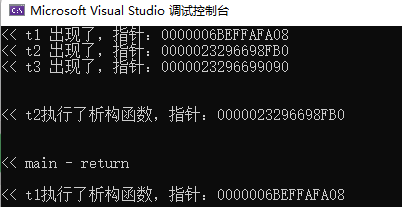

# [c++]new之后不delete的弊端

## 前言

> \* new申请的内存，即使你没有执行delete，在程序结束后，也会释放掉的。
> 
> \* 但这样做会有很多弊端，下文将列举部分情况。

* * *

## 弊端

### 不delete的话被释放时不会执行析构函数

- 测试 - 在vs2022中：
    - 定义一个test类，并在main函数中声明t1，t2，t3三个对象：

```
#include<iostream>
using namespace std;

class test
{
	string name;
public:
	test(const string& in_name)
	{
		name = in_name;
		cout << "<< " + name + " 出现了，指针：" << this << endl;
	}


	~test()
	{
		cout << "<< " + name + "执行了析构函数，指针：" << this << endl;
	}

};

int main()
{
	test t1("t1");

	test* t2 = new test("t2");

	test* t3 = new test("t3");

	cout << endl << endl;

	delete t2;

	cout << endl << endl << "<< main - return" << endl << endl;

	return 0;
}
```

- 可以看到在main函数中，t2，t3是new出来的，我们手动把 t2 delete。
- 运行结果：



- 可以看到，t2因为我们手动delete而在main结束前执行了析构函数
    
    - t1则main结束后执行了析构函数。
    
    - t3则是由系统回收，可见它并没有执行析构函数
- 因此，如果析构函数中有输出提示，缓冲内容等需要执行，则应该手动delete。当然，即便没有也倡导自己手动delete。

### 可能导致运行时占用大量内存，影响程序长时间运行
