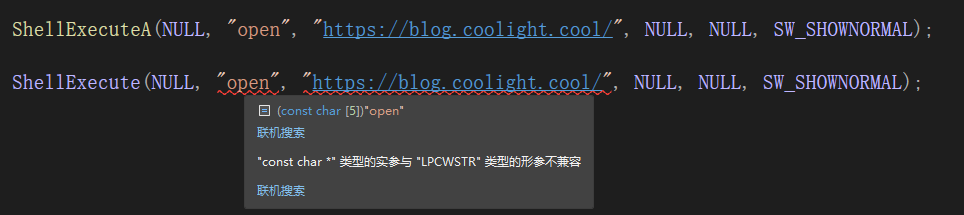

# [c++]Windows的函数后面加’A‘或’W‘的含义

## 含义

- 其实就是编码问题
    - A：
        - 代表ANSI
    - W：
        - 代表宽字节（wide），即 Unicode
- 一般win的库函数如果后面不加 ’A‘ 或 'W' 时，直接给它传字符串类型值时会报错：
    - 以我常用的 ShellExecute() 为例：



- 会报错：
    - "const char \*" 类型的实参与 "LPCWSTR" 类型的形参不兼容
    - 不存在从 “std::string” 到 “LPCWSTR” 的适当转换函数
- LPCWSTR 是个啥？让我们来看看它的定义：
    - typedef const wchar\_t\* LPCWSTR;
    - 即指向unicode编码字符串的32位指针，并且所指向字符串是wchar，而非char。
- 解决方法：
    - 把函数改为 ShellExecuteA() 或 ShellExecuteW()
    - 或者在传字符串时使用宏定义转换类型
    - 对于常量字符串：
        - \_T() （推荐使用）自适应转换，当程序定义为unicode时，相当于L，当程序定义为ansi时，则被忽略（头文件：#include <tchar.h>）
        - L ；例如原本传值为 fun("open")，使用后为fun(L"open")；注意这个L并没有括号。
        - CA2W() 从宽字符集（Unicode）转为多字符集（ANSI）（头文件：#include <atlstr.h>）
        - CW2A() 从多字符集（ANSI）转化为宽字符集（Unicode）（头文件：#include <atlstr.h>）
    - 对于string / char\[\] / const char\[\] ：
        - 使用以下函数

```
LPCWSTR stringToLPCWSTR(const std::string& orig)
{
    size_t origsize = orig.length() + 1;
    const size_t newsize = 100;
    size_t convertedChars = 0;
    wchar_t *wcstring = (wchar_t *)malloc(sizeof(wchar_t)*(orig.length()-1));
    mbstowcs_s(&convertedChars, wcstring, origsize, orig.c_str(), _TRUNCATE);
    return wcstring;
}
```

- \-
    - \-
        - 那么如果我是 char\[\] 或者 const char\[\] 呢？那当然是转string再使用上面的函数啦。
        - 示例：

```
ShellExecuteA(NULL, "open", "https://blog.coolight.cool/", NULL, NULL, SW_SHOWNORMAL);

string str = "https://blog.coolight.cool/";
ShellExecute(NULL, _T("open"), stringToLPCWSTR(str), NULL, NULL, SW_SHOWNORMAL);

const char link_char[] = "https://blog.coolight.cool/";
ShellExecute(NULL, _T("open"), stringToLPCWSTR(string(link_char)), NULL, NULL, SW_SHOWNORMAL);

ShellExecute(NULL, L"open", CA2W("https://blog.coolight.cool/"), NULL, NULL, SW_SHOWNORMAL);
```

* * *

## 常见编码格式

> 见另一篇文章：[常见编码格式 / 字节序（大端 / 小端）/ 带BOM](https://blog.coolight.cool/?p=633)
