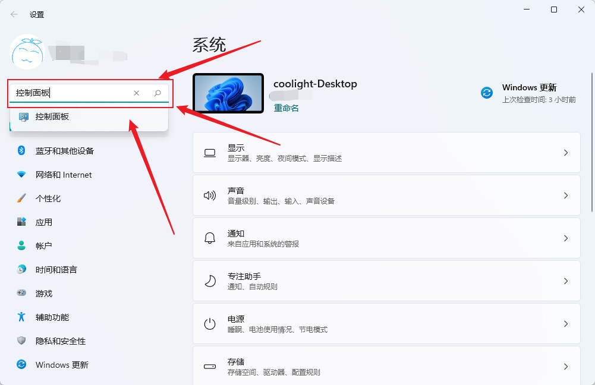
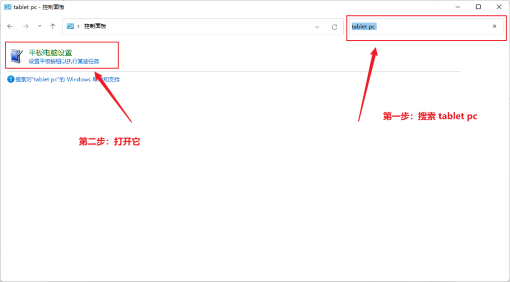
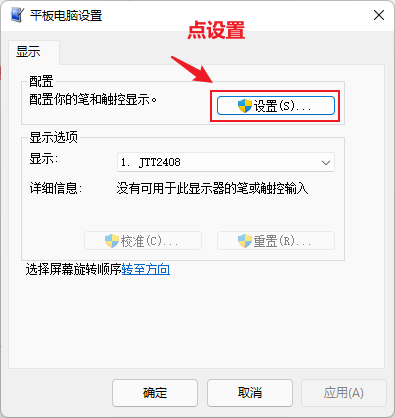

## 环境

- win11
- 两个屏幕：
    - 1号屏幕，设置为主显示器，但没有触摸功能
    - 2号屏幕。有触摸功能
- 存在问题：
    - 2号屏幕的触摸功能错误地在1号屏幕响应

* * *

## 解决方法

- 打开控制面板
    
    - 按 win + i 打开设置
    
    - 在搜索里输入控制面板

- 在控制面板中搜索 tablet pc 并打开
    - 图中的平板电脑设置也可能显示名称为：Tablet PC 设置

- 在 平板电脑设置中点 设置

- 此时在两个屏幕上会有一个显示如图的文字
- 另一个应该会是空白一片

- 此时按 Enter 可以切换文字显示的屏幕
    - 并且文字显示在哪个屏幕，哪个屏幕就是响应触摸的！
- 因此现在就是：
    
    - 按Enter把文字切换到 想要响应触摸 的那个屏幕
    
    - 然后在触摸屏上点一下就可以了
    - 注意：按ESC退出是不保存设置的，相当于你没修改。
