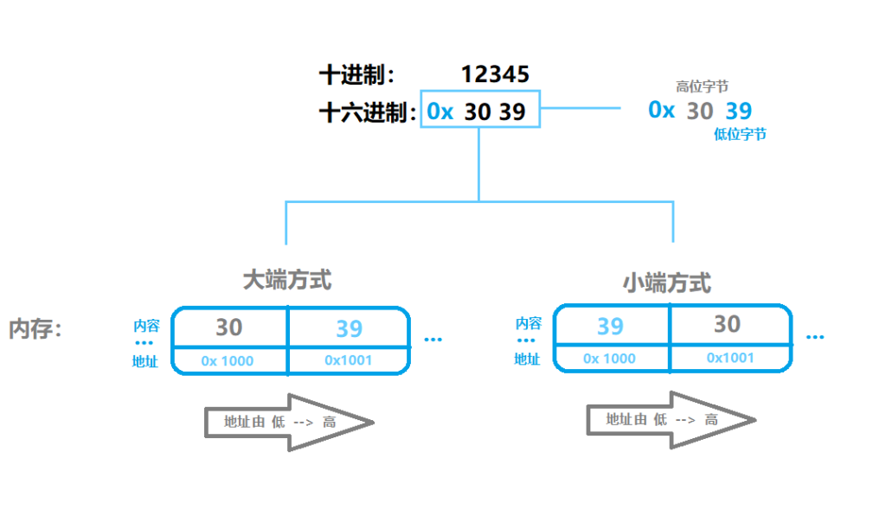

## 前言

> 在计算机中，我们如何表示数字，英文字母（A ~ Z / a ~ z），中文，符号（, .?<>），等各种符号呢？

- \-
    - 人们最终想到了对这些字符进行编码，比如在ASCII编码中，用一个字节的大小（8个bit位，故可表示的数量是 2^8 = 256个字符，但只用了 128 个，即（0 - 127））
    - 比如：65 就代表 英文字母A，48 代表 数字0。
    - 除此之外，还有很多 非打印字符（换行符、制表符等）以及 控制字符（退格、响铃等）控制编码。
- 本文中你将了解到：
    
    - 常见的字符编码格式
    
    - 字节序标记： 大端方式（Big endian） / 小端方式（Little endian）
    - 带BOM是什么意思？

* * *

## 常见的字符编码格式

### ASCII

- 单字节编码，使用一个字节的大小来表示一个字符（1Byte = 8 bit，故可表示的数量为 2^8 = 256个）到目前为止共定义了128个字符（0 - 127）。
- 单单我们中文常用的字符就不止256个，因此ASCII在全世界范围肯定是不够用的，因此后来才出来了很多扩展的编码格式。
- 如今的其他编码格式基本都兼容ASCII。即可理解为在它身上进行扩展。

### ANSI

- **A**merican **N**ational **S**tandards **I**nstitute （美国国家标准学会），由这个标准学会制订的一种编码规则。
- 使用 1 - 4 个字节来代表一个字符。ANSI在不同语言系统上代表不同的编码。不同 ANSI 编码之间互不兼容。
- 在 简体中文win系统 中代表 GBK
- 在 日文win系统 中代表 Shift\_JIS

### GBK / GB-2312 / GB18030

- 这几个就和我们中国密切相关了。
- **GB2312**：对 ANSI 的简体中文扩展。GB2312共收录了七千个字符。
- **GBK**：（即 国**G**标**B** 扩**K**展）由于GB2312支持的汉字太少而且不支持繁体中文，所以GBK对GB2312进行了扩展，以支持繁体中文和更多的字符，GBK共支持大概22000个字符。
- **GB18030**：在GBK的基础上又增加了藏文、蒙文、维吾尔文等主要的少数民族文字。 

### Unicode

- 由于（ANSI）各国的编码不同造成交流传输不便，ISO 打算废除所有的地区性编码方案，建立一个全球性的编码方案，并把所有字符都编码进去，称之为 "Universal Multiple-Octet Coded Character Set"，简称 UCS(ISO10646)。
- 同时又有 unicode.org 这个组织也制定了自己的全球性编码 unicode，自从unicode2.0开始，unicode采用了与UCS相同的字库和字码。
- 现在用的是UCS-2，即2个字节编码，而UCS-4是为了防止将来2个字节不够用才开发的。
- **Unicode只是一个符号集，它只规定了符号的二进制代码，却没有规定这个二进制代码应该如何存储（使用的字节数 / 定长存储 / 变长存储）**。怎样存储、传输这些编码，则是由UTF来实现。

### UTF

- 在可以使用ASCII表示的字符时使用Unicode并不高效，因为Unicode比ASCII占用大一倍的空间，而对ASCII来说高字节对他毫无用处。为了解决这个问题，就出现了一些中间格式的字符集，他们被称为**通用转换格式**，即UTF（**U**nicode **T**ransformation **F**ormat）。这其中就有如UTF-8这种变长编码。而让最常出现的字符编码尽量的短，即可使得总的存储和传输代价小很多，这也是哈夫曼压缩编码的思想。
- UTF-8、UTF-16、UTF-32 都是 Unicode 的一种实现。**目前使用最为广泛的就是UTF-8**。这些看名字差别就是后面的 -8 / -16 / -32。意义就是处理单元的比特位数（即一次拿到 8 / 8 = 1 ； 16 / 8 = 2；32 / 8 = 4个字节进行处理）。
- **UTF-8**： **变长**编码方式。也就是用这种编码出来不同字符的长度不一定相同。比如UTF-8表示ASCII中的字符需要1个字节，表示中文需要3个字节。
- **UTF-16**：**变长**编码方式。
- **UTF-32**：**定长**4字节编码。

* * *

## 字节序标记

> 处理单元为多个字节时（一次拿到多个字节进行处理），如果不分字节顺序的话，那么就会出现解读错误。比如我们一次要处理四个字节 12 34 56 78，这四个字节是表示 0x12 34 56 78 还是表示 0x78 56 34 12？不同的解释最终表示的值也不一样。因此就有了大端方式和小端方式之分。

### 大端方式（Big endian）

- **高位**字节存在**低位**地址
- **低位**字节存在**高位**地址

### 小端方式（Little endian）

- **高位**字节存在**高位**地址
- **低位**字节存在**低位**地址

- 显然 UTF-16 和 UTF-32 是需要区分大小端方式的，因为它们一次处理拿到的字节数不止一个。
- UTF-8 不需要区分大小端。

* * *

## 带BOM（签名）是什么意思？

- 在有些软件中（如VS2019），把带BOM翻译为带签名。
- 我们已经介绍了字节序的大端和小端方式，但怎么让计算机知道这段文本是大端还是小端方式呢？
- 这就需要在文件开头为BOM（Byte Order Mark）的字符来表明文件是 大端 还是 小端方式 来存取。
- **注意：**BOM是Unicode标准建议的，因此 UTF-16 和 UTF-32 编码存储的文件需要带 BOM。而GB2312尽管是双字节，但是没有BOM这个概念的。因为他出生太早了，那时候还没有这个概念。GBK也是没有BOM的。
- **UTF-8 不需要区分字节序，当然也就不需要 BOM**。但可以用BOM来表明该文件的编码方式是UTF-8。但实际上非常**不建议这样做**，尽管 Unicode 标准允许在 UTF-8 中使用 BOM，但  UTF-8 带BOM，是Win基于兼容性考虑独创的格式，linux默认不兼容。
