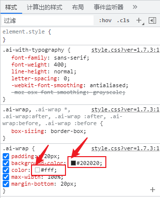

# [WP]修改WP插件样式（简码插入）思路之一（修改AudioIgniter插件样式）

## 简介

> 修改插件样式的方式有多种，可以直接通过wordpress自带的插件文件编辑器修改插件文件，但显然插件更新时需要重新修改。本文将介绍通过”自定义HTML“模块来修改通过简码插入的插件样式。

* * *

## 前言/起因

> 起初是想建一个在线播放音乐的网站，需要一个音乐播放器插件，且需要带有播放列表，循环播放等功能。但一直找不到好用的，最后找到了一个功能上满足我的基本需求的插件：**AudioIgniter**。但它的外观没有长在我的审美上，于是用上刚学俩星期的前端三件套，走上了自己动手，丰衣足食的道路。

* * *

## **AudioIgniter**样式对比

- 原来的样式：


- 一顿修改后的样式：


- 在网站整体上看：


* * *

## **AudioIgniter**插件样式源码/使用方法

### 样式源码

```
<style>
/*取消原来的部分设置*/
.ai-wrap .ai-track.ai-track-active, .ai-wrap .ai-track:hover {
    background-color: transparent;  
    background: rgba( 255, 255, 255, 0.25);
}
.ai-wrap .ai-track {
    background-color: transparent;
}
.ai-wrap .ai-track-control{
    border-left: transparent;
}

/*播放器背景div*/
.ai-wrap{
    background: linear-gradient(200deg,#8eeac7,#b5e6fe);
    /* 溢出隐藏 */
    overflow: hidden;
    /*圆角*/
    border-radius: 30px;
    /* 阴影 */
    box-shadow: 0 5px 20px rgba(102,204,255,2);
}

/*播放列表*/
.ai-track{}
.ai-track:hover, .ai-track-active{
    background: rgba( 255, 255, 255, 0.5 );
    backdrop-filter: blur( 6px );
    -webkit-backdrop-filter: blur( 6px );
    border-radius: 10px;
    border: 1px solid rgba( 255, 255, 255, 0.3);
    /* 阴影 */
    box-shadow: 0 2px 20px rgba(208, 216, 222, 1);
}
.ai-track-name{
    font-weight: 900;
    color:#535273;
}

/*专辑图*/
.ai-wrap .ai-track-no-thumb, .ai-wrap .ai-control-wrap-thumb{
    background-color: transparent;
}
.ai-track-no-thumb, .ai-track-thumb, .ai-wrap .ai-control-wrap-thumb{
    background: rgba( 255, 255, 255, 0.2);
    backdrop-filter: blur( 20px );
    -webkit-backdrop-filter: blur( 20px );
    border-radius: 10px;
    /* 阴影 */
    box-shadow: 0 2px 20px rgba(208, 216, 222, 1);
}


/*正在播放歌曲的标题*/
.ai-track-title span{
    font-weight: 900;
    color: #535273;
}
.ai-track-subtitle span{
    color:#b187a2;
}

/*播放/暂停按钮*/
.ai-wrap .ai-audio-control, .ai-wrap .ai-audio-control:focus{
    background-color: transparent;
    background: rgba( 255, 255, 255, 0.1);
    backdrop-filter: blur( 20px );
    -webkit-backdrop-filter: blur( 20px );
    border-radius: 50px;
    border: 1px solid rgba( 255, 255, 255, 0.3);
    /* 阴影 */
    box-shadow: 0 2px 20px rgba(208, 216, 222, 1);
}
.ai-wrap .ai-audio-control:hover, .ai-wrap .ai-btn:hover, .ai-wrap .ai-btn.ai-btn-active:hover{
    background: rgba( 255, 255, 255, 0.35);
}

/*控制按钮*/
.ai-wrap .ai-btn{
    background-color: transparent;
    background: transparent;
    border-radius: 10px;
    border: transparent;
}

/*循环播放按钮，选中状态*/
.ai-wrap .ai-btn.ai-btn-active{
    background-color:transparent;
}
.ai-wrap .ai-btn.ai-btn-active svg{
    fill: #66ccff;
}

/*音量条*/
.ai-wrap .ai-volume-bar {
    background-color: transparent;
    border-right: transparent;
}
.ai-wrap .ai-volume-bar:before {
    background-color: #b7eee7;
}
.ai-wrap .ai-volume-bar.ai-volume-bar-active:before{
    background-color: #d9f6f3;
}

/*进度条*/
.ai-wrap .ai-track-progress-bar{
    border-radius: 50px;
    background-color: #b8eee7;
}
.ai-wrap .ai-track-progress{
    border-radius: 50px;
    background-color: #66ccff;
}

/*滚动条*/
.ai-wrap .ai-scroll-wrap>div:last-child{
    background-color: #b5eee4;
}
.ai-wrap .ai-scroll-wrap>div:last-child div{
    background-color: #d9f6f3!important;
}
</style>
```

### 使用方法：

- 进入wordpress后端管理界面（其链接一般是你的网站主页网址/wp-admin）
    - 比如我访问我的主页的网址是：https://blog.coolight.cool
    - 则我的wordpress后端管理界面链接是：https://blog.coolight.cool/wp-admin/
    - 进入管理界面后需要先填写管理员的账号和密码。
    - 然后就可以进到这样的一个界面：


- 确保你的wordpress已经**安装**并**启用**了 **AudioIgniter** 插件：


- 确保已经有一个**播放列表**。如果还没有创建或者你不知道这是什么，请跟着下面的步骤创建一个播放列表：
    - 来到播放列表管理界面：


- \-
    - 新建一个播放列表：


- 复制刚刚创建的播放列表的**简码**：
    - 在刚刚添加播放列表的界面往下滑到底部，复制Shortcode的内容：


- 确保已经有一个 **页面** 或者是一篇 **文章** ：
    - 这里我们新建一个文章为例：


- 在页面或文章中插入简码以启用音乐播放器，并插入HTML代码修改其样式：


* * *

## 思路

- 首先在页面或文章中插入简码以启用音乐播放器：


- 键盘按下F12，进入开发者工具，并点击“元素”：


- 当鼠标在”元素“列表里面移动时，浏览器就会提示对应的标签在页面的位置：


- 所以我们现在需要找到音乐播放器所在的元素标签，然后修改对应标签的CSS样式即可，如图的div就是播放器所在的容器：


- 找到想修改的目标以后，可以直接看它的class类名，然后写CSS样式来修改。
- 也可以在右边的样式表中取消一些样式的勾选，看看是否为想修改的样式，然后复制出来修改即可。
- 这里以修改播放器的背景色为例，颜色的样式在样式表中很明显，它会有一个小色块：



- 我们把background-color取消勾选看看：


- 可以看到，其背景色随之改变，所以我们就复制这个类名出来，并把样式background-color复制出来修改：


- \-
    - 注意：
    - 如果这个类名很长，也建议全部复制，不然可能改不到！
    - 比如这个，虽然很长，但建议复制横线画的整个（即左花括号‘ **{** ’之前的内容）：


- 比如我们把原来的黑色 #202020，改为浅蓝色 #66ccff，把下面的代码插入到编辑文章页面的一个”自定义HTML“区块中：

```
<style>
.ai-wrap {
    background-color: #66ccff;
}
</style>
```

- 如图操作后，其颜色就变了。
- 建议分屏操作，有双屏就更好了，毕竟左边的网页需要开着开发者模式看结构的。


- 如此操作，接着改其他想改的即可。

* * *

## 疑难杂症

### 如果想改的元素没有类名也没有id怎么办？

- 没有类名在CSS里也是可以定位到的，还是在开发者工具中找到它的样式，它样式的左花括号 ‘ { ’ 前面就是了。
- 比如Audiolgniter的滚动条


- 在样式表中，滚动条的颜色样式是这样的：

```
.ai-wrap .ai-scroll-wrap>div:last-child div {
    background-color: #f70f5d!important;
}
```

- 那我们把它复制出来，改成蓝色 #66ccff 试试，注意保留后面的 **!important**：

```
.ai-wrap .ai-scroll-wrap>div:last-child div {
    background-color: #66ccff!important;
}
```

- 然后插入“自定义HTML”中，并更新文章，然后刷新网页：


