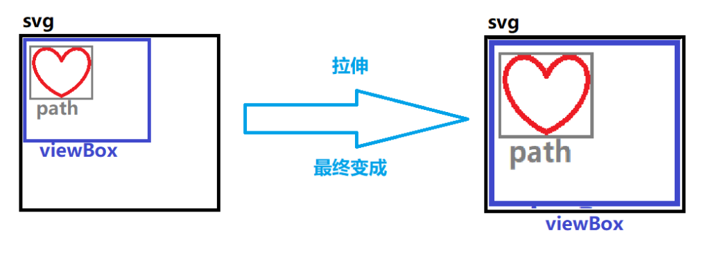
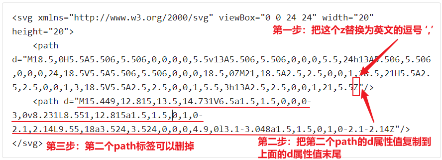

# [svg]修改svg图标/大小/颜色

## svg

> **svg** 和我们常见的 jpg / png 一样是图片的存储格式。但svg是矢量图，jpg / png 是位图。由于这些概念并不影响本文的主题（修改svg的内容/大小等操作），故概念介绍请见本文末尾。

* * *

## 修改svg

- 首先我们来看一下svg标签一般的样子：

```
<svg xmlns="http://www.w3.org/2000/svg" viewBox="0 0 24 24" width="20" height="20" fill="#66ccff">
    <path
d="M20.492,7.969,10.954.975A5,5,0,0,0,3,5.005V19a4.994,4.994,0,0,0,7.954,4.03l9.538-6.994a5,5,0,0,0,0-8.062Z"/>
</svg>
```

- 它的效果就是这样的：

- 主要属性和结构：
    
    - path元素（图标内容）：
        - d：描绘图标的命令内容。可以想象浏览器有一支画笔，这个d元素就告诉浏览器的画笔要怎么动
    
    - xmlns：命名空间，一般不需要修改。它只是看起来像一个http链接
    - fill：图标的填充颜色，这里是 #66ccff ，即浅蓝色
    - width / height：svg本身的宽 / 高
    
    - viewBox："x, y, width, height“，可以看到它有4个数值（在这里是 0 0 24 24）。
        - “x，y”说明了图标的左上角位置，即图标从哪里开始出现
        - ”width，height“说明了图标的宽和高
        - 但要注意的是，图标会先描绘成 viewBox 设置的宽 / 高的大小，然后再拉伸成svg标签的 width / height 的大小。当调小 viewBox 的 width / height时，path描绘的图标相对viewBox的占比就会增大，然后被拉伸到svg的大小，同样的图标相对svg的大小占比也增大，因此就会表现为增大了图标的大小



- **因此总结下来就是**：
    
    - 修改图标**颜色**：修改 fill 属性
    - 修改图标**大小**：
        - 增大：将 viewBox 的后两个数字调小，或将svg的 width 和 height 属性调大
        - 缩小：将 viewBox 的后两个数字调大，或将svg的 width 和 height 属性调小
        - 如果图像显示不全，则应考虑svg是否被div之类的标签限制了大小
    
    - 修改图标**内容**：修改 path 元素的 d 属性
        
        - 一般我们是去一些图标网站下载想要的svg图标，然后复制修改到想修改的地方，但有时会遇到一些问题：
        
        - 原svg只有一个path标签，但想修改的svg包含多个path标签：
            - 一般是一些不连续的图标会有多个path，比如这个：

```
<svg xmlns="http://www.w3.org/2000/svg" viewBox="0 0 24 24" width="20" height="20">
    <path d="M18.5,0H5.5A5.506,5.506,0,0,0,0,5.5v13A5.506,5.506,0,0,0,5.5,24h13A5.506,5.506,0,0,0,24,18.5V5.5A5.506,5.506,0,0,0,18.5,0ZM21,18.5A2.5,2.5,0,0,1,18.5,21H5.5A2.5,2.5,0,0,1,3,18.5V5.5A2.5,2.5,0,0,1,5.5,3h13A2.5,2.5,0,0,1,21,5.5Z"/>
    <path d="M15.449,12.815,13.5,14.731V6.5a1.5,1.5,0,0,0-3,0v8.231L8.551,12.815a1.5,1.5,0,1,0-2.1,2.14L9.55,18a3.524,3.524,0,0,0,4.9,0l3.1-3.048a1.5,1.5,0,1,0-2.1-2.14Z"/></svg>
```

- \-
    
    - 它由两部分组成：外围的 矩形 和里面的 箭头
    
    - 效果：

- \-
    - 此时我们可以修改HTML源码或者用JS给原来的svg增加一个path标签，然后修改它的d属性。
    - 或者是合并多个path为一个：
        - 合并其实是很简单的，只需要把前一个path的d属性末尾的 ‘Z’（也可能是小写的 'z' ）替换为英文的逗号 ',' ，然后把下一个path的d属性值原封不动复制到上一个path的d属性值的末尾即可
        - 比如上面这个下载符号：



- \-
    - 最后就变成了这样：

```
<svg xmlns="http://www.w3.org/2000/svg" viewBox="0 0 24 24" width="20" height="20">
    <path d="M18.5,0H5.5A5.506,5.506,0,0,0,0,5.5v13A5.506,5.506,0,0,0,5.5,24h13A5.506,5.506,0,0,0,24,18.5V5.5A5.506,5.506,0,0,0,18.5,0ZM21,18.5A2.5,2.5,0,0,1,18.5,21H5.5A2.5,2.5,0,0,1,3,18.5V5.5A2.5,2.5,0,0,1,5.5,3h13A2.5,2.5,0,0,1,21,5.5,
   M15.449,12.815,13.5,14.731V6.5a1.5,1.5,0,0,0-3,0v8.231L8.551,12.815a1.5,1.5,0,1,0-2.1,2.14L9.55,18a3.524,3.524,0,0,0,4.9,0l3.1-3.048a1.5,1.5,0,1,0-2.1-2.14Z"/>
```

- \-
    - 注意：如果第一个path的d元素值末尾的 ‘z’ 没有替换掉，则可能会出现后一部分覆盖前一部分的问题。
    - 我们仍然以上面的下载图标为例子：

```
<svg xmlns="http://www.w3.org/2000/svg" viewBox="0 0 24 24" width="20" height="20">
    <path d="M18.5,0H5.5A5.506,5.506,0,0,0,0,5.5v13A5.506,5.506,0,0,0,5.5,24h13A5.506,5.506,0,0,0,24,18.5V5.5A5.506,5.506,0,0,0,18.5,0ZM21,18.5A2.5,2.5,0,0,1,18.5,21H5.5A2.5,2.5,0,0,1,3,18.5V5.5A2.5,2.5,0,0,1,5.5,3h13A2.5,2.5,0,0,1,21,5.5Z,
   M15.449,12.815,13.5,14.731V6.5a1.5,1.5,0,0,0-3,0v8.231L8.551,12.815a1.5,1.5,0,1,0-2.1,2.14L9.55,18a3.524,3.524,0,0,0,4.9,0l3.1-3.048a1.5,1.5,0,1,0-2.1-2.14Z"/>
```

- \-
    - 效果：
    - 可以看到只剩下外面的矩形了。

* * *

## 相关概念

> 图片的表示方法主要有矢量方式和位图方式，下面我们来看看它们的差别。

### 矢量图

- 由数学向量表示，想象把图像拆分为 线段 和 点 来表示，因此图像越是复杂，则文件越大。显然曲线就要比直线要复杂一些，五角星比矩形要复杂
- 特点：
    - 文件通常比较小。放大后图像不会失真，和分辨率无关，即不会因放大缩小而模糊或出现锯齿。
    - 缺点是难以表现色彩层次丰富的图像效果
- 格式例子：
    - svg / raw / bw

### 位图

- 由像素点构成一个矩阵，每一个像素点可以有各种各样不同的颜色，显然像素点越多，颜色越丰富则文件越大
- 特点：
    
    - 由像素点组成，文件通常较大。只要有足够多的不同色彩的像素，就可以制作出色彩丰富的图象
    
    - 缺点是缩放和旋转后容易失真，出现锯齿或像素点
- 格式例子：
    - bmp / jpg / png
