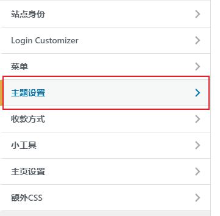
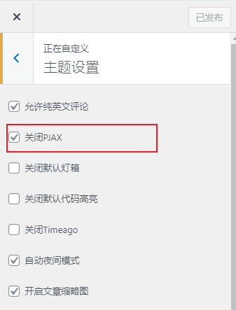

## 简介

> 本文列举了一些使用wordpress建站时碰过的问题，并给出一定的解决方法以供参考。

## 加载主页时概率空白

> 在一些主题中，进入主页时有概率页面会是空白，需要刷新一下才会出现主页内容？

- 如果你的网站协议是http，则可能是http劫持问题，故建议使用https。
- 我所在的校园网就有这个问题，换了https之后就好了。

## 切换页面时可能错乱

> 在进入wp的后台管理页面，或是登录页面等操作时，页面有文字，但是是错乱的？

- 可能是pjax导致的，建议在主题设置中看看是否有这个选项，考虑关闭它解决：

