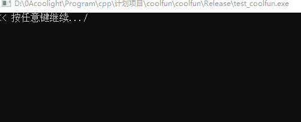
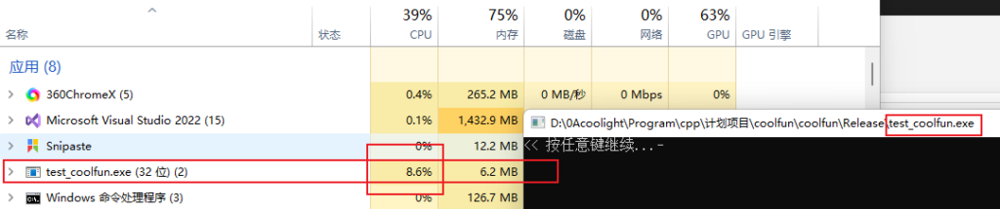
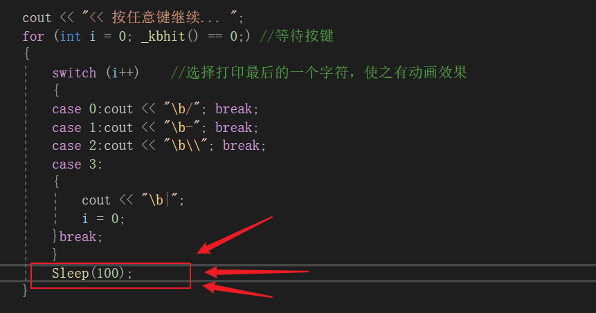
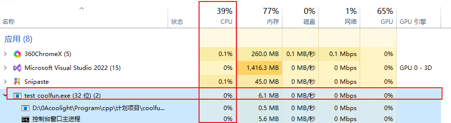
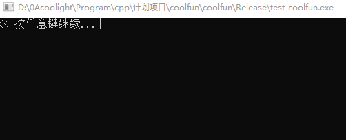

> 加入比较短时间的Sleep()一般对时效性影响不大，但能极大地降低CPU占用。

- 比如，这里我们用coolfun::UI\_suspend()等待按键函数的源码来举例：

```
#include<conio.h>
#include<iostream>
#include<windows.h>
using namespace std;

int main()
{
	cout << "<< 按任意键继续... ";
	for (int i = 0; _kbhit() == 0;)	//等待按键
	{
		switch (i++)	//选择打印最后的一个字符，使之有动画效果
		{
		case 0:cout << "\b/"; break;
		case 1:cout << "\b-"; break;
		case 2:cout << "\b\\"; break;
		case 3:
		{
			cout << "\b|";
			i = 0;
		}break;
		}
		//Sleep(100);    //暂停100毫秒（1秒 = 1000毫秒）
	}
}
```

- 效果：



- 但是它的CPU占用相当的高，一直了 8% 左右，而这还仅仅是一个简单的动画功能。



- 那接下来我们在循环内加一条Sleep()：



- 然后再来看看它的CPU占用：



- 可以看到，显示的是CPU占用 0%，显然是因为占用太低了，所以才显示了 0%。
- 这句Sleep(100)，暂停的100毫秒对用户来说基本没感觉，但却大幅度降低了CPU占用，而且动画效果甚至更舒服了：


