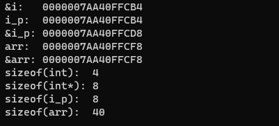

- 首先要明确的是，数组名和指针还是有区别的
- 数组名本身就是一个常量地址，它是数组的首地址，并且不可修改，而数组名本身不占空间。
- 指针是一块空间，它存放了一个地址。在32位系统中，由于地址是4个字节大小，因此一个指针占用的空间就是4个字节。而64位系统中，地址是8字节大小，一个指针的大小也随之为8个字节。
- 示例：

```
#include <iostream>
using namespace std;

int main()
{
	int i = 0;
	int* i_p = &i;
	int arr[10] = {};

	cout << "&i:   " << &i   << endl;
	cout << "i_p:  " << i_p  << endl;
	cout << "&i_p: " << &i_p << endl;
	cout << "arr:  " << arr  << endl;
	cout << "&arr: " << &arr << endl;
	cout << "sizeof(int):  " << sizeof(int) << endl;
	cout << "sizeof(int*): " << sizeof(int*) << endl;
	cout << "sizeof(i_p):  " << sizeof(i_p) << endl;
	cout << "sizeof(arr):  " << sizeof(arr) << endl;
	return 0;
}
```

- 运行结果：



- 可以看到，指针 i\_p 存放的就是 i 的地址，但 i\_p 本身也是占空间的，所以 i\_p 的地址 &i\_p 和 i\_p 存放的内容是不一样的。
- 而数组则不同，arr 和 &arr是同一个地址。
- 使用sizeof()取占用空间大小时：
    - sizeof(i\_p) 的值为指针的大小，即8个字节
    - sizeof(arr) 的值为数组int arr\[10\]，10个int的总大小，故为 4 \* 10 = 40 个字节
