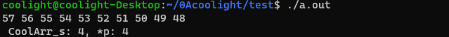
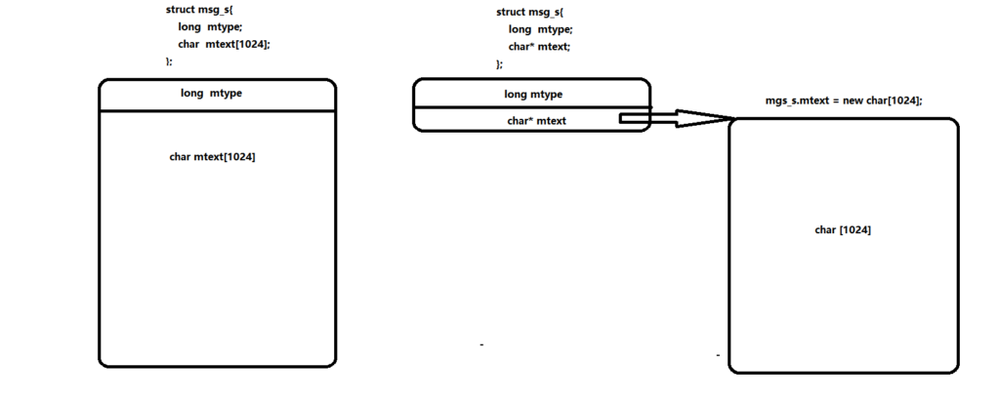

## 柔性数组

> 在C99标准之后，在结构体中最后一个元素允许是未知大小的，称之为柔性数组

- 一般定义为：
    - **类型 变量名\[\]**
    - 注意：
        - 结构体中，柔性数组前必须有变量
        - 柔性数组必须定义在结构体的最后
    - 示例：

```
struct CoolArr_s{
	int len;
	char arr[];
};
```

- \-
    - 如果编译器报错，则考虑把最后的 char arr\[\] 尝试替换为一下几种写法：
        - char arr\[0\]
        - char arr\[1\] （非常不推荐，如果这样声明后使用时会被认为是越界行为）
- 使用 **malloc(sizeof(int) + sizeof(char) \* 长度)** 申请内存空间
- 示例：

```
#include "stdio.h"
#include "stdlib.h"

struct CoolArr_s
{
        int len;
        char arr[];
};

int main()
{
        //这里给arr的长度为10个char的大小
        struct CoolArr_s* p = (struct CoolArr_s*)malloc(sizeof(int) + sizeof(char) * 10);
        for (int i = 10; i--;)
        {
                (p->arr)[i] = i + '0';
                printf("%d " ,(p->arr)[i]);
        }
        printf("\n CoolArr_s: %d, *p: %d\n", sizeof(struct CoolArr_s), sizeof(*p));
        return 0;
}
```

- 运行结果：



- 那么这和直接把它定义为指针有什么区别呢？或者说它有什么好处呢？
    
    - 首先从上面的例子的运行结果可见，结构体 CoolArr\_s 的大小就是 int len 的大小。也就是说，**柔性数组 char arr\[\] 并不会占一个指针的大小**。数组名 arr 是一个常量地址，这个地址是紧接着 int len 的后面的地址。（[**数组名和指针是不同的**](https://blog.coolight.cool/?p=987)）
    
    - 其次就是**柔性数组的内存空间是和结构体连续的**，而声明为指针时，其指向的数组内存空间和结构体极大概率不是连续的。这一点在给一些函数传值时是非常重要的区别，比如 [**linux中的消息队列**](https://blog.coolight.cool/?p=973) 相关的函数。



* * *

## 在C++中的柔性数组

> **注意：在c++中并不建议使用柔性数组**，而应考虑使用array代替。即使它可以使用在struct和class中，但部分编译器是不支持这种操作的。

- 截止至2022（C++20标准）：
    - 在g++中是可以使用柔性数组的
    - 在VS2022的MSVC中使用柔性数组，虽然可以运行，但会有警告：
        - warning C4200: 使用了非标准扩展: 结构/联合中的零大小数组
        - warning C6011: 取消对 NULL 指针 “xxx” 的引用
- 所以在c++中应考虑使用array容器代替。
- 示例（使用array容器代替上面的例子）：

```
#include <iostream>
#include <array>
using namespace std;

int main()
{
        //数组长度
	const int len_arr = 10;
        //定义数组
	array<int, len_arr> arr;
        //array::data()返回数组的首地址
        //array::begin()返回的是迭代器iterator
	int *arr_p = arr.data();
	for (int i = len_arr; i--;)
	{
		arr_p[i] = i;
		cout << arr[i] << " ";
	}
	cout << endl;
	return 0;
}
```
