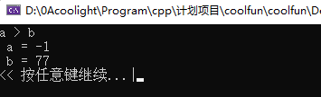

# [c/c++]unsigned和int的比较会默认强制转换为unsigned

> **无符号整形**(unsigned) 和 **有符号整形**(int) 的比较会默认强制转换为 **无符号类型**(unsigned)

- 先来看示例代码，这里以 int a = -1 和 unsigned int b = 77 来做大小比较：

```
#include <iostream>
using namespace std;

int main()
{
	int a = -1;
	unsigned int b = 77;
	if (a > b)	//a > b  = true
		cout << "a > b" << endl;
	else
		cout << "a < b" << endl;
	cout << " a = " << a << endl;
	cout << " b = " << b << endl;
}
```

- 运行结果
    - 如下图，a = -1，b = 77，但比较结果却是a > b， 即-1 > 77
    - 原因正是两者类型不同导致的，这如果在实际项目中遇到了，在debug的时候真的感觉是见鬼了。


