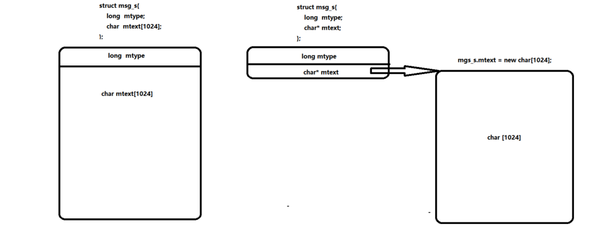
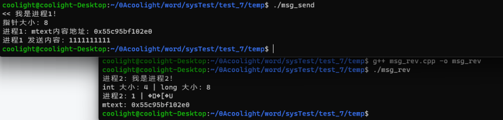
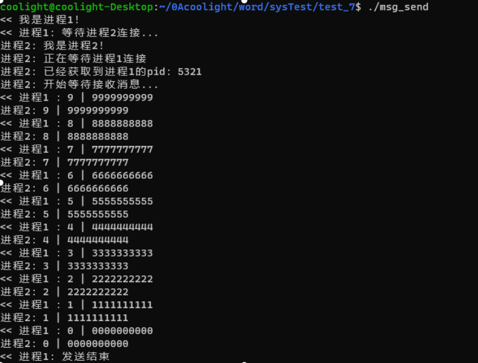

# [linux操作系统实验]消息的发送与接收（消息发送中英文都乱码/变长消息结构体/msgget()一直失败返回-1）

## 问题

### msgget()一直失败返回-1

- 如果你使用的是win10的子系统，则目前来看会有这个问题，而且几乎在每一台机子上都有这个问题，建议使用虚拟机VMware，或者升级win11。

### 消息发送中英文都乱码

- 如果连发送英文字母都乱码，就很可能不是编码问题，而应考虑消息结构体msgp的定义是否正确：
- 在发送消息函数（msgsnd(msgqid,msgp,size,flag)）
- 接收消息函数（msgrcv(msgqid,msgp,size,type,flag)）中，都有msgp这个结构体，但它的类型是要我们自己定义的：

```
struct msg_s{
    long  mtype;       //消息类型
    char  mtext[1024]; //消息的文本
    //char* mtext;     //这样是错的！！
};
```

- 需要注意的是这个mtext，它是我们传输的消息的文本，这里定义为一个字符串，它所在的内存空间必须在结构体内或者说是和结构体是连在一起的。
- 当我们把mtext定义为 char\* 时，mtext仅仅是一个char指针，它指向一块存放char内容的内存空间，但这块空间显然极大概率不会和结构体连续，正如上一个句中的要求，mtext是需要和结构体的内存空间连续的。
- 所以如果使用了char \* mtext的定义，实际上是发送的消息是mtext的内容，也就是它所指向的char\[1024\]的首地址，在32位系统中这个地址将只有4个字节大小，而在64位系统为8字节大小，但都远小于我们定义的char\[1024\]。



- 我们可以写个程序来测试一下：

**msg\_send.cpp**

```
#include <sys/types.h>
#include <sys/msg.h>
#include <sys/ipc.h>
#include <iostream>
#include <string>
#include <cstring>
#include <time.h>
#include <fstream>
using namespace std;

/*发送进程*/
struct msg_s
{
        long mtype;
        char* mtext;
};

int main()
{
        cout << "<< 我是进程1！" << endl;
        int msgqid = 0;
        //搞一个消息队列描述符
        while((msgqid = msgget(key_t(77), 0777 | IPC_CREAT)) == -1);
        msg_s* msgp = new msg_s();
        msgp->mtype = 2;
        msgp->mtext = new char[1024];
        cout << "指针大小：" << sizeof(int*) << endl;
        cout << "进程1：mtext内容地址: " << (int*)(msgp->mtext) << endl;
        memset(msgp->mtext, 0, 1024);
        memset(msgp->mtext, 48 + msgp->mtype - 1, 10);
        msgsnd(msgqid, msgp, 1024, 0);
        cout << "进程1 发送内容：" << msgp->mtext << endl;
        delete[]msgp;
        return 0;
}
```

**msg\_rev.cpp**

```
#include <sys/types.h>
#include <sys/msg.h>
#include <signal.h>
#include <sys/ipc.h>
#include <iostream>
#include <cstring>
#include <fstream>
#include <unistd.h>
using namespace std;

/*接收进程*/
struct msg_s
{
        long mtype;
        char mtext[];
};

int main()
{
        cout << "进程2：我是进程2！" << endl;
        int msgqid = 0;
        //搞一个消息队列描述符
        while((msgqid = msgget(key_t(77), 0777 | IPC_CREAT)) == -1);
        msg_s* msgp =  (msg_s*)malloc(sizeof(long) + sizeof(char) * 1025);
        memset(msgp->mtext, 0, 1025);
        msgrcv(msgqid, msgp, 1024, 0, 0);
        cout << "int 大小：" << sizeof(int) << " | long 大小：" << sizeof(long) << endl;
        cout << "进程2：" << msgp->mtype - 1 << " | " << msgp->mtext << endl;
        cout << "mtext: " << (int*)(*((long*)(msgp->mtext))) << endl;
        msgctl(msgqid,IPC_RMID,0);
        return 0;
}
```

- 分析：
    
    - msg\_rev.cpp：cout << "mtext: " << (int\*)(\*((long\*)(msgp->mtext))) << endl;
    
    - 首先我们收到的msgp->mtext虽然是char\*，但它存的是发送进程发送过来的一个指针，由于环境是64位系统，其指针大小为8个字节，1个char为1字节，如果我们直接输出(msgp->mtext)，则是把8个字节的地址（地址实际上可以看作是一个整数）拆分为8个char分别输出，就不好对比了。而此时的int仅有4个字节大小，故应转为同样有8字节大小的long值（此时的long值即为地址的十进制数）再随便转为一个非char\*的指针，输出的就是这个地址的十六进制数，此时与发送进程的比较就容易多了。
- 运行结果：



- 显然我们的猜想是正确的，char\* mtext 定义后，发送的消息内容是mtext存放的指针，即指向char\[1024\]的首地址。

### 可变长度的消息结构体

> 如上所述，如果只能在结构体内定义数组，则消息的大小必须是固定的吗？
> 
> 看这一小节的标题就知道显然不是的，我们可以使用柔性数组来实现变长消息结构体，使得mtext的内存空间即与结构体连续，又是可变长度。这实际上在上一小节的举例中msg\_rev.cpp中已经用到了。

- 首先，我们需要这样声明 msg\_s 类型：

```
struct msg_s {
        long mtype;
        char mtext[];   //mtext必须放在最后
};
```

- 要注意mtext必须放在结构体声明的最后面。
- 然后在需要使用到它时，使用malloc来申请空间：

```
int main()
{
    //使用malloc动态申请空间
    msg_s* coolmsg = (msg_s*)malloc(sizeof(long) + sizeof(char) * 长度);
    //然后就可以初始化并使用它了
    coolmsg->mtype = 1;
    //将mtext的内容全部置为 'A'
    memset(coolmsg->mtext, 'A', 长度);
}
```

- 这种操作被称为[**柔性数组**](https://blog.coolight.cool/?p=971)

### 获取消息的信息

> 使用msgctl()可以获取到消息缓冲区地址，由此可以查询消息队列中消息数目，最后一个发送消息的进程的pid，发送时间，队列中的最大字节数等等。

- 首先我们来看一下msgctl()的函数定义：
    - int msgctl(msgqid,cmd,buf);
    - int  msgqid,cmd;
    - struct  msqid\_ds  \*buf;
    - 其中：
    - msgqid：消息队列描述符
    - cmd：命令内容，命令可分三类：
        1. IPC\_STAT。查询有关消息队列情况的命令。如查询队列中的消息数目、队列中的最大字节数、最后一个发送消息的进程标识符、发送时间等；
        2. IPC\_SET。按buf指向的结构中的值，设置和改变有关消息队列属性的命令。如改变消息队列的用户标识符、消息队列的许可权等；
        3. IPC\_RMID。消除消息队列的标识符。
    - buf是缓冲区地址，它的类型是结构体 msqid\_ds，定义如下：

```
struct  msqid_ds
{  
      struct  ipc_perm  msg_perm; /*许可权结构*/
      short  pad1[7];    /*由系统使用*/
      ushort msg_qnum;   /*队列上消息数*/
      ushort msg_qbytes; /*队列上最大字节数*/
      ushort msg_lspid;  /*最后发送消息的PID*/
      ushort msg_lrpid;  /*最后接收消息的PID*/
      time_t msg_stime;  /*最后发送消息的时间*/
      time_t msg_rtime;  /*最后接收消息的时间*/
      time_t msg_ctime;  /*最后更改时间*/
};
struct  ipc_perm
{  
      ushort uid;  /*当前用户*/
      ushort gid;  /*当前进程组*/
      ushort cuid; /*创建用户*/
      ushort cgid; /*创建进程组*/
      ushort mode; /*存取许可权*/
      { short pid1; long pad2;} /*由系统使用*/  
}
```

- 重点就在于最后的这个缓冲区结构体msqid\_ds，它包含了很多有段消息队列的信息，我们获取信息也很多是从它而来。
- 这里举例：
    - 获取最后发送消息的进程pid：

```
struct msg_s
{
        long mtype;
        char mtext[];
};

void tempfun()
{
    int msgqid = 0;
    //搞一个消息队列描述符
    while((msgqid = msgget(key_t(77), 0777 | IPC_CREAT)) == -1);
    //申请一个消息长度1025的消息
    msg_s* msgp =  (msg_s*)malloc(sizeof(long) + sizeof(char) * 1025);
    memset(msgp->mtext, 0, 1025);

    //接收一次信息
    msgrcv(msgqid, msgp, 1024, 0, 0);
    msqid_ds cool_msgDs;

    //查询缓冲区
    msgctl(msgqid, IPC_STAT, &cool_msgDs);
    //获取缓冲区中记录的最后发送消息的进程pid
    int send_pid = cool_msgDs.msg_lspid;
    cout << "已经最后一个发送消息的进程pid：" << send_pid << endl;
    return 0;
}
```

* * *

## 具体实验内容

### 实验内容

> 消息的创建、发送和接收。使用系统调用msgget( ),msgsnd( ),msgrev( ),及msgctl( )编制一长度为１k的消息发送和接收的程序

### 概念

> 消息（message）是一个格式化的可变长的信息单元。消息机制允许由一个进程给其它任意的进程发送一个消息。当一个进程收到多个消息时，可将它们排成一个消息队列。消息使用二种重要的数据结构：一是消息首部，其中记录了一些与消息有关的信息，如消息数据的字节数；二个消息队列头表，其每一表项是作为一个消息队列的消息头，记录了消息队列的有关信息。

- 消息机制的数据结构
    
    - 消息首部：记录一些与消息有关的信息，如消息的类型、大小、指向消息数据区的指针、消息队列的链接指针等。
    
    - 消息队列头表：其每一项作为一个消息队列的消息头，记录了消息队列的有关信息如指向消息队列中第一个消息和指向最后一个消息的指针、队列中消息的数目、队列中消息数据的总字节数、队列所允许消息数据的最大字节总数，还有最近一次执行发送操作的进程标识符和时间、最近一次执行接收操作的进程标识符和时间等。
- 消息队列的描述符
    - Linux中，每一个消息队列都有一个称为关键字（key）的名字，是由用户指定的；消息队列有一消息队列描述符，其作用与用户文件描述符一样，也是为了方便用户和系统对消息队列的访问。

### 涉及函数

#### **msgget()**

- 创建一个消息，获得一个消息的描述符。核心将搜索消息队列头表，确定是否有指定名字的消息队列。若无，核心将分配一新的消息队列头，并对它进行初始化，然后给用户返回一个消息队列描述符，否则它只是检查消息队列的许可权便返回。
- 系统调用格式：
    - msgqid=msgget(key,flag)
- 该函数使用头文件如下：
    - #include<sys/types.h>
    - #include<sys/ipc.h>
    - #include<sys/msg.h>
- 参数定义
    - int msgget(key,flag)
    - key\_t  key;
    - int  flag;
- 其中：
    - key是用户指定的消息队列的名字；flag是用户设置的标志和访问方式。如  IPC\_CREAT |0400       是否该队列已被创建。无则创建，是则打开；
    - IPC\_EXCL |0400        是否该队列的创建应是互斥的。
    - msgqid 是该系统调用返回的描述符，失败则返回-1

#### **msgsnd()**

- 发送一消息。向指定的消息队列发送一个消息，并将该消息链接到该消息队列的尾部。
- 系统调用格式：
    - msgsnd(msgqid,msgp,size,flag)
- 该函数使用头文件如下：
    - #include <sys/types.h>
    - #include <sys/ipc.h>
    - #include <sys/msg.h>
- 参数定义：
    
    - int msgsnd(msgqid,msgp,size,flag)
    - I   int msgqid,size,flag;
    - struct msgbuf  \* msgp;
    - 其中：
    - msgqid是返回消息队列的描述符；msgp是指向用户消息缓冲区的一个结构体指针。缓冲区中包括消息类型和消息正文，即
    
    - {
    -     long  mtype;             /\*消息类型\*/
    -     char  mtext\[ \];           /\*消息的文本\*/
    -  }
    - size指示由msgp指向的数据结构中字符数组的长度；即消息的长度。这个数组的最大值由MSG-MAX( )系统可调用参数来确定。flag规定当核心用尽内部缓冲空间时应执行的动作:进程是等待，还是立即返回。若在标志flag中未设置IPC\_NOWAIT位，则当该消息队列中的字节数超过最大值时，或系统范围的消息数超过某一最大值时，调用msgsnd进程睡眠。若是设置IPC\_NOWAIT，则在此情况下，msgsnd立即返回。
- 对于msgsnd( )，核心须完成以下工作：
    1. 对消息队列的描述符和许可权及消息长度等进行检查。若合法才继续执行，否则返回；
    2. 核心为消息分配消息数据区。将用户消息缓冲区中的消息正文，拷贝到消息数据区；
    3. 分配消息首部，并将它链入消息队列的末尾。在消息首部中须填写消息类型、消息大小和指向消息数据区的指针等数据；
    4. 修改消息队列头中的数据，如队列中的消息数、字节总数等。最后，唤醒等待消息的进程。

#### **msgrcv()**

- 接受一消息。从指定的消息队列中接收指定类型的消息。
- 系统调用格式：
    - msgrcv(msgqid,msgp,size,type,flag)
- 本函数使用的头文件如下：
    - #include <sys/types.h>
    - #include <sys/ipc.h>
    - #include <sys/msg.h>
- 参数定义：
    - int  msgrcv(msgqid,msgp,size,type,flag)
    - int  msgqid,size,flag;
    - struct  msgbuf  \*msgp;
    - long  type;
- 其中，msgqid,msgp,size,flag与msgsnd中的对应参数相似，type是规定要读的消息类型，flag规定倘若该队列无消息，核心应做的操作。如此时设置了IPC\_NOWAIT标志，则立即返回，若在flag中设置了MS\_NOERROR，且所接收的消息大于size，则核心截断所接收的消息。
- 对于msgrcv系统调用，核心须完成下述工作：
    1. 对消息队列的描述符和许可权等进行检查。若合法，就往下执行；否则返回；
    2. 根据type的不同分成三种情况处理：
        1. type=0，接收该队列的第一个消息，并将它返回给调用者；
        2. type为正整数，接收类型type的第一个消息；
        3. type为负整数，接收小于等于type绝对值的最低类型的第一个消息。
    3. 当所返回消息大小等于或小于用户的请求时，核心便将消息正文拷贝到用户区，并从消息队列中删除此消息，然后唤醒睡眠的发送进程。但如果消息长度比用户要求的大时，则做出错返回

#### **msgctl()**

- 消息队列的操纵。读取消息队列的状态信息并进行修改，如查询消息队列描述符、修改它的许可权及删除该队列等。
- 系统调用格式：
    - msgctl(msgqid,cmd,buf);
- 本函数使用的头文件如下：
    - #include <sys/types.h>
    - #include <sys/ipc.h>
    - #include <sys/msg.h>
- 参数定义：
    - int msgctl(msgqid,cmd,buf);
    - int  msgqid,cmd;
    - struct  msqid\_ds  \*buf;
- 其中：
- 函数调用成功时返回0，不成功则返回-1。buf是用户缓冲区地址，供用户存放控制参数和查询结果；cmd是规定的命令。命令可分三类：
    1. IPC\_STAT。查询有关消息队列情况的命令。如查询队列中的消息数目、队列中的最大字节数、最后一个发送消息的进程标识符、发送时间等；
    2. IPC\_SET。按buf指向的结构中的值，设置和改变有关消息队列属性的命令。如改变消息队列的用户标识符、消息队列的许可权等；
    3. IPC\_RMID。消除消息队列的标识符。
- msqid\_ds  结构定义如下：

```
struct  msqid_ds
{  
      struct  ipc_perm  msg_perm;     /*许可权结构*/
      short  pad1[7];                 /*由系统使用*/
      ushort msg_qnum;                /*队列上消息数*/
      ushort msg_qbytes;              /*队列上最大字节数*/
      ushort msg_lspid;               /*最后发送消息的PID*/
      ushort msg_lrpid;               /*最后接收消息的PID*/
      time_t msg_stime;               /*最后发送消息的时间*/
      time_t msg_rtime;               /*最后接收消息的时间*/
      time_t msg_ctime;               /*最后更改时间*/
};
struct  ipc_perm
{  
      ushort uid;                     /*当前用户*/
      ushort gid;                     /*当前进程组*/
      ushort cuid;                    /*创建用户*/
      ushort cgid;                    /*创建进程组*/
      ushort mode;                    /*存取许可权*/
      { short pid1; long pad2;}       /*由系统使用*/  
}
```

### 源代码

**msg\_send.cpp**

```
#include <sys/types.h>
#include <sys/msg.h>
#include <sys/ipc.h>
#include <iostream>
#include <string>
#include <cstring>
#include <time.h>
#include <fstream>
using namespace std;

/*发送进程*/
struct msg_s
{
        long mtype;
        char mtext[];
};

int main()
{
        cout << "<< 我是进程1！" << endl;
        int msgqid = 0;
        while((msgqid = msgget(key_t(77), 0777 | IPC_CREAT)) == -1);    //搞一个消息队列描述符

        msg_s* msgp = (msg_s*)malloc(sizeof(long) + sizeof(char) * 1025);
        msgp->mtype = 10;
        while(msgp->mtype > 0)
        {
                memset(msgp->mtext, 0, 1024);
                memset(msgp->mtext, 48 + msgp->mtype - 1, 10);
                msgsnd(msgqid, msgp, 1024, 0);
                cout << "进程1 ：" << msgp->mtype - 1 << " | " << msgp->mtext << endl;
                --(msgp->mtype);
        }
        delete[]msgp;
        return 0;
}
```

**msg\_rev.cpp**

```
#include <sys/types.h>
#include <sys/msg.h>
#include <sys/ipc.h>
#include <iostream>
#include <cstring>
#include <fstream>
#include <unistd.h>
using namespace std;

/*接收进程*/
struct msg_s
{
        long mtype;
        char mtext[1025];
        msg_s(long in_mtype)
        {
                mtype = in_mtype;
        }
};

int main()
{
        cout << "<<  我是进程2！" << endl;
        int msgqid = 0;
        while((msgqid = msgget(key_t(77), 0777 | IPC_CREAT)) == -1);  //搞一个消息队列描述符

        cout << "<< 进程2开始等待接收消息..."<<endl;
        msg_s* msgp = new msg_s(10);
        do{
                memset(msgp->mtext, 0, 1025);
                msgrcv(msgqid, msgp, 1024, 0, 0);
                cout << "<< 进程2：" << msgp->mtype - 1 << " | " << msgp->mtext << endl;
        }while(msgp->mtype > 1);

        msgctl(msgqid,IPC_RMID,0);
        return 0;
}
```

### 运行结果截图



### 思考

- **实现“(client)sent”和 “(server)received”的交替输出**
    - 注：message的传送和控制并不保证完全同步，当一个程序不在激活状态的时候，它完全可能继续睡眠，造成了上面的现象，在多次send message 后才recieve message。这一点有助于理解消息传送的实现机理
- 思路：先发送一个没用的消息，让接收进程获取到发送进程的pid，然后通过pid每次接收消息并输出后给发送进程发送信号，发送进程接收到信号才会发送下一条信息。
- 源代码：

**msg\_send.cpp**

```
#include <sys/types.h>
#include <sys/msg.h>
#include <sys/ipc.h>
#include <iostream>
#include <string>
#include <cstring>
#include <time.h>
#include <fstream>
#include <signal.h>
#include <unistd.h>
using namespace std;

/*发送进程*/
struct msg_s
{
        long mtype;
        char mtext[];
};

/*指示是否接收*/
bool is_rev = false;

void setRev(int)
{
        is_rev = true;
}
int main()
{
        if(fork() == 0)
        {
                execl("./msg_rev", "msg_rev",NULL);
        }else{
                cout << "<< 我是进程1！" << endl;
                int msgqid = 0;
//搞一个消息队列描述符
                while((msgqid = msgget(key_t(77), 0777 | IPC_CREAT)) == -1);    
                signal(16, setRev);
                msg_s* msgp = (msg_s*)malloc(sizeof(long) + sizeof(char) * 1025);
                msgp->mtype = 10;
                (msgp->mtext)[0] =  'a';
                msgsnd(msgqid, msgp, 1, 0);
                cout << "<< 进程1：等待进程2连接..." << endl;
                msgp->mtype = 10;
                while(msgp->mtype > 0)
                {
                        while(is_rev == false)
                                usleep(1000 * 100);
                        is_rev = false;
                        memset(msgp->mtext, 0, 1024);
                        memset(msgp->mtext, 48 + msgp->mtype - 1, 10);
                        msgsnd(msgqid, msgp, 1024, 0);
                        cout << "<< 进程1 ：" << msgp->mtype - 1 << " | " << msgp->mtext << endl;
                        --(msgp->mtype);
                cout << "<< 进程1：发送结束" << endl;
                delete[]msgp;
        }
        return 0;
}
```

**msg\_rev.cpp**

```
#include <sys/types.h>
#include <sys/msg.h>
#include <signal.h>
#include <sys/ipc.h>
#include <iostream>
#include <cstring>
#include <fstream>
#include <unistd.h>
using namespace std;

/*接收进程*/
struct msg_s
{
        long mtype;
        char mtext[];
};

int main()
{
        cout << "进程2：我是进程2！" << endl;
        int msgqid = 0;
//搞一个消息队列描述符
        while((msgqid = msgget(key_t(77), 0777 | IPC_CREAT)) == -1);  
        msg_s* msgp =  (msg_s*)malloc(sizeof(long) + sizeof(char) * 1025);
        cout << "进程2：正在等待进程1连接" << endl;
        int send_pid = 0;
        memset(msgp->mtext, 0, 1025);
        msgrcv(msgqid, msgp, 1024, 0, 0);
        msqid_ds cool_msgDs;
        msgctl(msgqid, IPC_STAT, &cool_msgDs);
        send_pid = cool_msgDs.msg_lspid;
        cout << "进程2：已经获取到进程1的pid：" << send_pid << endl;
        kill(send_pid, 16);
        cout << "进程2：开始等待接收消息..."<<endl;
        do{
                memset(msgp->mtext, 0, 1025);
                msgrcv(msgqid, msgp, 1024, 0, 0);
                cout << "进程2：" << msgp->mtype - 1 << " | " << msgp->mtext << endl;
                kill(send_pid, 16);
        }while(msgp->mtype > 1);

        msgctl(msgqid,IPC_RMID,0);
        return 0;
}
```
