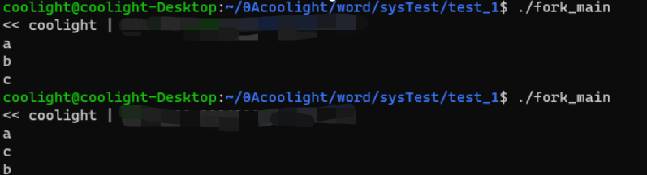

## 问题

- 有的时候，程序运行后的输出结果会在cmd的输出提示之后：


- 本实验中是父进程创建了两个子进程，然后父进程输出 a 后结束，子进程分别输出 b c 后结束。
- 出现该问题其实就在于父进程可能比子进程先结束，此时cmd提示就会冒出来。
- 当我们在命令行里面输入命令并回车执行时，命令内容是交给了shell去执行，而shell是有很多种具体实现的程序：如 bath，zsh ...... 并且正在使用的 shell 是可以修改的。
    - 需要查看自己的shell是谁，可以执行cmd命令：echo $SHELL
    - cmd就会输出当前使用的shell的位置：


- **原因**：我们在shell中运行我们写的实验程序（$ ./fork\_main）时，shell会等待fork\_main这个进程结束，但fork\_main里面又创建了两个子进程，shell是不管的，一旦shell启动的父进程fork\_main结束，shell的提示（coolight@coolight-Desktop:~$）就会冒出来，而此时子进程才开始输出，因此会出现有些程序输出是在shell提示之后。

* * *

## 实验具体内容

### 实验内容

> 编写一段程序，使用系统调用fork( )创建两个子进程。当此程序运行时，在系统中有一个父进程和两个子进程活动。让每一个进程在屏幕上显示一个字符：父进程显示'a'，子进程分别显示字符'b'和字符'c'。试观察记录屏幕上的显示结果，并分析原因。

### **涉及的系统调用**

- **fork()**
    - 创建一个新进程。 
    - 系统调用格式： 
    - pid=fork( )
    - 参数定义：
        - int  fork(  )
    - fork(  )返回值意义如下：
        - 0：在子进程中，pid变量保存的fork(  )返回值为0，表示当前进程是子进程。
        - \>0：在父进程中，pid变量保存的fork(  )返回值为子进程的id值（进程唯一标识符）。
        - \-1：创建失败。
    - 如果fork( )调用成功，它向父进程返回子进程的PID，并向子进程返回0，即fork( )被调用了一次，但返回了两次。此时OS在内存中建立一个新进程，所建的新进程是调用fork( )父进程（parent process）的副本，称为子进程（child process）。子进程继承了父进程的许多特性，并具有与父进程完全相同的用户级上下文。父进程与子进程并发执行。
    - 核心为fork( )完成以下操作：
        - （1）为新进程分配一进程表项和进程标识符，进入fork( )后，核心检查系统是否有足够的资源来建立一个新进程。若资源不足，则fork( )系统调用失败；否则，核心为新进程分配一进程表项和唯一的进程标识符。
        - （2）检查同时运行的进程数目，超过预先规定的最大数目时，fork( )系统调用失败。
        - （3）拷贝进程表项中的数据，将父进程的当前目录和所有已打开的数据拷贝到子进程表项中，并置进程的状态为“创建”状态。
        - （4）子进程继承父进程的所有文件，对父进程当前目录和所有已打开的文件表项中的引用计数加1。
        - （5）为子进程创建进程上、下文，进程创建结束，设子进程状态为“内存中就绪”并返回子进程的标识符。
        - （6）子进程执行，虽然父进程与子进程程序完全相同，但每个进程都有自己的程序计数器**PC(注意子进程的PC开始位置)**，然后根据pid变量保存的fork(  )返回值的不同，执行了不同的分支语句。
    - 例：

<figure>

<table><tbody><tr><td>…..<br>pid=fork( );<br>if &nbsp;(! pid)&nbsp;printf("I'm the child process!\n");<br>else if (pid&gt;0)&nbsp;printf("I'm the parent process! \n");<br>else&nbsp;printf("Fork fail!\n");<br>……</td></tr></tbody></table>

<figcaption>

fork( )调用前

</figcaption>


</figure>

<figure>

<table><tbody><tr><td>…..<br>pid=fork( );<br>if (! pid)&nbsp;printf("I'm the child process!\n");<br>else if (pid&gt;0)&nbsp;printf("I'm the parent process!\n "); &nbsp;&nbsp;&nbsp;<br>else&nbsp;printf("Fork fail!\n");<br>……</td><td><strong>&nbsp;</strong></td><td>…..<br>pid=fork( );<br>if (! pid)&nbsp;printf("I'm the child process!\n");<br>else if (pid&gt;0)&nbsp;printf("I'm the parent process!\n ");<br>else&nbsp;printf("Fork fail!\n");<br>……</td></tr></tbody></table>

<figcaption>

fork( )调用后

</figcaption>


</figure>

### 源代码

```
#include <iostream>
#include <unistd.h>
using namespace std;
int main()
{
        cout << "<< coolight | [软件202,2006300052,郑泳坤]" << endl;
        int fork_num = fork();
        if(fork_num == -1){
                cout << "<< fork Error" << endl;
        }else if(fork_num == 0){ //子进程
                fork_num = fork();
                if(fork_num == -1){
                        cout << "<< fork Error" << endl;
                }else if(fork_num == 0){ //子进程
                        sleep(0.5);
                        cout << "c" << endl;
                }else if(fork_num > 0){
                        sleep(0.5);
                        cout << "b" << endl;
                }
        }else if(fork_num > 0){
                sleep(0.5);
                cout << "a" << endl;
        }
        return 0;g
}
```

### 运行结果截图




### **思考**

- 系统是怎样创建进程的？
    - 主要是四个步骤
        - 申请空白PCB（过程控制块）
        - 为新工序分配资源
        - 初始化PCB
        - 将新进程插入就绪队列
    - 当使用fork()创建时将复制父进程的PCB块，U区和内存图像到新进程。Fork()会用到写时复制，子进程会和父进程共享一些资源，直到有人对一部分数据进行写操作，才会真正开辟空间复制出来这一部分资源
- 当首次调用新创建进程时，其入口在哪里？
    - 父进程和子进程入口都在fork()函数调用的下一句指令代码。但由于fork()返回值不同，两者可以依据分支语句区分，然后后续执行不同的代码
