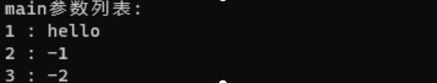
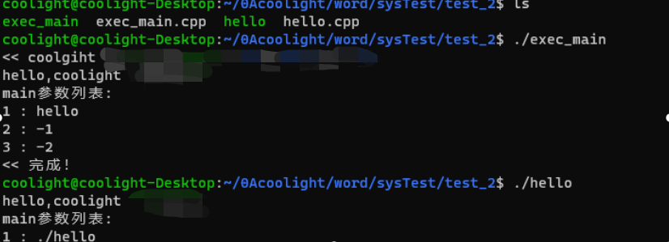

# [linux操作系统实验]进程的控制（execl()第二个传参为什么是可执行程序名）

## 问题

> 实验示例代码中，调用execl()时，第二个传参为什么会是可执行程序名：
> 
> execl("/bin/ls", "ls", "-l", "-color", NULL)

- 猜测原因：可以更好地模拟在shell中执行时的传参，防止传参失效。
- 剖析：
- 我们先来看看 execl() 的定义：
    - int  execl( path, arg0\[,arg1,...argn\], NULL);
    - char  \*path, \*arg0, \*arg1, ..., \*argn
    - path：（必须）可执行程序的路径（可以是相对路径，也可以是绝对路径）
    - arg0, ... argn ：（可选）可变参数数量，给这个可执行程序的传参（这些传参是传给可执行程序的main函数）
    - NULL：（建议）最后需要一个NULL结尾，表示传参结束。
- 可见，按理从第二个参数开始，都是给可执行程序的传参，因此是不需要第二个参数给一个程序名的。
- 我们可以写一个hello来接收main函数的参数：hello.cpp

```
#include <iostream>
using namespace std;

int main(int aNum, char** aStr)
{
        cout << "hello,coolight" << endl;
        cout << "main参数列表:" << endl;
        for(int i = 0; i < aNum; ++i)
                cout << i + 1 << " : " << aStr[i] << endl;

        return 0;
}
```

- \-
    - 编译生成 hello
- 然后在实验写的程序中使用execl调用这个 hello ：
    - execl("./hello", "hello", "-1", "-2", NULL);
    - hello程序输出结果：



- 可以看到，第二个参数是程序名（“hello”）确实也是main函数的传参。
- 但是，为什么要这样做呢？
    - 如果我们直接在shell运行hello，且不给它传参呢？
    - shell执行：$ ./hello
    - 运行结果：


- 可见，在shell中，即使只执行hello程序，**它本身的文件名也会作为给main函数的第一个传参**
- 那现在看来，答案似乎已经在我们面前了：
    - 在程序中调用execl()时，第二个参数给了可执行程序名是为了更接近地模拟直接在shell中执行时的传参，防止有些程序会忽略main函数的第一个参数（在shell中运行时是可执行文件名），导致传参可能会失效。

* * *

## 实验具体内容

### **实验内容**

- 用fork()创建一个进程，再调用exec()用新的程序替换该子进程的内容
- 利用wait()来控制进程执行顺序

### **涉及的系统调用**

> 在Linux中fork()是一个非常有用的系统调用，但在Linux中建立进程除了fork()之外，也可用与fork() 配合使用的exec()。

#### **exec()系列**

- 系统调用exec( )系列，也可用于新程序的运行。fork( )只是将父进程的用户级上下文拷贝到新进程中，而exec( )系列可以将一个可执行的二进制文件覆盖在新进程的用户级上下文的存储空间上，以更改新进程的用户级上下文。exec( )系列中的系统调用都完成相同的功能，它们把一个新程序装入内存，来改变调用进程的执行代码，从而形成新进程。如果exec( )调用成功，调用进程将被**覆盖，**然后从新程序的入口开始执行，这样就产生了一个新进程，新进程的进程标识符id 与调用进程相同。
- exec( )没有建立一个与调用进程并发的子进程，而是用新进程取代了原来进程。所以exec( )调用成功后，没有任何数据返回，这与fork( )不同。exec( )系列系统调用在Linux系统库unistd.h中，共有execl、execlp、execle、execv、execvp五个，其基本功能相同，只是以不同的方式来给出参数。
- 一种是直接给出参数的指针，如：
    - int  execl(path,arg0\[,arg1,...argn\],0);
    - char  \*path,\*arg0,\*arg1,...,\*argn;
- 另一种是给出指向参数表的指针，如：
    - int execv(path,argv);
    - char \*path,\*argv\[ \];

#### **exec()****和****fork()****联合使用**

- 系统调用exec和fork( )联合使用能为程序开发提供有力支持。用fork( )建立子进程，然后在子进程中使用exec( )，这样就实现了父进程与一个与它完全不同子进程的并发执行。
- 一般，wait、exec联合使用的模型为：

```
int status;
     ............
if (fork() == 0)
{
     ............
     execl(...);
     ............
}
wait(&status);
```

#### **wait**()

- 等待子进程运行结束。如果子进程没有完成，父进程一直等待。wait( )将调用进程挂起，直至其子进程因暂停或终止而发来软中断信号为止。如果在wait( )前已有子进程暂停或终止，则调用进程做适当处理后便返回。
- 系统调用格式：
    - int  wait(status)　
    - int  \*status;
- 其中，status是用户空间的地址。它的低8位反应子进程状态，为0表示子进程正常结束，非0则表示出现了各种各样的问题；高8位则带回了exit( )的返回值。exit( )返回值由系统给出。
- 核心对wait( )作以下处理：
    - （1）首先查找调用进程是否有子进程，若无，则返回出错码；
    - （2）若找到一处于“僵死状态”的子进程，则将子进程的执行时间加到父进程的执行时间上，并释放子进程的进程表项；
    - （3）若未找到处于“僵死状态”的子进程，则调用进程便在可被中断的优先级上睡眠，等待其子进程发来软中断信号时被唤醒。

#### **exit**()

- 终止进程的执行。
- 系统调用格式：
    - void exit(status)
    - int status;
- 其中，status是返回给父进程的一个整数，以备查考。
- 为了及时回收进程所占用的资源并减少父进程的干预，Linux利用exit( )来实现进程的自我终止，通常父进程在创建子进程时，应在进程的末尾安排一条exit( )，使子进程自我终止。exit(0)表示进程正常终止，exit(1)表示进程运行有错，异常终止。
- 如果调用进程在执行exit( )时，其父进程正在等待它的终止，则父进程可立即得到其返回的整数。核心须为exit( )完成以下操作：
    
    - （1）关闭软中断
    - （2）回收资源
    - （3）写记帐信息
    
    - （4）置进程为“僵死状态”

### 源代码

- exec\_main.cpp

```
#include <iostream>
#include <unistd.h>
#include "sys/wait.h"
#include "sys/types.h"
using namespace std;
int main()
{
        cout << "<< coolgiht" << endl;
        int status, renum_fork = fork();
        if(renum_fork == -1){
                cout << "<< fork error!" << endl;
        }else if(renum_fork == 0){ //子进程
                execl("./hello", "hello", "-1", "-2", NULL);
                cout << "execl error!" << endl;
        }else{  //父进程
                wait(NULL);
                cout << "<< 完成！" << endl;
        }
        return 0;
}
```

- hello.cpp

```
#include <iostream>
using namespace std;
int main(int aNum, char** aStr)
{
        cout << "hello,coolight" << endl;
        cout << "main参数列表:" << endl;
        for(int i = 0; i < aNum; ++i)

                cout << i + 1 << " : " << aStr[i] << endl;

        return 0;
}
```

### 运行结果截图



### 思考

- 什么是进程同步？wait( )是如何实现进程同步的？
    - 一组进程为了协调其推进速度，在某些地方需要相互等待或者唤醒，这种进程间的相互制约就被称作是进程同步。
    - 当父进程调用wait()时，会阻塞等待一个子进程结束而发出信号，然后父进程才会继续运行。
