## WinSCP

> WinSCP是一个支持SSH的SCP文件传输软件。免费、有中文、有图形化界面，连接服务器（win / linux）后支持文件的复制、移动、更名文件、下载和上传文件等操作。

## 安装WinSCP

- 首先在百度或者应用商店搜索”winscp“并下载
- 下载下来就是一个exe安装包：

- 双击它打开，如果弹出安全警告则点击运行：

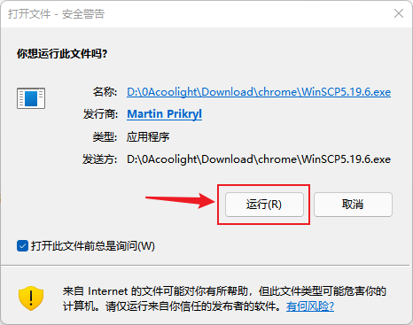

- 选择安装模式（一般选为所有用户安装）：
    - 为所有用户安装：由于win系统是支持多个用户的，选这个就不管用什么用户登录，都有这个WinSCP这个软件
    - 只为我安装：即只为当前登录的用户安装，使用其他用户登录win系统时就没有这个软件了

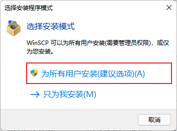

- 然后弹出授权管理员权限，点”是“
- 后面一直无脑下一步就可以了

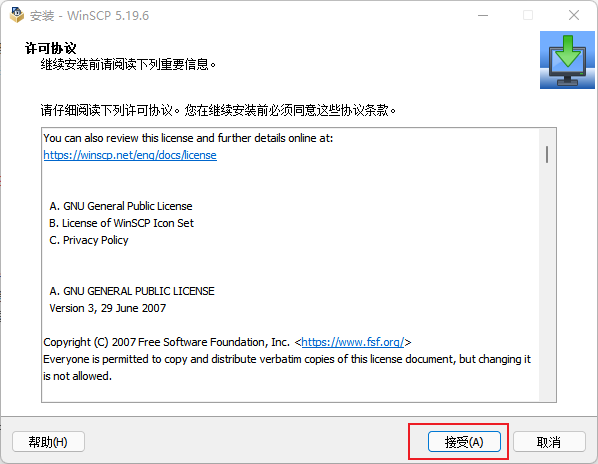

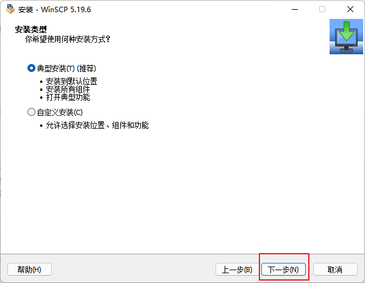

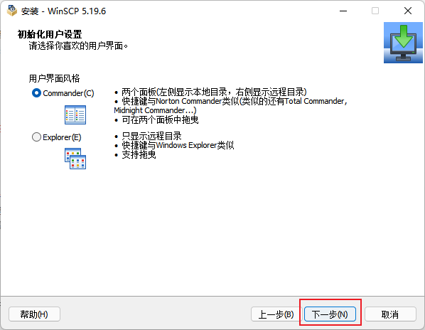

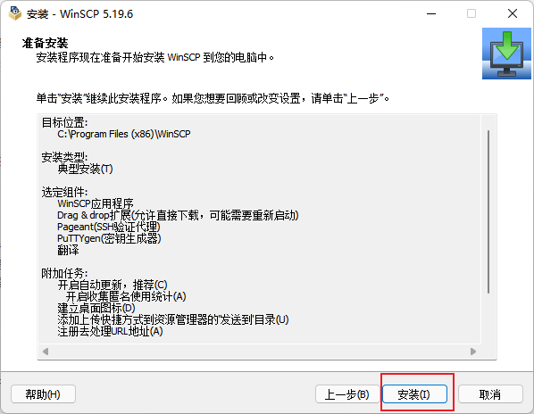

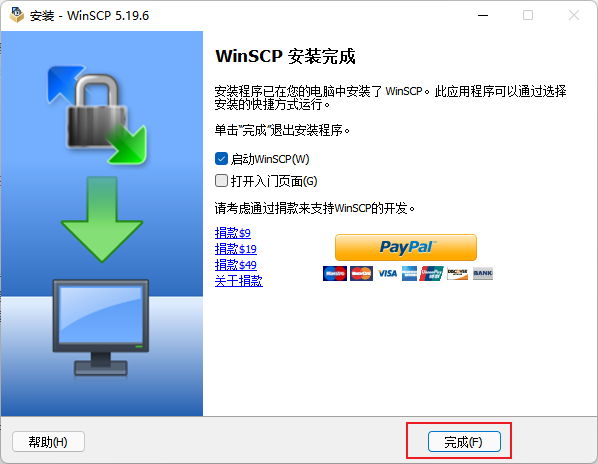

* * *

## 使用方法

- 首先，要连接的主机需要确保已经开启ssh（可以用Xshell等工具连接上它则已经开始ssh）
- 登录：

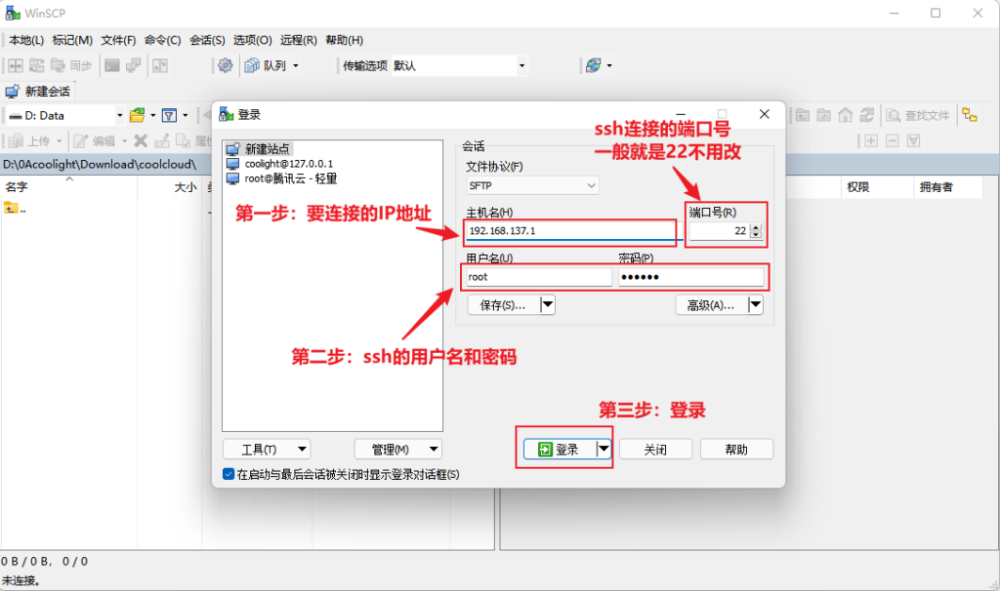

- 第一次连接会有警告，点“是”即可：

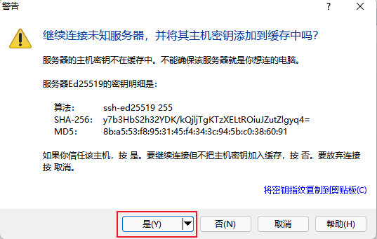

- 此时窗口会分为两栏：

- 接下来就可以和在win一样地管理远程连接的服务器上的文件和文件夹
- 而且可以从系统的资源管理器中拖文件到右边这一栏，就可以上传文件到服务器

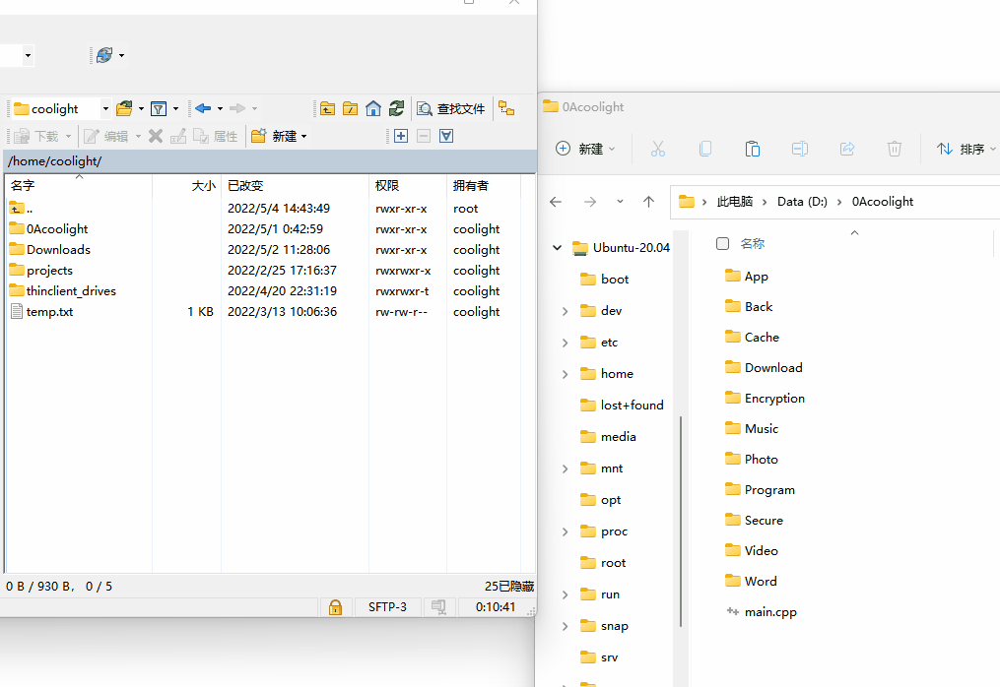

- 也可以把右边栏的文件拉出来，就是从服务器下载文件

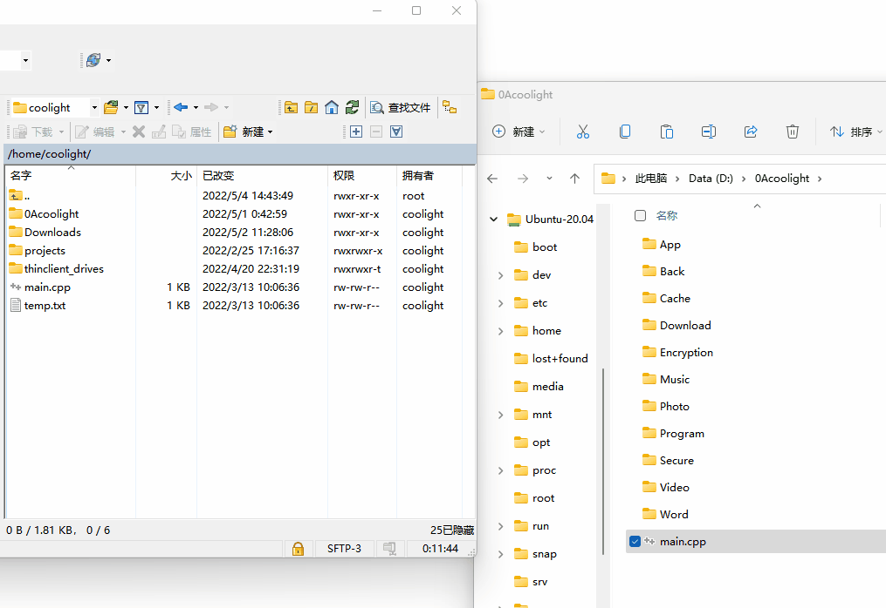
