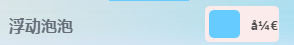
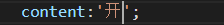
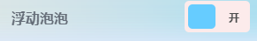
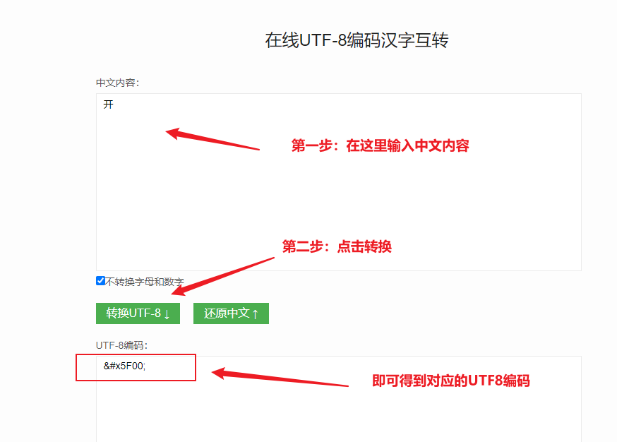
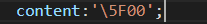

> 最近开发一个vue的小项目的时候，就碰到了这个问题，但其实HTML中已经设置了Utf-8编码方式，css中的中文仍然有概率会出现乱码

- css：

- 如上图，预期效果应该是显示中文 ‘开’：

## 解决办法

> 可以是直接把中文转为一串utf8编码，然后替换进去，下面我们来聊聊要怎么做。

- 在百度直接搜索 ‘在线中文转UTF8’，随便找一个网站：
- 这里就以 [**https://www.ip138.com/utf8/**](https://www.ip138.com/utf8/) 为例：
    - 输入我们的中文字符串，然后点击转换，就可以得到一串UTF8编码：&#x5F00;

- 接下来把 **&#x5F00;** 前面的 &#x 和 末尾的分号 ; 去掉， 就只剩下 5F00，然后在前面加一个反斜杠 \\ ，最终就得到了 \\5F00
- 然后把它替换掉CSS中的中文字符串即可：

- 然后刷新一下网页，最好先清理一下浏览器的缓存，不然可能页面没有反应（[浏览器缓存清理方法](https://blog.coolight.cool/%e5%89%8d%e7%ab%af%e5%89%8d%e7%ab%af%e5%bc%80%e5%8f%91%e6%97%b6%e6%b5%8f%e8%a7%88%e5%99%a8%e7%bc%93%e5%ad%98%e6%b8%85%e7%90%86/)）

## 其他

- 有些网站转出来的可能不是 **&#x5F00;** 这个格式可能会是 **%u5F00** ，还可能是 \\u5F00 ；处理方式都是差不多的，把前面的 **%u** 或是 **\\u** 删掉，并在前面添加反斜杠 **\\** 。
- 显然前缀都只是标记，为了去告诉计算机这是一个转义需要的UTF8编码，而不要输出为一串数字和字母，但在CSS中应使用反斜杠转义。
