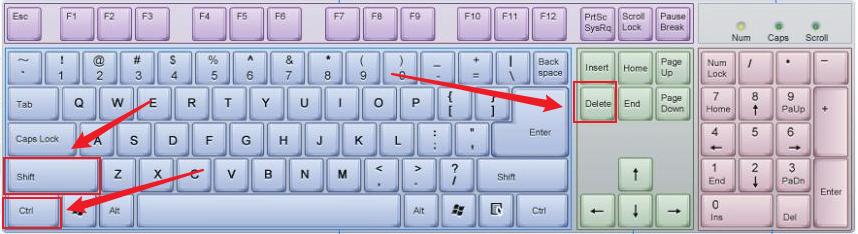
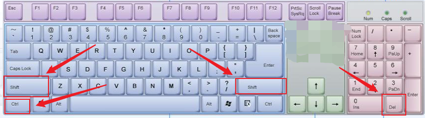
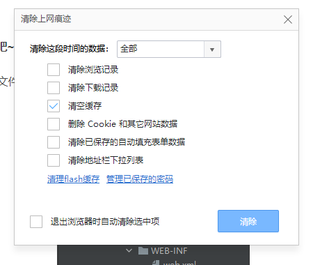
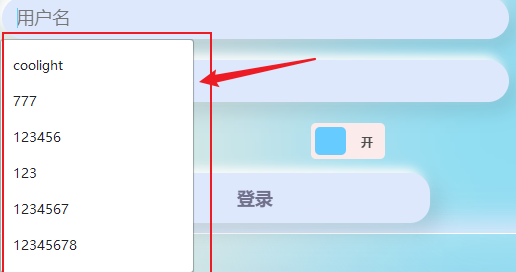

> 有时可能会遇到代码改了，但浏览器上的页面却没有变化，这种情况大多就是浏览器加载了缓存，而没有更新使用最新的代码。尤其在CSS的修改中经常会这样，这时就需要我们手动清理一下缓存。

- 清理的方法其实很简单，大多数浏览器中，我们可以按 **Shift + Ctrl + Del** 按键：

- 假如我的键盘没有delete按键怎么办？如果有数字小键盘还可以这样按：**shift + ctrl + shift + 数字键盘的英文句号 '.'**

- 实在没有这些按键，那就要自己在浏览器的设置里找了。
- 然后浏览器就会弹出一个弹窗，千万看清楚，不要直接点清除：

- **清除浏览记录和下载记录** 顾名思义就不多说了
- **清空缓存** 就是我们问题的关键，勾选它就可以让浏览器重新下载我们的代码来跑
- **删除Cookie** 注意，Cookie关乎你的很多网站的密码记录/自动登录，如果清理了它，很多网站你需要重新手动填写密码。
- **清除已保存的自动填充表单数据** 这个就是浏览器当你在输入框输入时的提示，提示内容就是你曾经输入过的东西，在输入用户名，搜索等输入框中很常见。相当便捷，但清了也问题不大：

- 选好后点击清除，然后按 F5 刷新我们的网页即可
