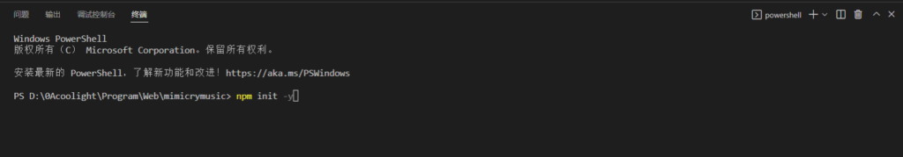
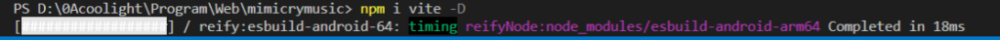

# [vue/vite]在vscode中使用vite手动创建vue项目

> \* vite是什么？
> 
> \* 一个前端的开发构建工具
> 
> \* 当我们的项目组件变大时，会自觉的分文件、分组件等操作，缩减单文件的大小、增加可维护性，vite则可以帮我们管理，并且它有很多插件帮助我们开发。

## 初始化

- 创建一个文件夹，比如这里创建一个叫 mimicrymusic 的文件夹：


- 然后进入这个文件夹，或是把它拖进vscode中：


- 可以进VSCode内，使用终端运行以下命令：



- 初始化生成包配置文件：npm init -y
    - 生成package.json：


- \-
    - 内容如下：


- \-
    - 其中：
    - name：项目名
    - version：版本号
    - description：项目描述
    - main：js入口
    - scripts：配置用于npm的命令
    - keywords：（可以不要）
    - author：作者信息（可以不要）
    - license：开源协议

## 安装vite依赖

- 在终端中执行命令：npm i vite -D
- 安装vite的开发环境依赖：


- 等待一段时间的下载：



- 下载完成后我们刚刚的包配置文件package.json中就会有**自动增加**一个vite的依赖：


## 安装vue的依赖

- 在终端中执行命令：npm i vue
- 等待安装完成以后，package.json中就会**自动增加**vue的配置：


## 创建index.html

- 在项目的根位置，即和package.json同级的位置创建一个index.html文件：


- 里面写如下内容：

```
<!DOCTYPE html>
<html lang="en">
<head>
    <meta charset="UTF-8">
    <meta http-equiv="X-UA-Compatible" content="IE=edge">
    <meta name="viewport" content="width=device-width, initial-scale=1.0">
    <title>标题</title>
</head>
<body>
    <!-- 引用的js文件位置 -->
    <script type="module" src=""></script>
</body>
</html>
```

- 正如上面代码中注释所说，script标签引入了一个js文件到index.html，但我们还没有指定引入哪一个js文件，下面我们将创建这个文件，然后在引入。

## 创建main.js

- 在项目根位置创建src目录，然后在src内创建main.js文件：


- 里面我们可以先随便写一句输出： console.log("hello coolight");
- 保存文件
- 在我们刚刚的index.html中引入main.js文件：

```
    <!-- 引用的js文件 -->
    <script type="module" src="./src/main.js"></script>
```

- 在package.json中配置npm命令，即把里面的scripts的内容改为 "dev" : "vite"


## 尝试让它跑起来（1）

- 在终端中敲 npm run dev，就会有如下信息提示
- 键盘按住ctrl，然后鼠标左键点击终端里图中框起来的链接（不要点我的图，点你的终端里的！！！）：


- 它就会跳转到浏览器，显示我们刚刚写的页面
- 一片空白则是正常的，因为我们的页面并没有写东西
- 我们的js也只写了一句输出，这时候要在浏览器中打开控制台看看有没有这句输出
    
    - 浏览器中来到我们写的页面
    
    - 在浏览器中按一下键盘F12键
    - 浏览器就会弹出一个窗口：


- 此时点击控制台，就可以看见我们的main.js的输出了：


## 创建App.vue

- 在src目录下，新建 App.vue 文件：


- 内容可以随便写点，比如：

```
<template>
    <div>
        你好 coolight
    </div>
</template>
```

## 在main.js中创建vue，安装vitejs

- 修改main.js的内容为：

```
import { createApp } from 'vue'
import App from './App.vue'

const app = createApp(App)

app.mount('#app')
```

- 可以看到，我们在main.js中创建的vue需要一个挂载点，在html中一个id为 app 的元素
- 所以我们需要在index.html中增加一个 <div id="app"></div> :


- 保存文件
- 此时你可能发现，欸vite好像报错了：
    - \[vite\] Internal server error: Failed to parse source for import analysis because the content contains invalid JS syntax. Install @vitejs/plugin-vue to handle .vue files.


- 浏览器里我们的页面也有报错：


- 它的意思很明显，需要我们去安装 **@vitejs/plugin-vue**，因为浏览器正常执行不了vue文件，所以需要安装插件来编译解析。
- 那么我们就来安装它。
- 如果你的终端vite还在运行，也就是没有显示提示让你输入，就像这样：


- 那么就按键盘ctrl + c ，停止掉vite
    
    - 它会问你 **终止批处理操作吗(Y/N)?**
    
    - 我们输入 y ，然后回车即可


- 然后再输入 npm i @vitejs/plugin-vue -D
- 等待下载安装：


- 然后在项目根目录创建vite的配置文件：vite.config.js


- 里面写如下配置：

```
import { defineConfig } from "vite"
import Vue from "@vitejs/plugin-vue"

export default defineConfig({
    plugins:[
        Vue()
    ]
})
```

- 保存文件
- 在终端中执行 npm run dev
- 然后回到浏览器中看看我们的页面，就会发现已经正常了！


## 结语

- 这个是手动配置的方法，其实有很简单的一键操作。
- 后面我们聊聊给手动配置路由router，状态管理pinia等
