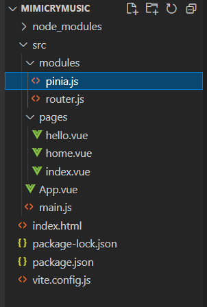

> \* pinia是什么？
> 
> \* Pinia官网：Pinia 是 Vue 的存储库，它允许您**跨组件/页面共享状态**。
> 
> \* 即数据共享。在使用过pinia后，相信你也会对它爱不释手的，下面我们来聊聊如何安装。

## 安装pinia

- 来到你的项目文件夹
- 在vscode的终端中执行：npm i pinia -D


- 在 /src/modules文件夹下新建文件 pinia.js



- 写入：

```
import { createPinia } from  "pinia"

const pinia = createPinia()

export default pinia
```

## 修改main.js

- 增加：

```
import pinia from "./modules/pinia"
//...
app.use(pinia)
```

- 最终main.js文件：


## 创建stores

- 在 /src文件夹内新建文件夹stores，用来存放状态管理
- 这里我们示例创建一个计数管理，counter.js


- 里面写入：

```
import { defineStore } from "pinia"

export const useCounterStore = defineStore('counter', {
    state() {
        return {
            num:1
        }
    },
    actions: {
        inc() {
            ++(this.num);
        }
    }
})
```

## 使用counter

- 在你想使用counter的页面中导入并使用，这里以home.vue示例：

```
<script setup>
import { useCounterStore } from "../stores/counter"

const counter = useCounterStore()
</script>

<template>
    <div>这里是home.vue捏</div>
    <span>{{counter.num}}</span>
    <button @click="counter.inc()">点我</button>
</template>
```

- home页面效果：
- 进入页面后，计数为1
- 点击按钮时，每点击一次，计数 + 1


