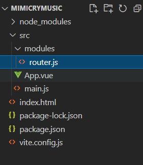

# [vue/vite/router]在vscode中给vite项目安装路由router/配置文件路由

## 安装router

- 在vscode中来到你的项目文件夹中
- 在终端中执行命令安装router：npm i vue-router -D
- 等待下载安装


- 安装好以后，在项目目录的src目录内，新建目录 modules 用于存放插件模块
- 在moudules内新建路由配置文件 route.js



- 里面写如下内容：

```
import { createRouter, createWebHistory } from "vue-router"

const router = createRouter({
    routes: [],
    history: createWebHistory()
})

export default router
```

## 修改main.js

- 导入router ： import router from "./modules/router"
    - 使用router ： app.use(router)
    - 最终main.js文件内容：

```
import { createApp } from 'vue'
import App from './App.vue'
import router from "./modules/router"

const app = createApp(App)

app.use(router)
app.mount('#app')
```

## 创建pages

- 在src目录下，新建文件夹pages，用于存放页面
- 在里面新建2个示例页面：hello.vue，home.vue
    - hello.vue


- \-
    - home.vue


- 在App.vue中使用路由，修改App.vue：

```
<template>
    <router-view></router-view>
</template>
```


## 在router.js中配置页面

- 上面两个页面（hello.vue和home.vue）新建后路由是不知道的，我们需要在配置文件router.js中告诉它，因此需要修改router.js
- 在routes数组中增加对应页面的配置：

```
        {
            name:"主页",
            component: () => import('../pages/home.vue')
        },
        {
            name:"欢迎",
            path:"/hello",
            component: () => import('../pages/hello.vue')
        }
```

- \-
    - name：页面名称，随意
    - path：在浏览器访问的时候的路径
    - component：导入访问的页面文件
- 由于第一个就是默认的主页，所以不需要写path
- 访问第二个的浏览器路径就是：http://localhost:3000/hello
- router.js总体代码：

```
import { createRouter, createWebHistory } from "vue-router"

const router = createRouter({
    routes: [
        {
            name:"主页",
            component: () => import('../pages/home.vue')
        },
        {
            name:"欢迎",
            path:"/hello",
            component: () => import('../pages/hello.vue')
        }
    ],
    history: createWebHistory()
})

export default router
```


- 到这里基本就配置完成了，运行项目看看：npm run dev
- 主页：


- 欢迎页：


## 配置文件路由

> 当我们增加页面时，总要在router中配置一下，一旦页面多起来就很麻烦，所以可以安装文件路由，也就是以文件夹pages内的文件结构自动作为访问路径。

- 安装文件路由插件
- npm i -D vite-plugin-pages


- 在vite.config.js中增加配置：

```
import Pages from "vite-plugin-pages"

export default defineConfig({
    plugins:[

        //...
        Pages(),
    ]
})
```

- 修改后的vite.config.js ：


- 修改router.js
- 从pages文件夹中导入
- 去掉routes内容

```
import { createRouter, createWebHistory } from "vue-router"
import routes from "~pages";

const router = createRouter({
    routes,
    history: createWebHistory()
})

export default router
```

- 到这里就完成了，但要注意的是，页面里主页不是home.vue了，默认的是index.vue，由于我们示例中并没有这个文件，因此访问http://localhost:3000就会报警告。而访问原来的home.vue就需要改为http://localhost:3000/home
