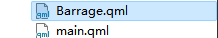

# [Qt/qml]程序之外显示的弹幕

> 前几天课设做个聊天系统，顺便实现了这个在程序外显示弹幕作为消息提示的功能，这里记录一下怎么搞。

## 效果


## 思路

- 创建一个子窗口
- 将子窗口去掉窗口标题栏，设置背景透明
- 在里面放文本Text
- 设置定时器控制子窗口从左到右移动，移动到右边缘时销毁子窗口

## 实操

- 新建qml文件，这里示例 Barrage.qml
- 里面写入：

```
import QtQuick 2.3
import QtQuick.Controls 2.5
//窗口
ApplicationWindow  {
    id:root
    property string str: "我的洛天依"  //弹幕文本内容
    width: 300
    height: 40

    flags:  Qt.FramelessWindowHint  //去掉窗口标题栏
    color:"#00000000"   //设置背景透明

    Rectangle {     //使用矩形包裹Text是为了在Text外面可以增加圆角矩形边框效果
        anchors.fill: parent
        border.width: 1     //设置边框
        border.color: "#66ccff"
        color:"#00000000"
        radius: 20          //边框圆角
        clip: true          //超出矩形范围的内容隐藏

        Text {      //弹幕文本
            anchors.fill: parent
            text: str
            font.bold: true
            font.pointSize: 15
            color: "#66ccff"
            style: Text.Outline     //设置文本样式，在字体轮廓加一层styleColor指定的颜色边缘,防止背景导致文本不明显
            styleColor: "#fff"
            horizontalAlignment: Text.AlignHCenter  //居中
            verticalAlignment:   Text.AlignVCenter
            clip: true
        }
    }
}
```

- 在需要调用的qml文件中，导入并按如下操作使用：
- 由于Barrage.qml和main.qml在同一目录下：



- 因此在main.qml中可以直接使用Barrage.qml
- 以下是 main.qml 的内容

```
import QtQuick
import QtQuick.Window 2.3
import QtQuick.Controls 2.5

Window {
    id:mainWin
    width: 700
    height: 500
    visible: true
    title: qsTr("MimicryChat")

    //添加弹幕
    function addBarrage(in_str) {
        var newCom = Qt.createComponent("Barrage.qml");   //创建弹幕窗口
        var newWin = newCom.createObject();
        newWin.x   = 200;
        newWin.y   = Math.random() * 900;   //随机竖直位置
        newWin.str = in_str;   //设置弹幕文本
        newWin.show();         //显示弹幕窗口

        //设置定时控制器
        let timer = Qt.createQmlObject("import QtQuick 2.14; Timer {}", mainWin);
        timer.interval = 20;    //执行间隔时间（单位ms）
        timer.repeat = true;    //重复执行
        timer.triggered.connect(function() {  //执行内容
            if(newWin.x < 1700) {  //如果没到右边缘就移动2个像素点
                newWin.x += 2;
            } else {
                timer.stop();      //到达右边缘，则停止定时控制器，并销毁弹幕
                newWin.close();
            }
        });
        timer.start();   //启动定时器
    }
    Rectangle {   //主窗口背景颜色
        anchors.fill: parent
        color: "#dde8fc"
        radius: 20
    }
    Button {
        width:100
        height: 40
        text:"发送弹幕"
        anchors.bottom: parent.bottom
        anchors.bottomMargin: 10
        //水平居中
        anchors.horizontalCenter: parent.horizontalCenter
        onClicked: {
            addBarrage("嘿嘿，我的洛天依");
        }
    }
}
```

## 问题

- 这个弹幕会被其他高层次的窗口遮挡，显然问题在于我们创建的窗口不是顶层窗口，这个后面再看看咋整。
