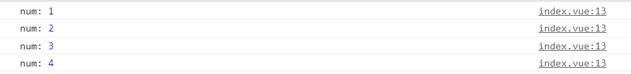
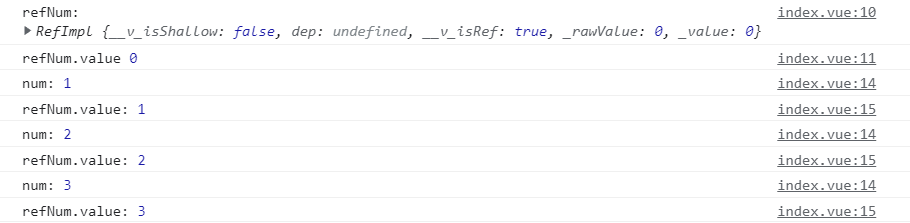
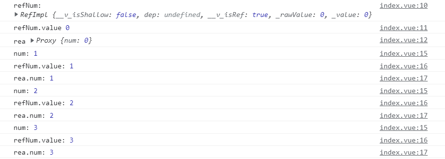

# [Vue3]在setup中声明响应式数据（ref，reactive）

> 响应式数据是vue的一大亮点，下面我们来聊聊如何声明响应式数据

## 直接声明变量

- 直接声明变量并不能使之拥有响应性
- 示例：

```
<script setup>
let num = 0;
const clickFun = () => {
    console.log("num:", ++num);
}
</script>

<template>
    <div style="display:flex;flex-direction: column;">
        <span>num : {{num}}</span>
        <button @click="clickFun()">修改</button>
    </div>
</template>
```

- 运行结果：




- 多次点击按钮后，控制台打印的num值虽然有增加，但在html页面显示的num值却不变

## ref(基本数据类型)

- 使用ref(基本数据类型)即可把一个基本数据类型的值转化为响应式并返回
- 基本数据类型：
    - String
    - Number
    - BigInt
    - Boolean
    - Symbol
    - Undefined
    - Null
- 示例：

```
<script setup>
import { ref } from 'vue';

let num = 0;
let refNum = ref(0);
console.log("refNum:", refNum);
console.log("refNum.value", refNum.value);

const clickFun = () => {
    console.log("num:", ++num);
    console.log("refNum.value:" , ++refNum.value);
}
</script>

<template>
    <div style="display:flex;flex-direction: column;">
        <span>num : {{num}}</span>
        <span>refNum : {{refNum}}</span>
        <button @click="clickFun()">修改</button>
    </div>
</template>
```

- 运行结果：




- 注意ref()返回的是一个refImpl的对象，它的value属性才是我们要的数据，所以在js中操作时需要.value，但在<template>中会自动展开为内部值
- 可以看到，通过ref()获取的变量是响应式的，会随着变量值的改变而体现在html页面中

## reactive(对象)

- reactive()需要我们传入一个对象
- 示例：

```
<script setup>
import { ref,reactive } from 'vue';

let num = 0;
let refNum = ref(0);
let rea = reactive({
    num:0
});

console.log("refNum:", refNum);
console.log("refNum.value", refNum.value);
console.log("rea", rea);

const clickFun = () => {
    console.log("num:", ++num);
    console.log("refNum.value:" , ++refNum.value);
    console.log("rea.num:", ++rea.num);
}

</script>

<template>
    <div style="display:flex;flex-direction: column;">
        <span>num : {{num}}</span>
        <span>refNum : {{refNum}}</span>
        <span>rea.num : {{rea.num}}</span>
        <button @click="clickFun()">修改</button>
    </div>
</template>
```

- 运行结果：




- reactive()也可以让变量得到响应性
- 但它需要传入对象，而ref()需要传入基本数据类型
- 而且它返回的是一个proxy对象，但我们在js操作和在<template>绑定时，都可以直接访问和操作其内部变量。
