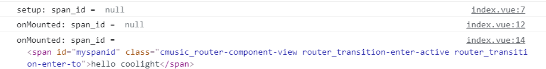
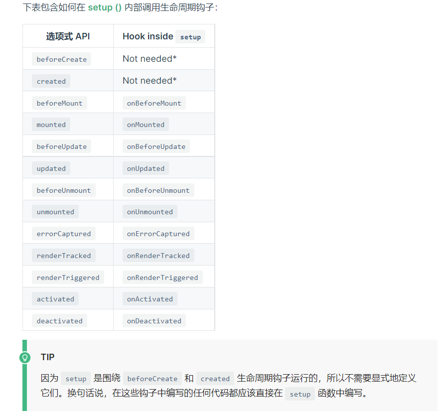
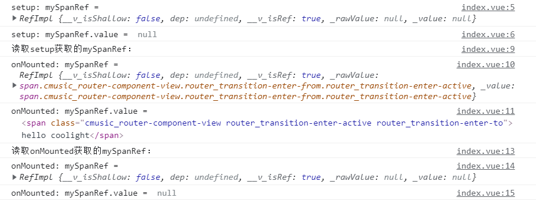
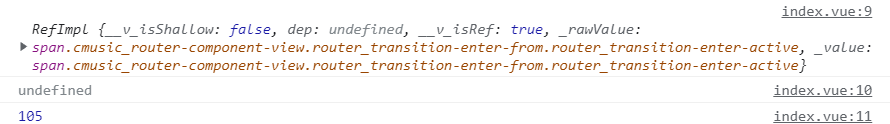
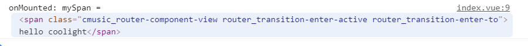
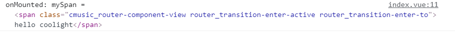
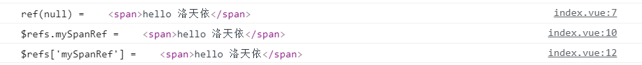
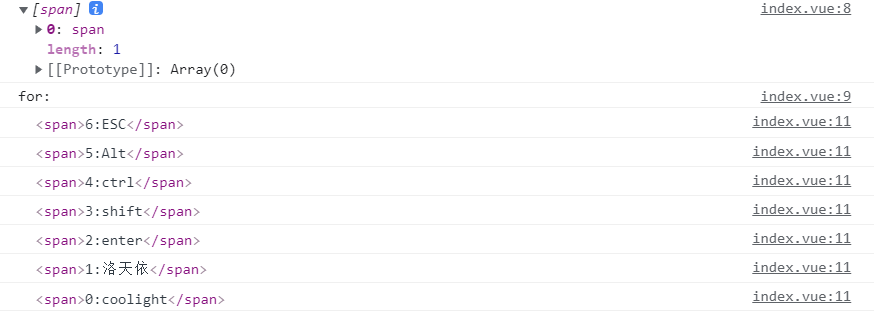

> **1\.** 原生js中我们会使用document.getElementsByClassName()，document.getElementById()等获取dom元素，但在vue中，更推荐使用ref获取。
> 
> **2\.** 不同文件的ref相互独立，即使同名也不会互相影响而导致获取错误。一个组件被多次引用后同时存在多个实例时，每个实例的ref也是互相独立的。这一点显然比getElementById()要好很多。
> 
> **3.** 标签的ref属性值在每一个vue文件中需要是唯一的，否则可能在获取时发生与预期不同的效果。显然使用v-for时如果单项带有ref就需要我们解决这个问题。

## 使用ref绑定Dom元素

- 用法相当简单，我们在想获取的标签上增加属性 ref="refName" 即可。
- 例如:

```
<template>
    <span id="myspanid" ref="mySpanRef">hello coolight</span>
</template>
```

## 获取

> 获取的方式很多，这里介绍其中的几种，以及提及一些document的方法和注意事项

### 祖传getElementById()

- 在vue中，getElementById()依然可用，但不建议，而且要注意生命周期问题

```
<script setup>
import { onMounted } from "vue";

let span_id = document.getElementById("myspanid");
console.log("setup: span_id = ", span_id);

onMounted(() => {
    console.log("onMounted: span_id = ", span_id);
    span_id = document.getElementById("myspanid");
    console.log("onMounted: span_id = ", span_id);
})
</script>

<template>
    <span id="myspanid" ref="mySpanRef">hello coolight</span>
</template>
```

- 运行结果：



- 可以看到，在setup中直接使用getElementById()是不行的，需要在onMounted（也就是已经把dom元素挂载完成后）重新调用getElementById()获取。
- 这就是vue的生命周期问题，贴一张vue官网的图，具体有关生命周期的在此不展开讲了：



### ref(null)

- refName = ref(null)是常见的获取方法
- 即声明一个与在标签中ref元素值同名的变量，然后调用ref(null)即可获取到。
- 注意需要导入：import { ref } from "vue";
- 示例：

```
<script setup>
import { ref,onMounted, getCurrentInstance } from "vue";

let mySpanRef = ref(null);
console.log("setup: mySpanRef = ", mySpanRef);
console.log("setup: mySpanRef.value = ", mySpanRef.value);

onMounted(() => {
    console.log("读取setup获取的mySpanRef：");
    console.log("onMounted: mySpanRef = ", mySpanRef);
    console.log("onMounted: mySpanRef.value = ", mySpanRef.value);
    mySpanRef = ref(null);
    console.log("读取onMounted获取的mySpanRef：");
    console.log("onMounted: mySpanRef = ", mySpanRef);
    console.log("onMounted: mySpanRef.value = ", mySpanRef.value);
})
</script>

<template>
    <span ref="mySpanRef">hello coolight</span>
</template>
```

- 运行结果：



- 可以看到 ref(null) 返回的是一个 RefImpl 对象，如果想它打印结果和getElementById()一样，则需要 .value。如果我们想调用元素的操作方法等，也需要.value后再接操作方法。
    - 比如：

```
<script setup>
import { ref, onMounted } from "vue";

const mySpanRef = ref(null);

onMounted(() => {
    console.log(mySpanRef);
    console.log(mySpanRef.clientWidth);
    console.log(mySpanRef.value.clientWidth);
})
</script>

<template>
    <span ref="mySpanRef">hello coolight</span>
</template>
```

- 运行结果：



- 显然，使用ref(null)获取的也会有生命周期问题，但这次仅仅是mySpanRef.value = null。
- 而且我们要注意应在setup中调用ref(null)获取，但在onMounted以后才能访问其.value，进行dom相关的函数调用操作。
- 如果在onMounted内调用ref(null)获取反而获取不到。

### $refs.refName

- 这个方法则不需要变量名和ref值相同
- 注意：
    - 需要在onMounted后获取
    - 需要导入getCurrentInstance()
    - 如果在setup直接调用了getCurrentInstance()，将导致在onMounted()中获取失败。
- 示例：

```
<script setup>
import { onMounted, getCurrentInstance } from "vue";

let mySpan;

onMounted(() => {
    let { $refs } = (getCurrentInstance()).proxy;
    mySpan = $refs.mySpanRef;
    console.log("onMounted: mySpan = ", mySpan);
})
</script>

<template>
    <span ref="mySpanRef">hello coolight</span>
</template>
```

- 运行结果：



- 如你所见，返回和getElementById()一样，我们可以直接调用dom标签的方法而不需要像ref(null)获取后.value。

### $refs\[refName\]

- 前面我们介绍的都是需要将refName当成变量名一样写，而不能使用字符串。
- 这个方法可以传refName的字符串类型，这将大大提高我们获取的灵活度，而且它也不限制接收的变量名。
- 示例：

```
<script setup>
import { onMounted, getCurrentInstance } from "vue";

let mySpan;

onMounted(() => {
    let { $refs } = (getCurrentInstance()).proxy;
    let name = "mySpanRef";
    mySpan = $refs[name]; 
    //mySpan = $refs['mySpanRef'];      //这个也是可以的
    console.log("onMounted: mySpan = ", mySpan);
})
</script>

<template>
    <span ref="mySpanRef">hello coolight</span>
</template>
```

- 运行结果：



- 其返回值同$refs.refName。

## 多个同名ref的解决方法

> 上面我们都是把ref当成id一样使用，但在v-for后产生的列表项可能遇到ref重复，下面我们聊聊如何解决这个问题

- 首先我们来看看如果ref重复，我们获取时会发生什么：
- 示例：

```
<script setup>
import { ref, onMounted, getCurrentInstance } from "vue";

let mySpanRef = ref(null);

onMounted(() => {
    console.log("ref(null) = ", mySpanRef.value);
    let { $refs } = (getCurrentInstance()).proxy;
    mySpanRef = $refs.mySpanRef;
    console.log("$refs.mySpanRef = ", mySpanRef);
    mySpanRef = $refs['mySpanRef'];
    console.log("$refs['mySpanRef'] = ", mySpanRef);
})
</script>

<template>
    <div>
        <span ref="mySpanRef">hello coolight</span>
        <span ref="mySpanRef">hello 洛天依</span>
    </div>
</template>
```

- 运行结果：



- 可以看到，三个方法都是得到了后一个拥有这个refName的标签
- 虽然没有报错或是警告，但已经不是预期的效果了（按平常感觉应返回一个数组）
- 解决思路：
    - 我们需要改造，使得ref仍然是唯一的。
    - 那么我们可以给这些同名的ref标签在refName后面再加一个id，就可以使得refName是唯一
    - 显然我们需要利用第三种获取方法（$refs\['refName'\]），并用字符串拼接来生成refName
- 示例：

```
<script setup>
import { onMounted, getCurrentInstance } from "vue";

let arr = ['coolight', '洛天依', 'enter', 'shift', 'ctrl', 'Alt', 'ESC'];

onMounted(() => {
    let { $refs } = (getCurrentInstance()).proxy;
    console.log($refs['myspan0']);
    console.log("for:");
    for(let i = arr.length; i-- > 0;) {
        console.log($refs['myspan'+ i][0]);
    }
})
</script>

<template>
    <div style="display:flex;flex-direction: column;">
        <span v-for="(item, index) in arr"
            :ref="'myspan' + index">{{index}}:{{item}}</span>
    </div>
</template>
```

- 运行结果：



- 可以看到，这一次$refs\['refName'\]返回的是一个包含一个span标签的数组，因此我们需要后面再加\[0\]访问数组内容。

## 其他问题

### 返回的是一个proxy对象

- 当返回的是proxy对象时，它的$el属性就是我们需要的标签
- 示例：

```
let { $refs } = (getCurrentInstance()).proxy;
let dom = $refs['myul'];    //proxy对象
dom.$el;                    //标签内容
dom.$el.clientWidth;        //通过$el即可同getElementById()获取到的标签一样操作
```
