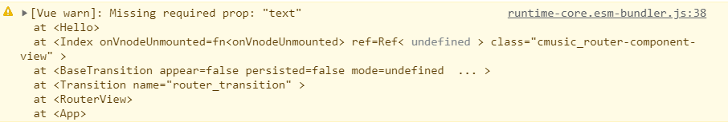
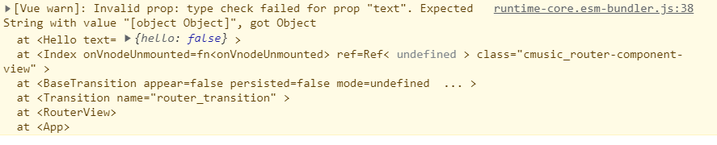
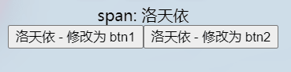
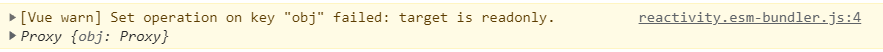
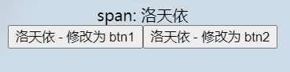

# [vue3]组件间v-bind，v-model传参(defineProps，defineEmits)

> 1\. 自定义组件间也可以和普通标签（<div> <span>）一样指定属性传参
> 
> 2\. 形如（<child value="hello coolight"></child>）给组件<child>指定value属性为"hello coolight"
> 
> 3\. 我们也可以自己模拟v-model的效果
> 
> 下面我们来聊聊怎么传参、接收与更新

## 传参，v-bind

- 子组件接收参数需要使用一个函数defineProps()
- defineProps():
    
    - 不需要import导入即可使用
    
    - 只能在<script setup>中使用
    - 不可以在局部变量中使用这个函数
    - 不可以访问 <script setup> 中定义的其他变量
- 需要传入自定义参数名，\[可选\]指定参数类型，\[可选\]指定参数是否必须传入，\[可选\]指定参数的默认值。
    - 类型：
        - Number
        - Boolean
        - String
        - Function
        - Object
        - Array
        - ...
- 返回组件的接收所有参数构成的一个对象
- 当类型不对或是指定必须传入而没有传入时，vue将会有警告，报错
    - 必须传入但没有传入：



- \-
    - 传入类型错误：



- 示例：
    - 组件：

```
<script setup>
import { toRefs } from 'vue';
const props = defineProps({
    text:{
        type:String,
        default:"默认：hello coolight",
        required:false
    }
})

const {
    text,
} = toRefs(props);
</script>

<template>
    <span>{{props.text}} - {{text}}</span>
</template>
```

- \-
    - 使用组件

```
<script setup>
import helloVue from '../../components/global/hello.vue';
</script>

<template>
    <div>
        <hello-vue />
        <hello-vue text="洛天依"/>
        <hello-vue :text="'v-bind:洛天依'" />
    </div>
</template>
```

- 解析：
    - 组件定义了一个要接收的参数text，并指定了它的类型为字符串String，默认值，并且它并不是必须传入的。
    - 组件的<template>中，可以通过props访问参数props.text，也可以使用toRefs，解构出来。
        - toRefs()需要import
        - 如果不使用toRefs()，直接解构将导致参数失去响应性
    - 在使用组件时，可以直接指定参数并传参，也可以使用v-bind，动态传参。
- 运行结果：


## v-model

> 一般的传参进来，组件对它是只读的，不能修改。
> 
> 只读也并不完全，对于数组和对象是可以操作其内部值的。
> 
> 但我们可以使用v-model指定参数，使之允许组件来修改它。

### ”只读“的探讨

- 这个只读限制和const声明一样。
- 只读是针对变量本身的指向，如果你了解c/c++的指针则会很好理解，它限制了变量的指向，但对于变量指向的内容是可以操作的。
- 比如对数组、对象的内部变量的操作则是可以的，但不能让变量指向别的数组或对象，如 list = \[\]，就是直接让list变量重新指向新的空数组\[\]。
- 示例：
    - 组件：

```
<script setup>
import { reactive } from 'vue';
import { toRefs } from 'vue';
const props = defineProps({
    obj:{
        type:Object
    }
})

const {
    obj,
} = toRefs(props);

const btn1_click = () => {
    props.obj.hello = "coolight - 1";
}
const btn2_click = () => {
    props.obj = reactive({
        hello:"coolight - 2"
    })
}
</script>

<template>
    <div>
        <button @click="btn1_click">1: {{obj.hello}}</button>
        <button @click="btn2_click">2: {{obj.hello}}</button>
    </div>
</template>
```

- \-
    - 使用组件：

```
<script setup>
import { reactive } from 'vue';
import helloVue from '../../../components/global/hello.vue';

let obj = reactive({
    hello:"洛天依"
})
</script>

<template>
    <div>
        <span>span: {{obj.hello}}</span>
        <hello-vue :obj="obj" />
    </div>
</template>
```

- 注意：
    - 在使用组件的代码中，obj被使用reactive()进行赋值，因此获得了响应性，如果直接定义为一个对象，obj就没有响应性，后续无论在父子组件中修改obj，html页面的显示内容都不会改变。
- 运行结果：



- 点击btn2时修改失败，触发警告，提示变量obj是只读的：



### 使用v-model

- 使用v-model则可以解决上述问题
- 在这之前，组件内需要定义一个更新信号，“update:valueName”，其中的valueName为参数名
- 我们上面的例子里的参数是obj，因此信号就是 “update:obj”
- 使用defineEmits()可以定义信号，而它也是我们后面自定义事件的重点。
- 发出修改信号 emits("信号名", 传参);
- 示例：
    - 组件：

```
<script setup>
import { toRefs } from 'vue';
const props = defineProps({
    obj:{
        type:Object
    }
})
const emits =  defineEmits ({
    'update:obj':null  //null位置可以是一个检查函数，用以检查绑定这个信号的处理函数是否有接收参数等，这里就不需要了
});

const {
    obj,
} = toRefs(props);

const btn1_click = () => {
    props.obj.hello = "btn1";
}
const btn2_click = () => {
    emits('update:obj', {
        hello:"btn2"
    });
}
</script>

<template>
    <div>
        <button @click="btn1_click">{{obj.hello}} - 修改为 btn1</button>
        <button @click="btn2_click">{{obj.hello}} - 修改为 btn2</button>
    </div>
</template>
```

- \-
    - 使用组件：

```
<script setup>
import { reactive } from 'vue';
import helloVue from '../../../components/global/hello.vue';

let mValue = reactive({
    obj:{
        hello:"洛天依"
    },
})
</script>

<template>
    <div>
        <span>span: {{mValue.obj.hello}}</span>
        <hello-vue v-model:obj="mValue.obj"/>
    </div>
</template>
```

- 注意：
    - 即使使用了v-model，我们也不能直接在组件中用=修改obj（如obj = { hello:"wow" } 是不行的）
    - 需要修改obj时，使用emits()发出信号即可
    - 注意在使用组件的代码中，我们使用mValue包裹了obj后再传递给了子组件，因为如果同上一个例子中，直接声明obj后传递，在修改时会发生一些问题。因此建议把它放reactive()内。
- 运行结果：



### 尝试取代v-model

- 在上面的例子里，我们已经知道，修改obj时是发出了一个信号"update:obj"
- 那么我们就可以自己绑定一个事件给这个信号，然后自己来更新obj
- 示例（组件代码不变，使用组件的代码修改）：

```
<script setup>
import { reactive } from 'vue';
import helloVue from '../../../components/global/hello.vue';

let mValue = reactive({
    obj:{
        hello:"洛天依"
    },
})
const change = (in_obj) => {
    console.log("我们的change");
    mValue.obj = in_obj;
}
</script>

<template>
    <div>
        <span>span: {{mValue.obj.hello}}</span>
        <!-- 也可以这样：
            <hello-vue v-model:obj="mValue.obj" @update:obj="change"/>
        -->
        <hello-vue :obj="mValue.obj" @update:obj="change"/>
    </div>
</template>
```

- 当我们自己实现更新事件时，使用v-model和v-bind绑定是一样的
- 运行后，无论使用了v-model还是v-bind，都会执行我们的更新事件change()
- 有时候我们传进去的值是getter生成的等各种原因，直接v-model绑定在修改时会出错，因此我们就需要自己实现变量的更新事件。
