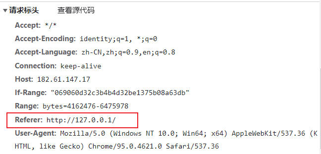

> 有时我们想引用其他网站的资源（图片，视频等），明明在其网站上可用，而我们发送请求时却得到了403错误，访问被拒绝，很可能就是该网站对这些资源文件设置了防盗链，下面我们聊聊其防盗的原理以及破解方法。

## 名词

### 防盗链

- 其效果顾名思义，就是希望阻拦其他网站来使用自己的资源文件，因为这种资源引用往往对于原本的网站来说没有收益，却还要承担流量，嫁衣了属于是。因此我们可以加一些判断，当请求不是自己允许的网站发来的时候，就拒绝。

- 而这个判断依据大多就是Http请求头中的Referer属性
    - 下面是我在http://127.0.0.1中搭建的网站发出的请求的请求头
    
    - 可以看到，它的Referer属性值其实就是我的网址



### Referer

- 当浏览器发送请求时，一般会带上Referer，告诉服务器我是哪个页面发送过来的，服务器借此可以获得一些信息用于处理。

- 在浏览器中，我们不能自定义请求的Referer属性，它是由浏览器给请求带上的。

- 当我们在地址栏直接输入网址并回车时，会发送一个Get请求，并且其Referer属性为空

- 到这里，相信你已经发现防盗链为什么使用Referer来判断，正是因为在浏览器中，它不能被伪造。

### Origin

- 在请求头中，用于指明当前请求来自于哪个站点，仅包含站点信息，**不包含**任何路径信息

- 服务器端也经常使用这个属性来判断是否允许请求。

- 而行为正确的浏览器，也会用这个属性判断是否允许跨域请求。

## 破解防盗链

- 请求的所有属性，我们实际上都可以伪造，但伪造了不允许自定义的属性后的请求放在浏览器中是发不出去。
    - 如果我们是客户端（比如exe，app）而不是网页，不使用浏览器，自己发送请求则可以随意伪造。
    
    - 对于网页，我们也是有办法的。这就需要让一个服务器来代理，网页把请求发到我们的服务器，由服务器去伪造请求，拿到我们要的资源后再返回给网页即可。

- 下面我们将从这两种情况出发，以请求b站接口示例，给出解决方法。

### 直接伪造请求

> 这个方法适用于客户端，而不适用于浏览器中的网页。

- 绝大多数编程语言（c++，java，js）都有自己热门的网络库，都应该会支持自定义请求头

- 这里我们使用js来演示，注意这里的js是运行在**node**环境的，而非浏览器环境
    - 安装好node环境
    
    - 新建一个文件夹
    
    - 打开cmd，cd路径到这个文件夹内，执行npm install axios安装axios
    
    - 在这个文件夹里面新建一个文件test.js，写入：

```
const axios = require(`axios`);
const getServer = (in_url, in_data, successFun, errFun) => {
    axios({
        method: "get",
        url:    in_url,
        params: in_data,
        headers: {
            "referer":"https://www.bilibili.com/"

            //"referer":"https://127.0.0.1/"  //你可以尝试使用这一句替换上面那句，请求将被拒绝
        }
    }).then(function (res) {
        console.log(res.data);
        if (typeof (successFun) != 'undefined') {
            successFun(res);
        }
        console.log("--- 请求成功 ---");
    }).catch(function (err) {
        console.log(err);
        if (typeof (errFun) != 'undefined') {
            errFun(err);
        }
        console.log("--- 请求失败 ---");
    })
}

//获取对应id的视频的下载链接
getServer(
    "https://api.bilibili.com/x/player/playurl",
    {
        "fnval": 80,
        "bvid":"BV1pT41157it",
        "cid":"746904707"
    });
```

- 这个b站接口可以获取到对应视频的下载链接

- 其referer允许置空，允许是“https://www.bilibili.com”等b站设置的允许的网站

- 你可以尝试伪造referer为"http://127.0.0.1/"，模拟在浏览器中从127.0.0.1的网页中发出请求，我们就会发现请求错误，被拒绝了。

- 因此我们上面直接伪造为b站首页地址去请求是相当成功的。

### 代理转发

> 客户端，网页都适用，但一般客户端不需要由服务器代理，客户端自己可以搞定，就不需要占用服务器的带宽性能

- 这里我们的服务端使用openresty（nginx）转发请求，配置nginx的配置信息去修改referer等即可

- 示例：

```
server {
        listen       80;
        server_name  localhost, 127.0.0.1;
	resolver 8.8.8.8;
        location / {
		header_filter_by_lua_file /usr/local/openresty/lua/toBili.lua;
                proxy_set_header referer 'https://www.bilibili.com/';
		proxy_set_header Host $proxy_host;
		proxy_set_header Origin 'https://www.bilibili.com';
		if ($query_string ~* ^(.*)url=(.*)$) {
			proxy_pass $2;
		}
	}
}
```

- \-
    - 其中用到的lua脚本文件，toBili.lua：
    
    - 这个脚本是修改响应头的3个属性，让请求允许跨域

```
ngx.header['Access-Control-Allow-Origin']  =  '*';
ngx.header['Access-Control-Allow-Methods'] = 'get, post, options';
ngx.header['Access-Control-Allow-Headers'] = 'dnt,x-mx-reqtoken,keep-alive,user-agent,x-requested-with,if-modified-since,cache-control,content-type,authorization';
```

- 下面我们来一步步分析配置文件和lua代码

- 显然这个配置文件是给http://127.0.0.1用的

- 第四行：resolver 8.8.8.8;
    - 如果这一句不加，当转发目的地址是一个域名时，请求会出错，服务器返回502

- 在location / {} 中
    - header\_filter\_by\_lua\_file即执行后面路径指向lua脚本，修改响应头的属性，让请求允许跨域。
    
    - proxy\_set\_header referer 'https://www.bilibili.com/';显然就是我们的重点，修改请求头，伪造referer。后面也是伪造Host Origin。
    
    - if ($query\_string ~\* ^(.\*)url=(.\*)$) { proxy\_pass $2; }
        - $query\_string是请求带的所有参数
        
        - 在if()内是正则表达式在匹配参数中名为url开始，到链接末尾的部分
        
        - 如果匹配成功，即url参数存在，则转发到参数指定的链接
        
        - 注意这里匹配参数不能使用nginx的语法糖$arg\_url，当目标链接也带有多个参数时$arg\_url只会截取一部分，导致部分参数丢失。
        
        - 示例： http://127.0.0.1/?url=https://www.baidu.com?a=1&b=2
            - 我们预期应该是通过服务器转发到url指定的链接：https://www.baidu.com?a=1&b=2
            
            - 然而,如果使用$arg\_url匹配，根据标准，匹配出来url会是https://www.baidu.com?a=1
            
            - 因为b=2前面由符号&，因此会认为是发给127.0.0.1有两个参数：url=https://www.baidu.com?a=1和b=2
    
    - 我们使用时就可以写 http://127.0.0.1/?url=https://www.baidu.com，这样就会转发到百度首页。

## 关于空referer

- 伪造空referer
    - 前面我们提到，之前在浏览器敲地址后进入，其请求的referer就是空的
    
    - 除了用服务器代理置空以外，我们还可以在html网页中配置meta标签，告诉浏览器在跳转页面时不要带上referer
        - 在html的head标签内增加：`<meta` `name="referrer" content="never">`
        
        - 还有可以设置单个<a>标签跳转时不带上referer、使用window.open打开等操作。

```
<!DOCTYPE html>
<html lang="zh">
<head>

    <meta name="referrer" content="never">
</head>
<body>
</body>
```

- 然而部分浏览器在使用上面的方法跳转下载文件时，由于其**下载加速**之类的功能，将会自动截取下载链接中的域名等添加为referer。
    - 这么做初衷当然是好的，然而目前很多网站会使用云服务器商（如阿里云、腾讯云等）提供的对象存储、cdn等，而且这些功能提供的下载链接大部分的域名和源网站并不相同，但他们会拦截非源网站的referer，甚至有的自己的域名referer都拦截！
    
    - 例如：
        - 假设我想在我的网站提供下载B站视频，假设b站视频由cdn提供下载，且仅允许b站referer和空referer
            - 我们的网站是：www.coolight.cool
            
            - b站：www.bilibili.com
            
            - cdn提供的某个视频的下载链接：www.cdn.com/bilibili/video/BV123456789
        
        - 当我们使用上述有下载加速功能的浏览器时，首先在我们的网站，点击下载按钮，然后跳转到下载链接\[https://www.cdn.com/bilibili/video/BV123456789\]，此时应是空referer，但下载加速功能自动截取下载链接的域名部分作为referer\[https://www.cdn.com/\]，然后发送请求，而cdn发现请求referer即非空，也非b站，则会返回403拒绝请求。
        
        - 最死的还是有些浏览器，先发第一个请求获取目标下载文件的大小等信息，这个请求确实是没有referer，所以成功得到文件信息，然后开始分块下载，这个时候又带上自动截取的referer，然后就导致后面下载失败。
    
    - 解决办法：
        - 提示建议用户更换浏览器
        
        - 提示建议用户关闭浏览器的下载加速之类的功能
        
        - 更换使用服务器代理

## 摸索过程记录

- 难点显然是在给web的代理转发上，一开始懂的也很少，还精准踩了很多百度上没有的坑。

- 首先是proxy\_set\_header referer 'https://www.bilibili.com/';
    - 一开始就写了这句，然后就直接proxy\_pass $arg\_url转发，结果就一直返回502错误。
    
    - 百度才发现需要加一句resolver 8.8.8.8

- 然后先是尝试了转发到百度，也就是写 http://127.0.0.1/?url=https://www.baidu.com，正常可用！

- 但在尝试b站的接口的时候，有的接口可以，有的却不行，这个时候我就开始疑惑

- 后来直接把proxy\_pass的目标路径改成一个固定链接 https://api.bilibili.com/x/player/pagelist?bvid=BV1pT41157it，居然成功了，那显然问题就是这个$arg\_url

- 然后就发现了它在目标地址携带多个参数时截取后会丢失部分参数

- 修改完这个问题后，在浏览器地址栏直接测试都是成功的了

- 接下来就是把这个方法用在项目里，出现跨域问题

- 配置跨域
    - 自然而然地百度后直接修改配置文件，增加三句：

```
add_header Access-Control-Allow-Origin '*';
add_header Access-Control-Allow-Methods 'POST,OPTIONS,GET';
add_header Access-Control-Allow-Headers 'DNT,X-Mx-ReqToken,Keep-Alive,User-Agent,X-Requested-With,If-Modified-Since,Cache-Control,Content-Type,Authorization';
```

- \-
    - 但是后来发现有些接口它自己会添加Access-Control-Allow-Origin，然后我配置了nginx也添加了这个，导致这个的值出现多次，浏览器开始报错
    
    - 于是寻找方法，希望可以判断是否存在，没有则添加，有则修改
    
    - 于是找到了openresty，可以认为它是 nginx + 插件
    
    - 然后在openresty配置了lua脚本去修改。

## 思考

> 上面的示例中，我们在使用时，只能也必须传入一个参数 url，那有没有办法传递更多参数呢？

- 1: 可以将参数 url 的值进行 url编码，避免歧义，然后在nginx中截取出参数url的值后进行 url解码后再转发请求即可。

- 2: 链接的路径部分我们还可以动动手脚。
