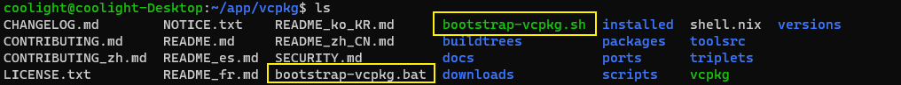
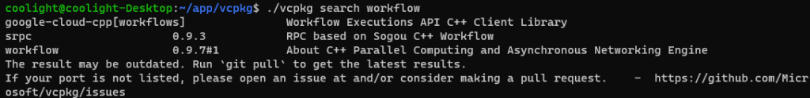
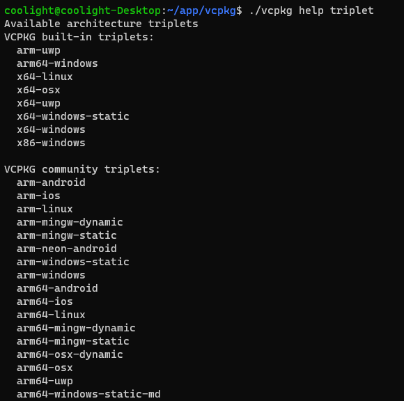
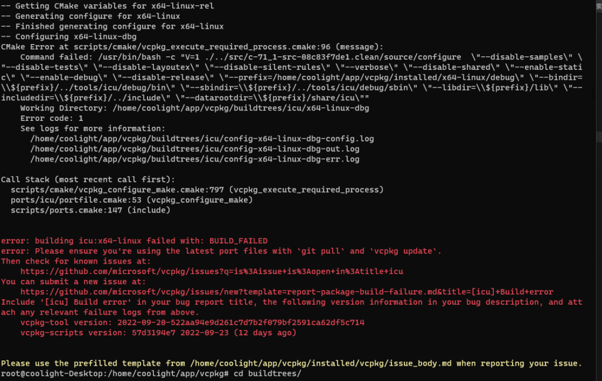

# [c++]包管理工具vcpkg安装使用

## 包管理工具

> 当我们需要使用别人开发的库时，可能会需要去下载其源码然后编译再引入我们的项目，这样做的话一来引用的库多了比较麻烦，而且需要自己管理这些包，二来一旦迁移到其他机子上就得复制过去或是再下载编译一次，尤其对跨平台项目来说简直苦不堪言，因此会有包管理工具的出现。

## vcpkg

> 它是由微软开发的，可以像安装普通软件一样地安装库，而且和visual studio/cmake很契合，在win和linux都可用。

## 安装

- 先找一个你希望安装vcpkg的位置，这里使用ubuntu示例，路径选在/home/coolight/app
- 打开控制台，来到上述路径，然后执行命令（需要先安装git，请忽略命令前的 $ ）：

```
$ git clone https://github.com/microsoft/vcpkg
```

- 由于网络原因，可能会拉取失败，如果你能搭梯子最好，不能的话就多试几次或者换wifi/移动数据等尝试。
- 下载完成后在当前目录下就会有一个叫vcpkg的目录


- 进入vcpkg目录，注意它有两个文件：
    - bootstrap-vcpkg.sh：linux系统请执行这个文件（执行命令 ./bootstrap-vcpkg.sh ）
    - bootstrap-vcpkg.bat：win系统请执行这个文件（双击打开或执行命令 bootstrap-vcpkg.bat）



- 执行完后就会出现上图中最后的那个vcpkg可执行文件，win系统下为vcpkg.exe。至此就安装完成了
- 当然目前只能在这个目录运行vcpkg来安装、升级等操作，设置环境变量即可在任意地方都可以运行。

* * *

## 常用命令

### 搜索库

- ./vcpkg search \[库名\]
    - 搜索可安装的包，示例：



### 安装库

- ./vcpkg install \[库名\]:\[位数-系统环境\] \[可选参数\]
    - 位数有x86和64；x86即32位，x64即64位。可以省略，win下默认安装32位，linux下默认安装64位。
    - 系统环境可以是windows，linux等，可以省略，默认会安装当前系统环境对应的库，可以通过命令查看：./vcpkg help triplet
    - win下默认会安装x86版本，而linux下默认是x64。可以设置环境变量修改这个默认安装的版本：
        - **VCPKG\_DEFAULT\_TRIPLET=x64-windows**



- \-
    - 可选参数有很多，比如：
        - \--head，安装库的最新的版本
        - \--dry-run，不做任何实质上的下载安装，仅显示将要被安装的库的名称和版本信息
        - ......
    - 例如：
    - 安装spdlog：./vcpkg install spdlog
    - 安装openssl并指定安装win的64位：./vcpkg install openssl:x64-windows

### 卸载库

- ./vcpkg remove \[库名\]
- ./vcpkg remove --outdated 卸载所有过期的库

### 列出已安装库

- ./vcpkg list

### 集成到开发环境

- ./vcpkg integrate install
- 需要执行这一句才能“通知”到vs或是cmake使用这些安装的库

* * *

## 问题

> 如果使用vcpkg安装库，更新等过程中报错，请一定一定要耐心看它的错误信息，往往它会告诉你解决办法，比如因缺少依赖软件需要安装；因网络问题文件下载失败，需要重试等等。

### 安装库之后导入使用依然报错

- 可能你没有让vcpkg集成过去，需要执行：./vcpkg integrate install
- 如果使用的是cmake，安装后还需要在项目的CMakelist.txt配置相应的编译链接，这些一般在vcpkg安装库完成后会提示：


### 如何重装/卸载vcpkg

- 我一直是直接把整个vcpkg文件夹删了就是卸载了，然后重新走一次教程安装就是重装

### ubuntu下安装ICU一直在最后出错



- 其实第一次出错的时候有提示说需要一个叫autoconf的程序但还没安装找不到
- 但我执行 sudo apt install autoconf 之后还是出错
- 后来根据vcpkg的提示去看了错误日志文件：\[vcpkg root\]/buildtrees/icu/config-x64-linux-dbg-err.log
    - 里面就提示错误是因为找不到 autoconf-archive
    - 因此执行sudo apt install autoconf-archive 安装上再运行vcpkg重新安装ICU就成功了
