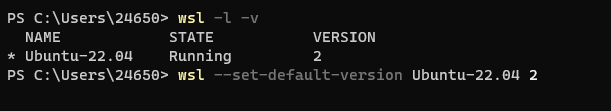

# [c++]win环境使用vs开发调试linux程序记录（WSL-ubuntu）

## 前言

> 尝试过使用ubuntu的UI环境+vscode，但最后还是感觉vs顺手。因此开始摸索使用vs连接虚拟机进行开发，调试。而win11有自带的ubuntu虚拟机，由于它的网络，文件路径映射感觉都很省心，因此最终决定使用它，但配置的过程中遇到很多问题，本文仅记录一些过程和问题解决方法，但不是一篇详细安装使用教程。

## 安装时报错

- 跟着百度的教程，但遇到了挺多问题的
- 报错：WslRegisterDistribution failed with error: 0x8007019e
    - 这个是因为未安装Windows子系统支持
    - 打开**Windows PowerShell（管理员）**
    - 输入 Enable-WindowsOptionalFeature -Online -FeatureName Microsoft-Windows-Subsystem-Linux 并回车执行
- 报错：WslRegisterDistribution failed with error: 0x800701bc
    - wsl1升级到wsl2但内核却没有升级
    - 下载并安装最新的wsl安装包：[wsl\_update\_x64.msi](https://wslstorestorage.blob.core.windows.net/wslblob/wsl_update_x64.msi)
- 报错：WslRegisterDistribution failed with error: 0x80041002
    - 这个是因为网络配置的问题，可能是因为之前安装过vmware之类的虚拟机，导致安装ubuntu时生成网络适配器出错，因此需要禁用或卸载vmware。
    - 但我删完后仍然不行，就先使用了一个退而求其次的办法：设置WSL默认安装版本为1，本来默认安装版本是2，改成1就顺利安装了。
    - 控制台命令：
        - 查看已安装wsl的信息：wsl -l -v
        - 修改默认安装版本为1：wsl --set-default-version 1
        - 修改已安装wsl的版本：wsl --set-default-version \[wsl名称\] \[版本\]

## 在linux上需要安装的程序

- 一键安装命令：sudo apt install g++ gdb make ninja-build rsync zip
- 包含的程序：
    - g++
    - gdb
    - make
    - ninja-build
    - rsync
    - zip

## VS无法打断点调试

- 正因为安装的是WSL1，后来vs一使用打断点调试就报错，当时就怀疑是这个版本的问题，因此后来就只能直面问题，搞了很多修改，最后还是重装了系统，把网络恢复了，然后就可以直接安装WSL2，但我们已经安装好WSL1版本，因此需要升级就可以了：
    - 查看已安装的wsl：wsl -l -v
    - 修改其版本为WSL2：wsl --set-default-version Ubuntu-22.04 2
    - 注意修改版本的命令后面那个名称Ubuntu-22.04不一定和你的一样，需要你用第一条命令查看想修改的系统的 NAME，如下图：

## 虚拟机网络适配器导致锐捷不可用

- 由于校园网需要锐捷认证，原本用的是6.84版本，这个版本似乎选不了网卡，当我们安装好虚拟机后，有一个叫 Hyper-V Virtual Ethernet Adapter的虚拟网卡，导致锐捷不知道要选那个网卡使用，然后就认证失败。
- 好在校园网提供了两个版本6.84和4.99，其中4.99是可以选择网卡的。因此就先卸载6.84，然后安装4.99，选择正确的网卡就可以了

## ubuntu虚拟机需要安装软件

- 打开ubuntu虚拟机，然后自己决定要不要换apt源让安装软件更快点。
- 并且需要安装软件 gcc，g++，gdb
- 如果项目使用了cmake，vcpkg，同样在ubuntu里也需要安装。

## VS中的相关配置

- 选择目标系统：
    - 在VS顶部有一个下拉栏可以选择目标系统，如图就是选择上面安装的WSL-Ubuntu

- \-
    - 如果没有，就点击右边的小箭头，然后勾选 目标系统：

- 选择编译配置：
    - 主要是选择编译器和debug/release
    - 同样是在VS的顶部，如果没有，则按照上一步里勾选 “配置”
    - 一开始很可能是没有如图的这个配置的，这个需要我们添加

- \-
    - 添加方法：
    - 点击 “配置” 下拉栏 -> 管理配置 -> 如图点击 + 号

- \-
    - 然后它会有一个弹窗，往下滑动就会出现WSL-GCC-Debug和WSL-GCC-Release，两个都添加进来就可以了：

