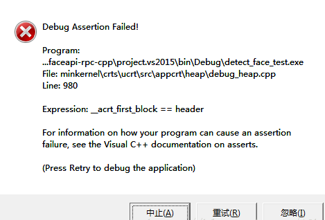
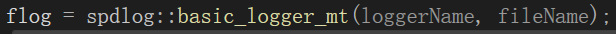
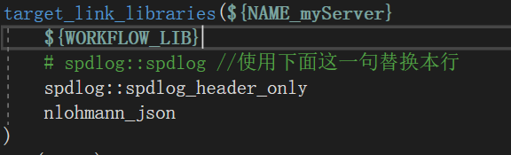
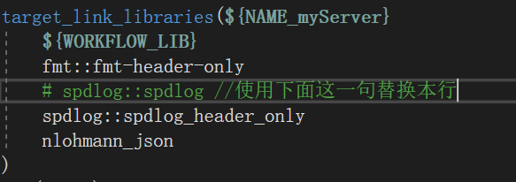

## 异常弹窗

- 且有时弹窗后点击中止，程序并不会停止运行

## 问题定位

- 打断点debug缩小范围，然后发现是一句调用spdlog库生成log文件的代码引发：

- 百度得到了一些解析，这个问题是因为对象在析构时不正确的释放内存导致，且该问题只在使用了动态库才会有

## 解决办法

- 但spdlog内的代码显然不好去碰，而且这个问题是因为我们链接了spdlog的动态库才会有，那么我们可以使用它的header-only，也就是仅头文件，直接静态编译进入我们的程序，不使用它的动态库了。

- 由于我的项目是用cmake构建，在CMakeLists.txt中，将原来的 spdlog::spdlog 改为 spdlog::spdlog\_header\_only 即可。

- 然后就发现fmt也来这个问题，我真是吐了

- 那就再加一句，fmt::fmt-header-only 也使用静态编译的方式引入fmt库

## 最后

- 回顾这个问题，百度上也有博客说应当注意，编译生成动态库应尽量使用 /MD 和 /MDd，避免/MT和/MTd。动态库中避免函数传入参数或返回值使用 std::string 类型，应当使用 std::string& 或 \[const\] char\*。

- 其次，这个问题和编译时的选项有关
    - 如果程序和动态库都使用 /MD 编译，则不会有问题
    
    - 如果动态库使用/MT编译，则程序和动态库各自有一个堆，假设我们的程序调用了一个动态库中的一个函数 std::string get(); 而这个string的内存是由动态库分配，但我们的程序并不能区分这个内存是程序的还是动态库的，当对象生命周期结束，就会由程序调用析构函数去释放内存，因此出错。
    
    - 因此解决办法还可以是避免我们的程序去析构动态库返回的string。比如动态库中的函数返回全局变量。
