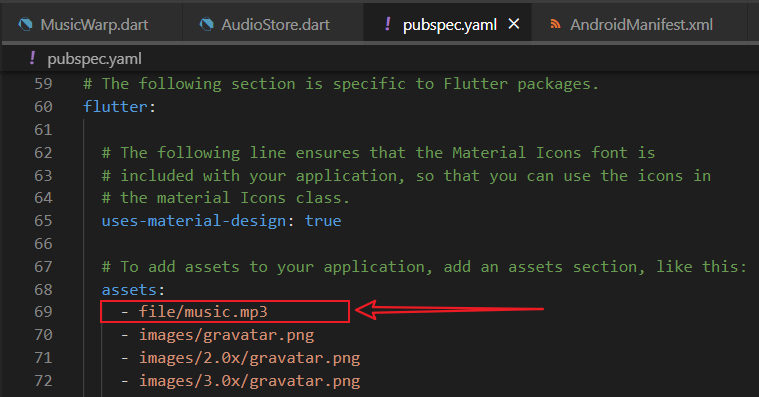
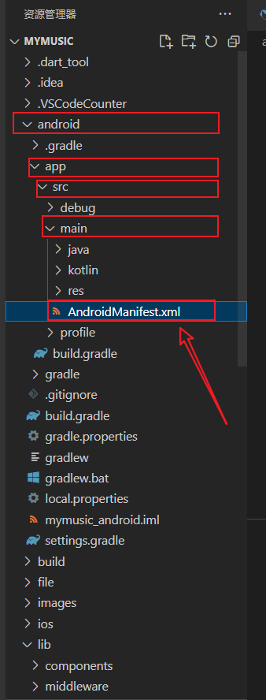
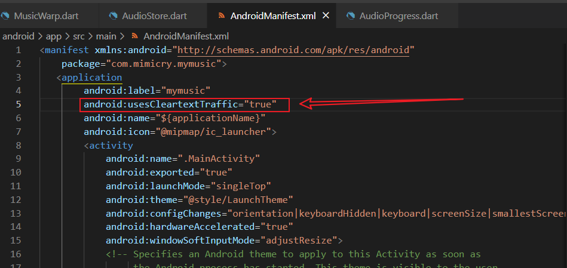
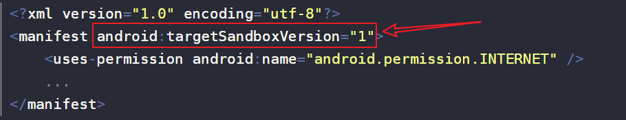

# [flutter/audioplayers]播放资源时报错

## 前言

- 记录使用audioplayers包时出现的问题，测试环境主要是 安卓11

## 问题

### 无法读取assets文件

- 这里是希望读取app自带文件 “file/music.mp3” 作为音乐来播放
- 那么首先就需要确保你是否已经在 pubspec.yaml 中加入了这个文件：



- 但仍然报错，报错代码行：audioPlayer.setSource(AssetSource("file/music.mp3"));

```
E/flutter (32073): [ERROR:flutter/runtime/dart_vm_initializer.cc(41)] Unhandled Exception: Unable to load asset: assets/file/music.mp3
E/flutter (32073): #0      PlatformAssetBundle.load (package:flutter/src/services/asset_bundle.dart:258:7)
E/flutter (32073): <asynchronous suspension>
E/flutter (32073): #1      AudioCache.fetchToMemory (package:audioplayers/src/audio_cache.dart:75:22)
E/flutter (32073): <asynchronous suspension>
E/flutter (32073): #2      AudioCache.load (package:audioplayers/src/audio_cache.dart:101:31)
E/flutter (32073): <asynchronous suspension>
E/flutter (32073): #3      AudioPlayer.setSourceAsset (package:audioplayers/src/audioplayer.dart:237:17)
```

- 可以看到开头第一句报错，“Unable to load asset: assets/file/music.mp3”，但我们指定的文件是"file/music.mp3"，即audioPlayer有一个默认路径前缀"assets/"。
- **解决办法**：通过 **audioPlayer.audioCache.prefix = '';** 去掉它的默认前缀，然后再调用 audioPlayer.setSource(AssetSource("file/music.mp3")); 读取mp3文件即可。

### 本地资源/网络资源都无法播放

- 报错信息

```
......
D/MediaCodecList(32073): codecHandlesFormat: no format, so no extra checks
D/CCodec  (32073): allocate(c2.android.mp3.decoder)
I/CCodec  (32073): setting up 'default' as default (vendor) store
I/CCodec  (32073): Created component [c2.android.mp3.decoder]
D/CCodecConfig(32073): read media type: audio/mpeg
D/ReflectedParamUpdater(32073): extent() != 1 for single value type: algo.buffers.max-count.values
D/ReflectedParamUpdater(32073): extent() != 1 for single value type: output.subscribed-indices.values
D/ReflectedParamUpdater(32073): extent() != 1 for single value type: input.buffers.allocator-ids.values
D/ReflectedParamUpdater(32073): extent() != 1 for single value type: output.buffers.allocator-ids.values
D/ReflectedParamUpdater(32073): extent() != 1 for single value type: algo.buffers.allocator-ids.values
D/ReflectedParamUpdater(32073): extent() != 1 for single value type: output.buffers.pool-ids.values
D/ReflectedParamUpdater(32073): extent() != 1 for single value type: algo.buffers.pool-ids.values
......
D/CCodecBufferChannel(32073): [c2.android.mp3.decoder#231] MediaCodec discarded an unknown buffer
I/hw-BpHwBinder(32073): onLastStrongRef automatically unlinking death recipients
......
```

- 这个问题可能是因为你使用了**lowLatency**（低延迟）播放模式，即使用了 audioPlayer.setPlayerMode(PlayerMode.lowLatency);
- audioplayers有两种播放模式PlayerMode：
    
    - **mediaPlayer**：最常用的播放模式，对时延要求不高的声音输出采用该模式，边加载边播放。
    
    - **lowLatency**：低延迟播放模式，用于按键音、游戏背景音等对时延要求高场景，一次加载完数据。
- 具体差别我还不了解，但实践中，无论在虚拟机还是真机，一使用lowLatency就无法播放，因此可以试试切换为mediaPlayer使用：
    - **audioPlayer.setPlayerMode(PlayerMode.mediaPlayer);**

### 网络资源加载失败

- 使用lowLatency播放模式时的报错内容：
    - 之所以强调lowLatency，是因为对于同一个问题，mediaPlayer 和 lowLatency 的报错信息是不同的，而且我觉得 lowLatency 的比较清晰。

```
......
Unexpected error!
D/AudioPlayers(31616): java.io.IOException: Cleartext HTTP traffic to {xxx.域名} not permitted
......
```

- 那么百度这一句报错后，很多 安卓 原生的文章提到，在高版本的安卓中不允许不加密的明文链接，说人话就是不让你用http链接，需要走https
- **解决办法**：
    - **方法1：**明显的当然就是换https链接了。
    - **方法2：**
        - 修改android/app/src/main/AndriodManifest.xml文件：



- \-
    - 在application标签的属性中添加：**android:usesCleartextTraffic="true"**
    - 注意是 **<application 这里></application>** ，而不是 **<application>不是这里</application>**



- 方法3：同样的修改 **AndroidManifest.xml** 文件
    - 修改/添加 <manifest> 标签的属性 **android:targetSandboxVersion="1"**


