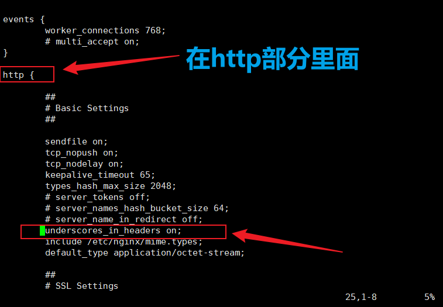

# [Http]自定义请求头名称

> 这几天之所以去了解这个，就是之前埋下的雷，自定义名称用了下划线\_，前两天莫名其妙犯病一直获取不了，以为是被浏览器或是nginx拦截了，开始考虑是否是这个名称的问题，然而debug两天，结果是代码里一个变量名忘了改......我的天，我真的会哭

## 正文

- 第一点，既然这个字段是我们自定义的，那名称肯定要避开协议中已经存在的字段的名称（如Host，Referer等都不能用）
- 注意请求头的名称**不区分大小写**，但会区分 - \_ 等符号
    - 例如：
        - HelloWorld和helloworld等价，如果请求头中实际名称是HelloWorld，但在读取时直接传入helloworld也是可以获取到的。（因为标准是这么规定的，解析库在设计时也应当支持这个操作）
        - HelloWorld 和 Hello-World 和 Hello\_World，三者都不一样
- 名称里不应包含 **空白符、换行符、下划线、冒号**
    
    - 连接符号可以使用短横杠，即减号 -
    
    - 例如：
        - 允许：HelloWorld、Hello-World、helloworld
        - 但不应：Hello World、Hello:World、Hello\_world等
    - 其中，如果硬要使用**下划线\_**，在**nginx**的**nginx.conf配置文件内的http部分内**需要配置一句：
        - underscores\_in\_headers on;
        - 这句配置会允许nginx放行包含下划线的请求头字段，否则nginx会默认把上述不符合要求的几种情况的字段全部去掉，然后再把这个请求转发过来，因此导致后端程序获取不到自定义的那个字段。

- 有时我们会看到一些网站在命名自定义字段时使用 **X-** 开头的格式，然而早在2012年6月，标准[RFC 6648](https://stackoom.com/question/EwTd/%E8%87%AA%E5%AE%9A%E4%B9%89HTTP%E6%A0%87%E5%A4%B4-%E5%91%BD%E5%90%8D%E7%BA%A6%E5%AE%9A)就明确弃用这一建议：

> 3.对新参数的创建者的建议
> 
> ......  
> 不建议在其参数名称前加上“X-”或类似的结构。

> 对协议设计者的建议
> 
> ......  
> 不应禁止注册具有“X-”前缀或类似结构的参数。  
> 绝不能规定具有“X-”前缀或类似结构的参数需要被理解为非标准化。  
> 绝不能规定没有“X-”前缀或类似结构的参数需要被理解为标准化。

- \-
    - 也就是说，X- 并没有什么特别的效果，它是以前的一种规范建议，而现在已经不建议了，继续用X-开头也没问题，但并不建议你这样干。
