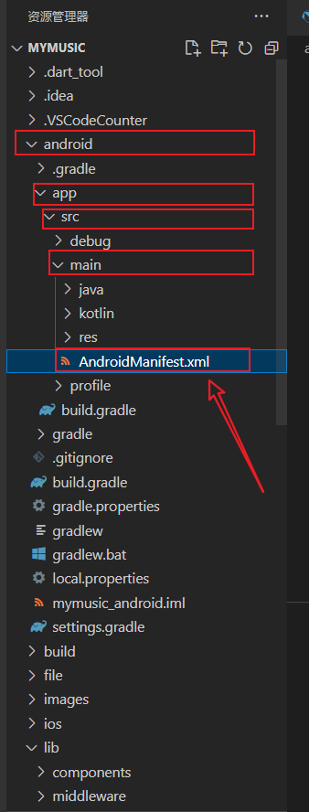
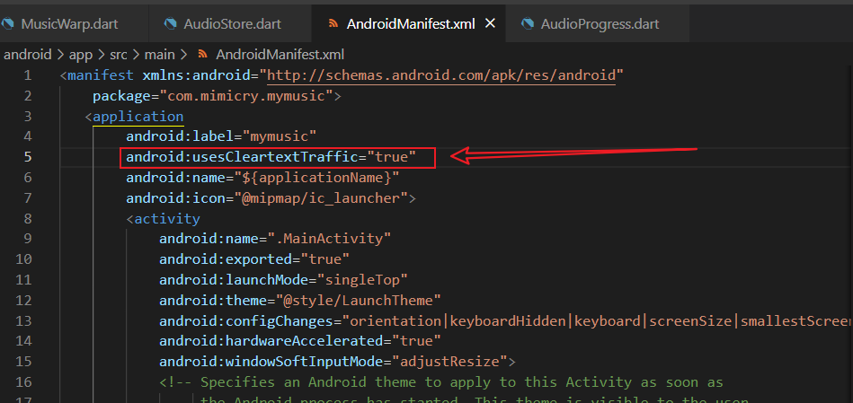
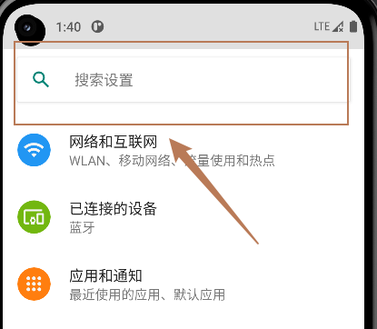
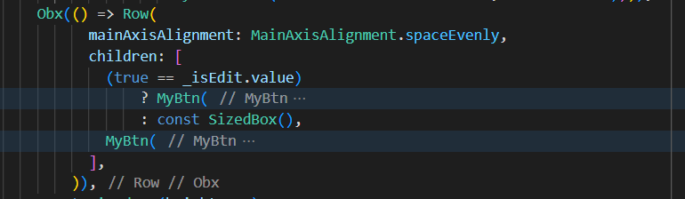
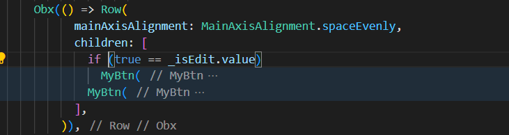
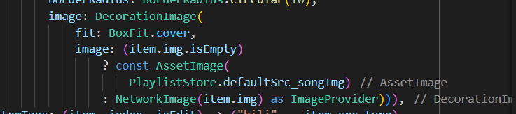
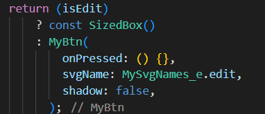

# [flutter]学习经验记录总结

> flutter已经上手接近一个月，也码了5000行左右的代码了，相比一开始写的”乱来“已经好了几分，下面记录下一些感受和技巧。

## 问题

- **入门第一个门槛，就是安装环境**
    - 不得不说，配置安卓的开发环境属实折磨人，其中大部分原因是网络的问题，因为谷歌被墙，所以刚创建好项目后，经常会卡在 ”Running Gradle task 'assembleDebug'…“，如果等了一段时间还是失败，可以试试用手机开流量，然后开WIFI给电脑。在学校就经常校园网会失败，然后用手机流量连vpn都不用就可以下载成功。

- **在高版本的安卓中，默认是不允许http请求的**
    - 需要使用加密的https；但可以在配置文件中修改让它放行http：
    
    - 修改配置文件android/app/src/main/AndriodManifest.xml：

- \-
    - 在application标签的属性中添加：**android:usesCleartextTraffic="true"**
    
    - 注意是 **<application 这里></application>** ，而不是 **<application>不是这里</application>**

- **安卓debug时在控制台没有日志？**
    - 这个很可能是安卓的**开发者模式**里的日志没有开启
    
    - 首先在手机的设置里打开**开发者模式**（默认是隐藏的，可以在 **关于手机-版本号** 连续点击5次后显示）
        - 然后开发者模式就因手机而异，可能会在设置的首页，也可能在辅助功能里，需要自己找或者**搜索**

- \-
    - 然后找到开发者选项，可以直接搜索设置，输入 ”开发者“ 应该就有了：

- \-
    - 在开发者选项中，找到 **日志记录器缓冲区大小** 的设置：

- \-
    - 只要不是关闭，选哪个应该都行了，一般就选1M的那个

## 第三方库

- 当仁不让的当然是Getx，这个真的牛，一个库就包含了**状态管理、路由、主题皮肤、多语言**等支持
    - 在pub.dev中搜索 get 即可找到

- crypto，加解密函数库，和js中的一样，包含md5、sha1、sha256等等各种算法，在加密、验证等会经常用。

- dio，http网络库，相当于js中axios

## 经验

- **GetX的使用**
    - 虽然官方文档说了很多，但还是有很多得自己摸索
    
    - 尤其是状态管理相关的Getx，GetBuilder、Obx、GetxController这一家
    
    - 首先分清楚，GetxController是保存，控制数据用的，它有点像前端的vuex和pinia。
    
    - 而Getx、Obx、GetBuilder是让我们写的静态组件（StatelessWidget）能和动态组件（StatefulWidget）一样，可以随着数据的更新而更新页面展示。
    
    - 然后GetBuilder和StatefulWidget类型，修改数据后，需要使用update()函数来通知它更新界面。
    
    - 而Getx和Obx则是修改数据后，界面会自动更新，但他们使用的内存会比GetBuilder多。
    
    - Obx大多是用于要绑定一个.obx的变量给我们的组件时使用，它并不需要GetxController，当然你把GetxController里面定义的.obx变量绑定过来用也是可以的
    
    - Getx则大多是需要一个GetxController配合使用的，但你不写init也不写Getx<T>的T类型也是可以的，只要被Getx包裹的组件有使用到.obx变量即可
    
    - 也就是说，Obx和Getx可以使用的前提并不是你给了他们GetxController，而是被包裹的组件有使用到.obx变量

- **if / 三目运算符 bool ？A ：B**
    - 在build()函数中，经常会使用三目运算符来判断这个位置使用的组件或其样式
    
    - 比如：
        - 这里就判断了（item.img.isEmpty）即item的img属性是否为空
        
        - 若true，则加载本地图片const AssetImage(...)
        
        - 若false，则加载网络图片NetworkImage(item.img)

- \-
    - 那如果我们的需求是判断条件为true则使用组件，false则不做任何操作呢？
    
    - 这时就要请**Sizedbox**出场了：

- \-
    - 如图，isEdit如果为true，则返回const SizedBox()，这个sizedbox由于没有传参，只是个占位的东西，在界面上高度是0，宽度也是0，因此相当于什么也没有
    
    - 而当isEdit为false，则返回MyBtn()组件

- 不过我们其实有更简单的写法，在\[\]中是可以直接写 if 的：
    - 但要注意这里的if不能加上花括号 {}

- **注意，\[ if (bool) widget \] 和 \[ (bool) ? widget : const sizedBox() \] 并不等价**
    - 尤其可以证明的就是如上面的代码中的Row的children内
    
    - Row的水平对其方式是spaceEvenly，即将子组件放在两端且和边界留有空隙，当子组件只有一个时，水平居中。
    
    - 如果是 \[ if (bool) widget \] ，当bool = false时，Row的子组件只有一个MyBtn()，因此在界面上会呈现只有一个水平居中的按钮：

- \-
    - 如果是 \[ (bool) ? widget : const sizedBox() \] ，即使bool = false， Row内仍然是有两个组件，但sizedBox()不在界面上显示，因此，在界面上会显示一个被放在右边的按钮。

