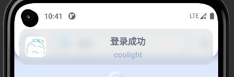
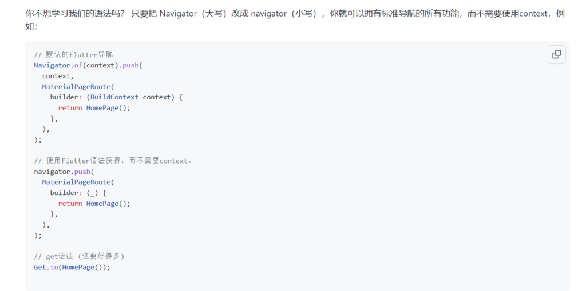
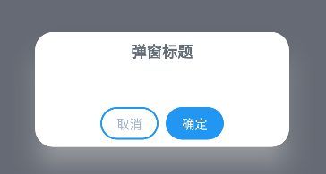
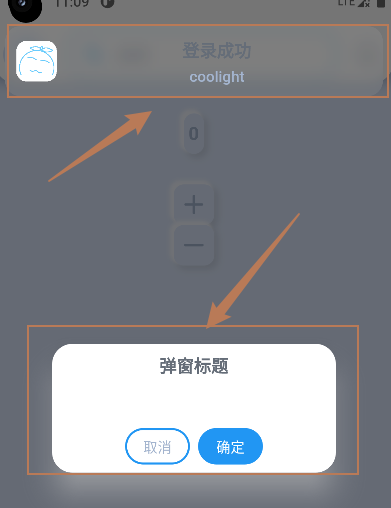
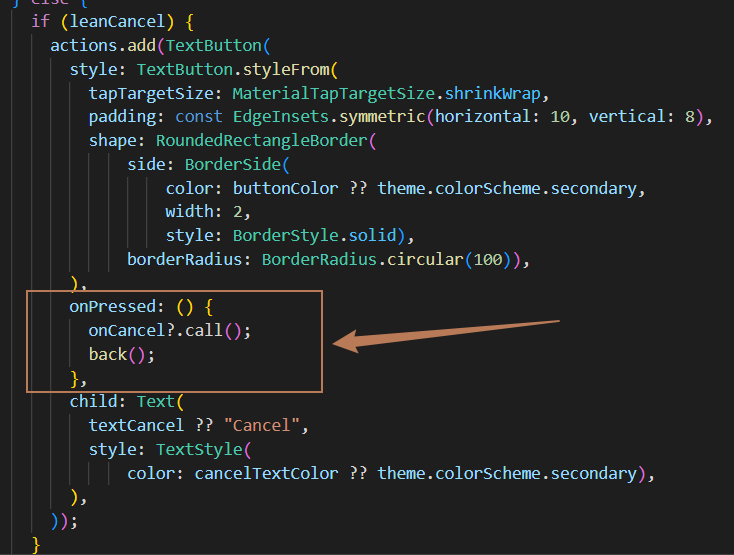
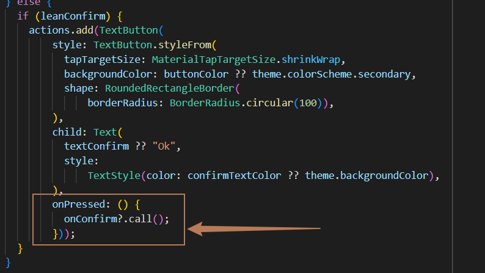

## Get.snackbar

- Getx提供的悬浮通知组件

- 默认效果还挺不错的：



## 问题

- Getx官方介绍和百度上的很多文章就有提到Get.back()可以关闭这个悬浮通知

- 然而，我们普遍用Get.back()的目的是关闭当且页面，返回上一级

- 因此，当项目使用上这个悬浮通知以后，如果此时有悬浮通知显示，然后页面需要返回调用了Get.back()，则会进行不符合原本预期的效果：
    - 悬浮通知被Get.back()关闭
    
    - 当前想关闭的页面没有被关闭

- **解决方法**：
    - 使用以下语句代替Get.back() ：
    
    - 其中，navigator是Getx提供的一个对象，用于代替flutter原生的Navigator

```
navigator!.pop();
```

- \-
    - Getx对navigator部分介绍：



- 这也意味着我们如果不使用Get.back()而使用flutter自带的路由管理Navigator则可以正常关闭页面而不会关闭悬浮通知

- 有时我们还需要使用Get.back<T>(result: res)来返回数据
    - 我们同样可以替换使用：

```
navigator!.pop<T>(result);
```

- 因此就可以搞一个自己的back()来代替Get.back()使用了：

```
class MyRoute_c {
  static void back<T>({T? result}) {
    navigator!.pop<T>(result);
  }
}
```

## Getx其他悬浮组件调整

> 正如上面所描述的问题一样，在Getx的其他悬浮组件中同样有类似的问题。
> 
> 下面我们以 Get.defaultDialog() 示例问题并解决

- 如果我们执行以下代码：

```
Get.defaultDialog(
    title: "弹窗标题",
    textConfirm: "确认", // 确认按钮的文本
    textCancel: "取消", // 取消按钮的文本
    onConfirm:() {
        print("确认按钮被按下");
        Get.back();
    }
);
```

- 运行效果：



- 当你点击确定时，执行 onConfirm 的函数，打印信息并执行Get.back()，可以把弹窗也看作是一个页面，弹窗将被这一句Get.back()关闭

- 然而，如果此时有悬浮通知Get.snackbar()正在显示：



- 那就会出问题了，按下确定后，Get.back()会关闭悬浮通知，弹窗则会继续存在

- 当然你确实可以多按几次确定，直到悬浮通知都被关闭，这时Get.back()才会正确地关闭弹窗

- 然而这也将导致 onConfirm 的代码被执行多次，如果你在里面写了网络请求之类的操作，就可能会出现多次重复的网络请求等等的问题了

- 因此，我们想关闭弹窗时，也应该使用上面我们自己实现的back()，即最终使用它来返回：
    - navigator!.pop();

- 可能你已经发现，确定按钮对应了 onConfirm 的函数，但取消按钮对应的 onCancel 我们并没有传参给它，也就是说，它会执行它默认的操作：
    - 查看Getx的源码，就可以发现，它执行我们传入的 onCancel ，然后执行一个Get.back()
    
    - 然而我们并没有传 onCancel ，因此它会直接执行一个Get.back()



- 那么假如此时有悬浮通知，显然默认的取消执行的Get.back()只会关闭悬浮通知，而不会关闭弹窗

- 但如果我们直接给一个onCancel的传参 onCancel: () => navigator!.pop() 的话，它即执行了navigator!.pop()， 又会执行后面的Get.back()，如果此时没有悬浮通知，页面将返回两次

- 因此我们需要判断一下，按下取消按钮时是否又显示悬浮通知，有则执行navigator!.pop()，没有则不需要我们干事，等它执行后面Get.back()即可以关闭弹窗

```
onConfirm: (null != onConfirm)
            ? onConfirm
            : () {
                MyRoute_c.back();
              },
onCancel: (null != onCancel)
            ? onCancel
            : () {
                if (Get.isSnackbarOpen) {
                  MyRoute_c.back();
                }
              }
```

- 由于源码中，onConfirm 后面并没有像 onCancel 一样带着一个Get.back()，因此需要我们自己调用我们的back() 关闭弹窗


