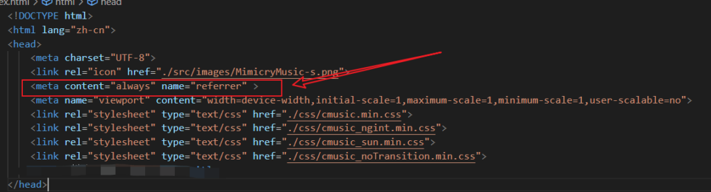

# [腾讯云/COS/CDN]对象存储和CDN配合

## 前言

> 云服务器用起来感觉最难受的就是带宽了，国内的云服务器普遍带宽都很小，但买国外或者香港的话延迟大还容易被封IP。一般网站/app最占带宽的是图片和音视频等文件的上传下载，下面我们要聊的cos和cdn就是解决这个问题来的。

## 简介

### 对象存储COS

- 对象存储不同于我们平时操作系统里的文件存储，它就像一个map，存储的所有文件都有一个唯一的名称作为key，文件内容作为value。而没有目录的概念。

- 这样做的意义在于，当文件很多，目录结构深时，文件存储需要根据那颗目录树一步一步找到文件，显然是比对象存储直接按文件名一步到位得到要来得慢。

- 但目前很多云服务厂商都有在对象存储上提供目录功能，这大多是模拟出来的。比如腾讯云是将文件名中的 / 识别为目录模拟得到的。
    - 比如：放进两个文件：
    
    - aaa.txt
    
    - wow/abc.cpp
    
    - 由于 "wow/abc.cpp" 的文件名带有 / ，则可以模拟解析为是放在wow目录下，存在一个文件叫abc.cpp。

- 我们使用云服务提供的COS来替换我们的服务器实现文件的上传和下载。一般云服务COS不限制下载速度，且用户上传也免费。但用户的下载流量、存储空间占用、请求次数是要收钱的。
    - 注意这不是三选一的问题，是三个方面都要收钱的！
    
    - 比如：在一个月的时间里，我们向COS上传了 100 MB 文件，发送过 1 w 次读写请求，且用户外网下载文件使用过 10G 的流量。
    
    - 那么结算时，需要支付：A + B + C
        - A：100M/1个月 的存储空间占用费用
        
        - B：1w次读取请求费用
        
        - C：外网下载 10 G 流量费用
    
    - 显然，**外网下载流量很容易被人攻击**，盗刷流量，然后疯狂扣流量包扣费，容易出现一觉醒来，没了一套海景房的刺激。后面我们用CDN来防止一部分攻击，因为COS的流量费比CDN贵非常多，而且CDN能设置更多的访问限制，降低被攻击的损失，所以可以用CDN抗在前面。

### CDN

- cdn的用途很广泛，由于用户在地域上分布全国甚至全球各地，而我们的服务器一般是只在一个或几个地方而已，cdn在地域上可以分散多个节点，作为一个中间人，缓存用户访问服务器上的文件，并在用户下一次请求这个文件时，cdn就可以直接提供给用户，而不需要大老远来请求服务器，提高用户的访问速度。

- 这里我们可以利用这个特性，且其价格低，来帮助COS降低被攻击的损失。

## 使用问题

### 盗刷COS流量

- 前面我们已经提到，COS的外网下载流量是比较贵的，而且速度快，容易被攻击刷流量。

- 解决办法：
    - 把COS**访问权限设置为 私有读私有写**
    
    - 当用户需要上传文件时，使用云厂商提供的SDK，服务端预签名上传文件的URL，并将签名后的链接发送给用户，客户端只能按照签名链接指定参数、请求头、请求类型的上传文件到COS，上传不需要使用CDN。
    
    - 当用户需要下载时，使用SDK获取COS上对应文件名的文件链接，并将链接的域名替换为CDN的域名，然后返回替换后的链接给用户下载文件，并在CDN设置限制IP访问速度、下载速度等限制即可。

### 防盗链/限速

- 由于浏览器不允许伪造请求头中的Referer、Host、Origin，因此可以在CDN/COS都配置防盗链，限制请求的Referer。这个可以阻止别人的网站直接把你的资源链接放到他的网站使用的情况，**减少一些被偷资源流量的问题**，但他直接下载你的资源然后上传到他的服务器还是可以的。

- 注意**网页是可以指定浏览器不携带Referer**的，即请求是空Referer。而在浏览器直接敲网址进入网页时的请求也是空Referer，你需要考虑是否需要允许空Referer的请求。防盗链挡不住客户端请求，因为客户端是可以随意伪造请求中的任意值的。如APP、nodejs、命令行、服务端程序等，只要是非标准浏览器环境就可以随意伪造。

- 在CDN中，可以**限制下载速度、IP访问速度**等。

### https网站中使用http资源

- 由于CDN的Https目前很多云厂商是收费的，虽然不贵，但也是钱。

- 如果你CDN访问使用了http，但网站是https协议时，直接在https网站里获取http资源（图片、音视频等）会被浏览器认为是不安全的，并在浏览器的开发者工具中打印警告，但也是能用的。但默认不会带上Referer，因此如果你设置了防盗链不允许空Referer的话，就有问题了，这个时候可以在网页的<head></head>中添加配置：<meta content="always" name="referrer" >，这样浏览器在获取Http资源时也会带上Referer了

- https网站中发起http请求是不允许的！

### 上传文件大小/数量限制

- 用户向我们的服务端申请用于上传文件的预签名URL时，需要携带参数：**文件大小、文件MD5**，然后我们可以指定该链接发送时必须携带：
    - Content-Length=500
    
    - x-cos-meta-md5: {文件md5值}
    
    - 由此就可以防止用户拿到预签名URL后，上传了其他文件的问题

- 文件大小限制，就是在我们服务端给预签名URL时进行检查。

- 文件数量限制，可以将用户、IP获取上传链接时写入数据库记录，根据这个记录来设计用户上传文件的数量和总大小等。

### 腾讯云COS的SDK/c++

- 整了老半天，终于写好了cmakelist能编译运行release，但debug版一直找不到链接符号。

- 看了大概是因为他是SDK源码里有一个文件夹three-party存放了已经编译好的第三方依赖库，但这些库是release的，因此需要我们编译debug的依赖库。但我的项目里也依赖openssl，改来改去才能release，最终debug版放弃了。

- 后来开始用上go了，学1天然后上手引入他的sdk和框架开发完cos相关的接口。有c基础还是很快上手的。
