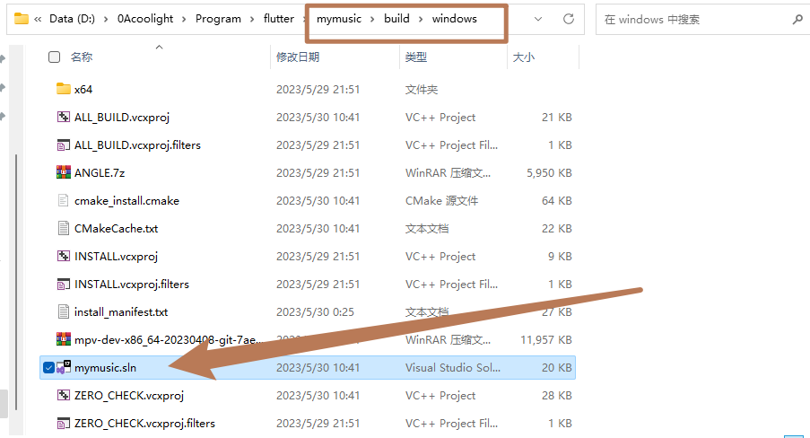
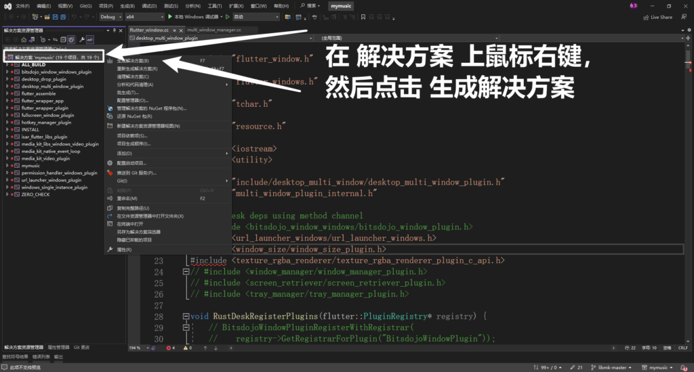

## 类型1：新引入一个包后出现

- 有时新引入一个包之后，就出现了这个构建失败，但又不说错误原因：

```
Launching lib\main.dart on Windows in debug mode...
Nuget.exe not found, trying to download or use cached version.
Building Windows application...                                    35.1s
Exception: Build process failed.
```

- 一开始一直是一头雾水，不过我这个是在构建windows上的，因此我们可以手动用 visual studio 打开flutter生成的构建项目，自己来构建一下，看看vs有没有更详细的错误信息：

- 首先在 {flutter项目}/build/windows/，应该会存在一个 {项目名}.sln 文件，在文件管理器双击使用vs打开或者直接在vs里选择打开它也行：



- 在vs中，在左侧的 解决方案 上，点击鼠标右键，然后点击 生成解决方案：



- 然后vs底部会弹出 输出信息 窗口，里面会打印编译过程的信息，现在我们需要仔细查看里面错误的原因：

```
......
16>D:\0Acoolight\Program\flutter\mymusic\windows\flutter\ephemeral\.plugin_symlinks\desktop_multi_window\windows\flutter_window.cc(22,10): fatal  error C1083: 无法打开包括文件: “window_size/window_size_plugin.h”: No such file or directory
16>window_channel.cc
9>正在生成代码...
9>  正在创建库 D:/0Acoolight/Program/flutter/mymusic/build/windows/plugins/media_kit_video/Debug/media_kit_video_plugin.lib 和对象 D:/0Acoolight/Program/flutter/mymusic/build/windows/plugins/media_kit_video/Debug/media_kit_video_plugin.exp
9>media_kit_video_plugin.vcxproj -> D:\0Acoolight\Program\flutter\mymusic\build\windows\plugins\media_kit_video\Debug\media_kit_video_plugin.dll
16>base_flutter_window.cc
16>正在生成代码...
16>已完成生成项目“desktop_multi_window_plugin.vcxproj”的操作 - 失败。
17>------ 已启动生成: 项目: mymusic, 配置: Debug x64 ------
17>Building Custom Rule D:/0Acoolight/Program/flutter/mymusic/windows/runner/CMakeLists.txt
17>flutter_window.cpp
17>main.cpp
17>utils.cpp
17>win32_window.cpp
17>generated_plugin_registrant.cc
17>正在生成代码...
17>LINK : fatal error LNK1104: 无法打开文件“..\plugins\desktop_multi_window\Debug\desktop_multi_window_plugin.lib”
17>已完成生成项目“mymusic.vcxproj”的操作 - 失败。
18>------ 已启动生成: 项目: ALL_BUILD, 配置: Debug x64 ------
18>Building Custom Rule D:/0Acoolight/Program/flutter/mymusic/windows/CMakeLists.txt
19>------ 已启动生成: 项目: INSTALL, 配置: Debug x64 ------
19>-- Install configuration: "Debug"
19>CMake Error at cmake_install.cmake:115 (file):
19>  file INSTALL cannot find
19>  "D:/0Acoolight/Program/flutter/mymusic/build/windows/runner/Debug/mymusic.exe":
19>  No error.
19>
19>
19>C:\Program Files\Microsoft Visual Studio\2022\Community\MSBuild\Microsoft\VC\v170\Microsoft.CppCommon.targets(159,5): error MSB3073: 命令“setlocal
19>C:\Program Files\Microsoft Visual Studio\2022\Community\MSBuild\Microsoft\VC\v170\Microsoft.CppCommon.targets(159,5): error MSB3073: "C:\Program Files\Microsoft Visual Studio\2022\Community\Common7\IDE\CommonExtensions\Microsoft\CMake\CMake\bin\cmake.exe" -DBUILD_TYPE=Debug -P cmake_install.cmake
19>C:\Program Files\Microsoft Visual Studio\2022\Community\MSBuild\Microsoft\VC\v170\Microsoft.CppCommon.targets(159,5): error MSB3073: if %errorlevel% neq 0 goto :cmEnd
19>C:\Program Files\Microsoft Visual Studio\2022\Community\MSBuild\Microsoft\VC\v170\Microsoft.CppCommon.targets(159,5): error MSB3073: :cmEnd
19>C:\Program Files\Microsoft Visual Studio\2022\Community\MSBuild\Microsoft\VC\v170\Microsoft.CppCommon.targets(159,5): error MSB3073: endlocal & call :cmErrorLevel %errorlevel% & goto :cmDone
19>C:\Program Files\Microsoft Visual Studio\2022\Community\MSBuild\Microsoft\VC\v170\Microsoft.CppCommon.targets(159,5): error MSB3073: :cmErrorLevel
19>C:\Program Files\Microsoft Visual Studio\2022\Community\MSBuild\Microsoft\VC\v170\Microsoft.CppCommon.targets(159,5): error MSB3073: exit /b %1
19>C:\Program Files\Microsoft Visual Studio\2022\Community\MSBuild\Microsoft\VC\v170\Microsoft.CppCommon.targets(159,5): error MSB3073: :cmDone
19>C:\Program Files\Microsoft Visual Studio\2022\Community\MSBuild\Microsoft\VC\v170\Microsoft.CppCommon.targets(159,5): error MSB3073: if %errorlevel% neq 0 goto :VCEnd
19>C:\Program Files\Microsoft Visual Studio\2022\Community\MSBuild\Microsoft\VC\v170\Microsoft.CppCommon.targets(159,5): error MSB3073: :VCEnd”已退出，代码为 1。
19>已完成生成项目“INSTALL.vcxproj”的操作 - 失败。
========== 生成: 16 成功，3 失败，0 最新，0 已跳过 ==========
```

- 我这里vs说是因为：无法打开包括文件: “window\_size/window\_size\_plugin.h”: No such file or directory

- 也就是某个库依赖了 window\_size 这个包，但我没装，因此去 pub.dev 上找它然后添加到flutter的 pubspec.yaml 文件中就可以了，但 window\_size 这个包并没有在 pub.dev 中，百度发现它是 谷歌 放在github上的一个插件，因此就直接去拉github：

```
 window_size: 
   git: 
     url: https://github.com/google/flutter-desktop-embedding
     path: plugins/window_size
```

- 改完直接在flutter里重新构建试试就可以了：flutter run

## 类型2：有时候突然发癫

- 最近就遇到它突然发癫，怎么搞都失败，而且错误提示有的时候会是这样的：

```
C:\Program Files\Microsoft Visual Studio\2022\Community\MSBuild\Microsoft\VC\v170\Microsoft.CppCommon.targets(159,5): error MSB3073: ���setlocal [D:\0Acoolight\Program\flutter\mymusic\build\windows\INSTALL.vcxproj]
C:\Program Files\Microsoft Visual Studio\2022\Community\MSBuild\Microsoft\VC\v170\Microsoft.CppCommon.targets(159,5): error MSB3073: "C:\Program Files\Microsoft Visual Studio\2022\Community\Common7\IDE\CommonExtensions\Microsoft\CMake\CMake\bin\cmake.exe" -DBUILD_TYPE=Debug -P cmake_install.cmake [D:\0Acoolight\Program\flutter\mymusic\build\windows\INSTALL.vcxproj]
C:\Program Files\Microsoft Visual Studio\2022\Community\MSBuild\Microsoft\VC\v170\Microsoft.CppCommon.targets(159,5): error MSB3073: if %errorlevel% neq 0 goto :cmEnd [D:\0Acoolight\Program\flutter\mymusic\build\windows\INSTALL.vcxproj]
C:\Program Files\Microsoft Visual Studio\2022\Community\MSBuild\Microsoft\VC\v170\Microsoft.CppCommon.targets(159,5): error MSB3073: :cmEnd [D:\0Acoolight\Program\flutter\mymusic\build\windows\INSTALL.vcxproj]
C:\Program Files\Microsoft Visual Studio\2022\Community\MSBuild\Microsoft\VC\v170\Microsoft.CppCommon.targets(159,5): error MSB3073: endlocal & call :cmErrorLevel %errorlevel% & goto :cmDone [D:\0Acoolight\Program\flutter\mymusic\build\windows\INSTALL.vcxproj]
C:\Program Files\Microsoft Visual Studio\2022\Community\MSBuild\Microsoft\VC\v170\Microsoft.CppCommon.targets(159,5): error MSB3073: :cmErrorLevel [D:\0Acoolight\Program\flutter\mymusic\build\windows\INSTALL.vcxproj]
C:\Program Files\Microsoft Visual Studio\2022\Community\MSBuild\Microsoft\VC\v170\Microsoft.CppCommon.targets(159,5): error MSB3073: exit /b %1 [D:\0Acoolight\Program\flutter\mymusic\build\windows\INSTALL.vcxproj]
C:\Program Files\Microsoft Visual Studio\2022\Community\MSBuild\Microsoft\VC\v170\Microsoft.CppCommon.targets(159,5): error MSB3073: :cmDone [D:\0Acoolight\Program\flutter\mymusic\build\windows\INSTALL.vcxproj]
C:\Program Files\Microsoft Visual Studio\2022\Community\MSBuild\Microsoft\VC\v170\Microsoft.CppCommon.targets(159,5): error MSB3073: if %errorlevel% neq 0 goto :VCEnd [D:\0Acoolight\Program\flutter\mymusic\build\windows\INSTALL.vcxproj]
C:\Program Files\Microsoft Visual Studio\2022\Community\MSBuild\Microsoft\VC\v170\Microsoft.CppCommon.targets(159,5): error MSB3073: :VCEnd�����˳�������Ϊ 1�� [D:\0Acoolight\Program\flutter\mymusic\build\windows\INSTALL.vcxproj]
Building Windows application...                                    33.3s
Exception: Build process failed.
```

- 百度查了下，大概的意思是 cmake 的install的时候想对c盘的一个路径进行写入，但权限不够？？？但是如果这是正确的行为，之前怎么能正常跑呢，emmm，所以我并不打算用管理员权限运行vscode来尝试，而是寻找其他办法。

- 在百度中翻到一篇有类似的报错，其中有回复解决办法是：
    - 打开visual studio安装程序，单击**修改**，然后打开**单个组件**。
    
    - 选择最新的**Windows 10 SDK**版本并安装。

- vs的安装程序可以按一下win键，然后在软件列表里找它：visual studio installer


- 点击 修改：


- 点击顶部的 单个组件 ：


- 然后在搜索框中搜索 “win”，在搜索结果中选中一个 windows 10 SDK，然后点击右下角的修改即可：


- 等它下载安装完成后，回到flutter项目，最好 执行 flutter clean 清理一下，然后重新构建试试 flutter run

## 类型3：突然发癫解决办法-2

- 最近就遇到，按类型2也解决不了，然后看报错里有提示是一些库需要include的系统头文件不存在，后来乱尝试之后发现，由于项目依赖的部分库在build时会向github下载一下压缩包等文件下来，然后才开始构建；而一旦网络问题，第一次下载失败后，即使我手动下载了文件然后复制到build文件夹内，它最终仍然会构建失败。需要第一次下载就成功并顺着进行构建，它最后才不会报错。

- 因此，我找出了它要下载的文件，然后先 flutter clean 清理一下，再手动新建build文件夹，并把它需要的文件先放在它要的位置，然后再回到flutter执行 flutter run，这时它会发现已经存在目标文件，就不需要下载了，然后就开始跑构建，一路下来就生成成功了，问题解决~
